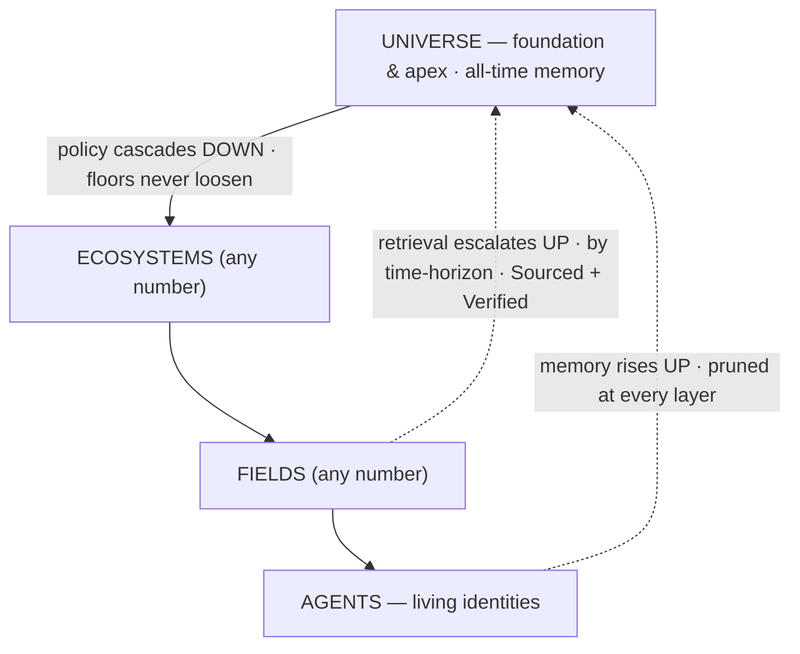

# Orreth

**A security-first, identity-anchored memory across spacetime — Universes of Ecosystems of Fields of Agents.**

An agent today is only as good as its data, and its data is bounded by time. Orreth uses the running
universe as **memory that never fades** (configurable for years) and is **not lonely** (collective,
cross-agent, authorized). **Governance is its first application, not its purpose.**

> Three flows: **policy cascades down** (foundational, non-overridable) · **memory rises up** (pruned at
> every layer) · **retrieval escalates up by time-horizon** (Sourced + Verified). Identity is the immortal
> thread; the Universe is both the **foundation** (policy) and the **apex** (all-time memory).
> *Security first. Trust, but verify — at ecosystem scale.*



---

## Status

🟢 **Design phase complete (2026-07-02) · the universe runs (2026-07-03).** All fourteen dives
(`0000`–`0013`) are drafted and **every decision in the ledger is locked** (`docs/decisions/`). The
**Python reference simulator** proves the whole model — 38 tests: three flows, the two-clock rule
(lived memory cannot be backdated), the roll-up monoid, the resolver fold, factories with birth
certificates, HITL quorums (bars are absolute), the provisioner rendering the League template.

**The Rust plane is live.** Six crates at `backend/plane/`, conformance-green against fixtures derived
from the reference (byte-for-byte canonicalization, same content hashes, Python-signed Ed25519 verifying
in Rust). **`orrethd`** — one binary, tier as a profile — serves the gateway over HTTP with **trust-root
pinning** (a self-issued token, however well signed, is refused), object-store bodies (tamper-evident;
tombstones are physical erasure), and Postgres write-through (a restarted daemon restores its records
*and its high-water mark*).

**One laptop = one universe:** `docker compose -f infrastructure/compose.yaml up` assembles the tree —
universe → ecosystem → field, floors pulled down at boot, retrieval escalating deep-time remainders UP
across containers. And the first **Window** exists: the daemon serves its own glass at `/window` — an
observatory console where every render is a governed, tokened query (no privileged pane path). Live
demos in `backend/conformance/`: `demo_digital_life.py` (the life outlives the process, the machine
boundary, and the daemon), `demo_spacetime_window.py` (one query, three tiers), `demo_open_window.py`.

**The universe thinks (2026-07-04).** The Model Plane (0016) is live — LiteLLM through the floors,
plane-held budgets, model lifecycle (no call ever lands on a retired model), first governed call
metered end to end. The Knowledge Loop (0014) runs: external knowledge admitted quarantined at
0.0000 through identified sources (did:web:tavily.com was the first), promoted on receipts,
recalled through the derived_from lineage. And Orreth.agent's chassis (0015) took its first
governed thought: one immutable loop, parallel nucleus, deterministic 0014 knowledge beside
metered reasoning, breaker-parks-as-knowledge-intent. CI green on every push (private remote,
iotlodge/orreth).

**The world's services become residents of history (2026-07-05).** The **Tool Farm** (0018) is
live: every tool/MCP an agent consumes is now an **identity with a worldline** — planted through
the human's queue, probed and hash-pinned by **charlotte** (the farm keeper), earning `serving`
through heartbeats, dropped by silence (the SPIFFE lesson: leases expire, nothing needs revoking),
and **quarantined the instant it comes back with a changed manifest** (the rug-pull door,
CVE-2025-54136's move, refused structurally — verified live against a mutating MCP stub). Every
lifecycle transition is a keeper-signed MemoryRecord in the spacetime window; the Console grew a
**Farm tab** (plant · approve · decommission, per floor), farm plots on the orrery, and worldline
diamonds among the stars. The librarian's *Ask* now consumes only governed, metered, identified
sources — and the Window finally shows what the librarian gathers (the pane's cut is the floor's
subtree, not one worldline).

The brand name **Orreth** is locked; **`orreth.ai` registered 2026-07-01**. Next: chassis
maturation (GraphSpec compile, per-cycle RunRecords, the parked→librarian→retry circuit closing
automatically), the pane growing beyond the first glass (usage + outage-survival views), pgvector
retrieval, and the League (PG-1) — the funnel's Play step.

---

## The center, and the mechanism

**The center — what Orreth *is*.** A memory substrate for **Living Identities**. An agent's process is
ephemeral (online / offline / reboot); its **identity is the immortal thread**, universe-unique, and
**memory is keyed to the identity, not the process.** Reboot is not death. Governance (drift → tune) is
the *first application* the substrate powers, not the point.

**The mechanism — how it's built.** One recursive primitive — the **Harness** — with `tier` as a property
(a **Tier Profile**), not three codebases. Children are Harnesses until the leaf **Field**, whose children
are living **Agents**.

- **Multiverse is free** — a Harness above Universes is just another Harness.
- **A 2-tier customer is free** — "just an Ecosystem with Fields" is a depth-2 tree.
- Depth is **capped at 3** (Universe / Ecosystem / Field) until we prove it out; expandable by design.

> Harnesses all the way down, until agents. The only special node is the Field — where governance meets a life.

---

## The lineage — three projects, one fabric

| Layer | Project | Where it lives | Role |
|---|---|---|---|
| **Universe** (apex + recursive runtime) | **Orreth** | this repo | the recursive Harness runtime; tier = a profile |
| **Ecosystem** | **ecosystem.harness** (EH) | `../ecosystem.harness` | the governance loop, proven (61 tests, end-to-end). Its engine **lifts** into Orreth as the node core. |
| **Field** | **native Orreth** *(reference proof: CortexObserver)* | `../CortexObserver/CortexObserver` (reference) | the leaf Harness where agents live — designed fresh for Orreth. CO proved the pattern (commander, roster, farms, skills, memory) and informs interoperability; it does **not** drive the design |
| **Agents** | LangGraph · AgentField | (in each Field) | the workforce; DID-identified via becky → NANDA; built or leased |

---

## Repo map — so you never chase a file

```
orreth/
├── README.md                 ← you are here
├── docs/
│   ├── vision/                ← the north stars (private vision artifacts + hero mockups)
│   │   ├── FUTURE-the-orreth.md                    ← the canonical Orreth spec (memory-first)
│   │   ├── Orreth-spacetime-memory.(png|svg)       ← the hero: the memory pyramid
│   │   ├── use-cases.md                            ← the same machine, different costumes + "Build My First Universe"
│   │   ├── the-spacetime-window.md                 ← the apex payoff at its limit: a live cross-section of a world
│   │   ├── governed-human-oversight.md             ← humans as governed principals: scoped, directional, audited access
│   │   ├── Orreth-mockup.(png|svg)                 ← the orrery (pre-rebaseline · superseded by Orreth-agentic-hierarchy)
│   │   ├── Orreth-agentic-hierarchy.(png|svg)      ← the staffing view: agents run every layer; humans at the gates
│   │   ├── Orreth-spacetime-window-concept.(png|svg) ← the north star: the block, the hypersurface at T, the cut
│   │   ├── Orreth-the-end-of-the-context-window.(png|svg) ← article 04 hero: the block as lanes, floors as bedrock, a context window drawn to scale
│   │   ├── FUTURE-the-conductor-and-the-field.md   ← the EH-tier vision (+ image)
│   │   └── EH-FRONTEND-the-cross-field-pane.md     ← the EH single-pane sketch (+ image)
│   ├── design/                ← the fourteen dives, 0000–0013 — ALL drafted, every decision locked
│   │   └── README.md          ← the dive sequence + index (start here for the how)
│   ├── decisions/             ← the ledger — closed 2026-07-02; build-phase decisions appended as they arise
│   │   └── README.md
│   └── articles/              ← LinkedIn pieces — local only, kept OUT of git (marketing/feedback iteration)
├── contracts/                 ← the wire contracts (v0 JSON Schemas — validated by both implementations)
├── backend/
│   ├── conformance/           ← the Python reference simulator (38 tests) + fixtures + live demos
│   └── plane/                 ← the Rust plane: 6 crates + orrethd (the daemon) — conformance-green
├── infrastructure/            ← compose.yaml — one laptop, one universe, one command
└── (frontend/ — reserved; the Window's first pane currently ships inside orrethd at /window)
```

**Start here:** `docs/vision/FUTURE-the-orreth.md` is the full vision. `docs/design/` is where
the vision becomes buildable, one schema at a time.

---

## Principles

- **Security first. Trust, but verify — foundationally, from the Universe down.** Universal policy is non-overridable; **retrieval is the #1 security surface.**
- **Identity is the thread; memory is the life.** The process is disposable; the identity and its memory are not.
- **The layers prune so the Universe holds only what matters.** Compression is the shape of the pyramid.
- **Skills are crystallized memory** — learn once, stop re-remembering.
- **Retrieval spans spacetime — Sourced and Verified, or not at all.**
- **Humans conduct; agents perform — and now, agents remember forever.**

---

*JB owns the vision. Claude owns the code and usability. We move at the speed of the ideas.* 🥂
