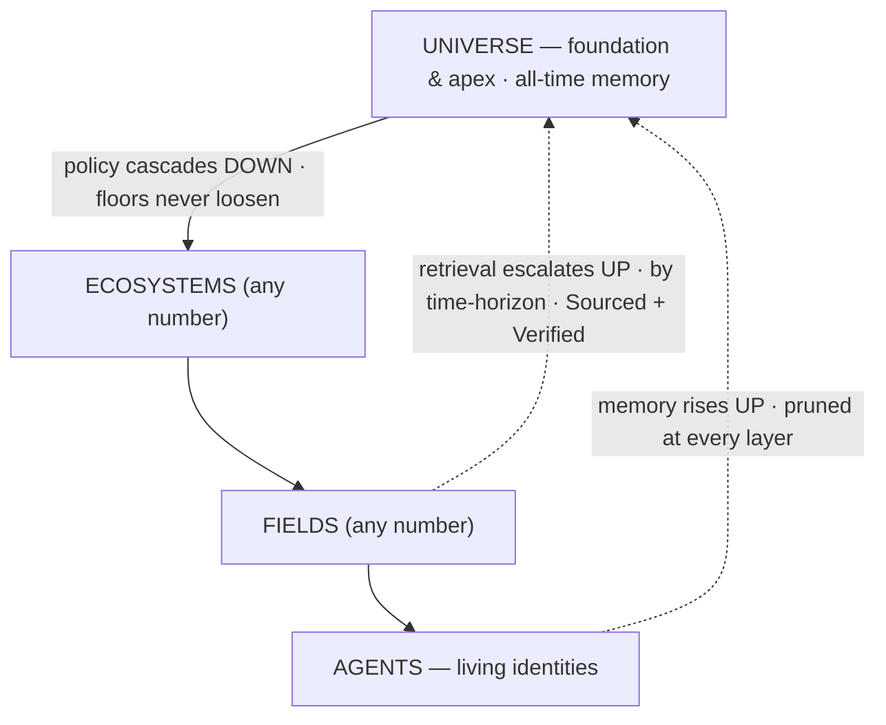
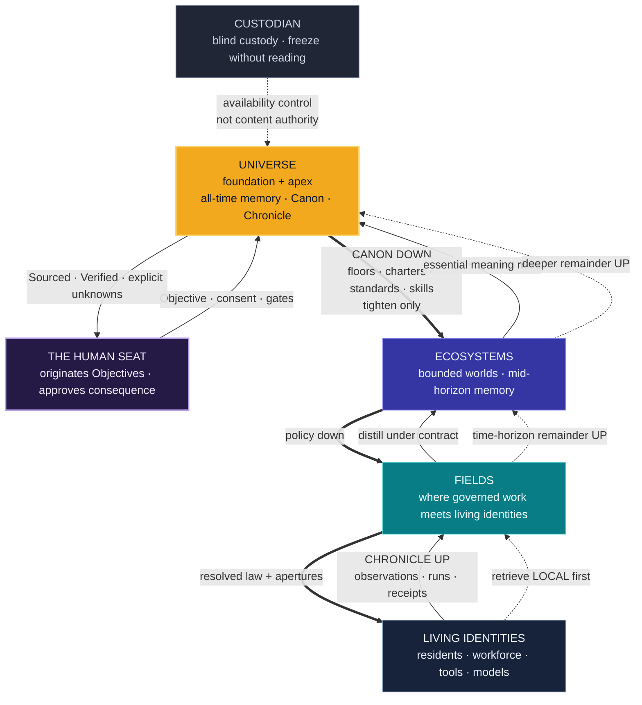
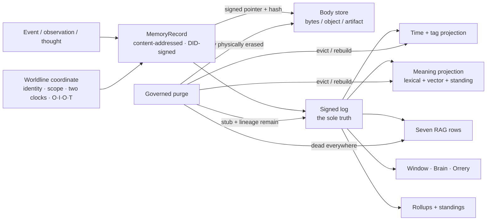
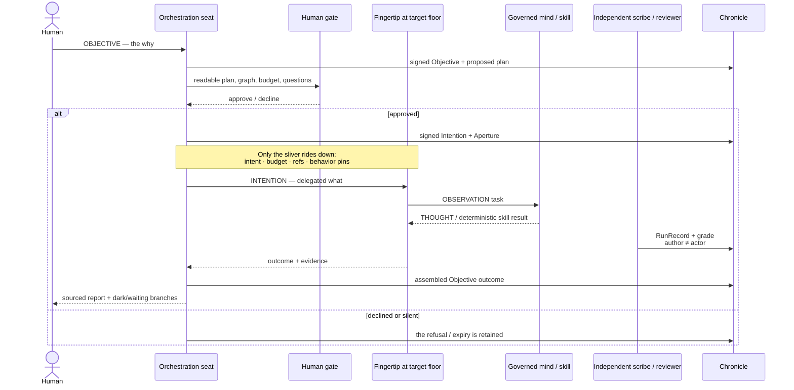
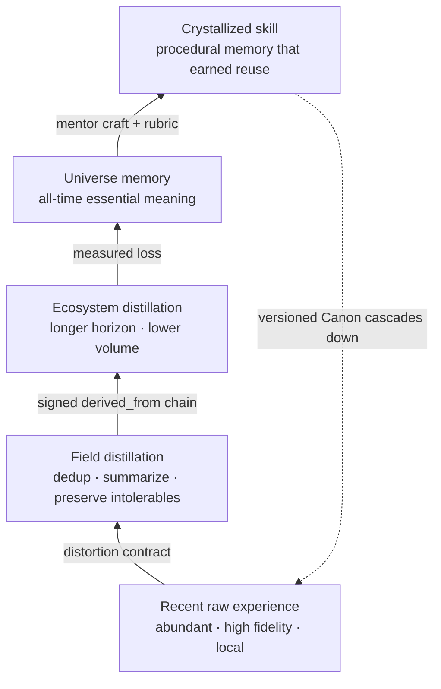
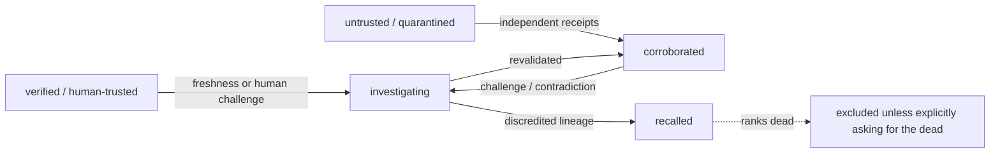
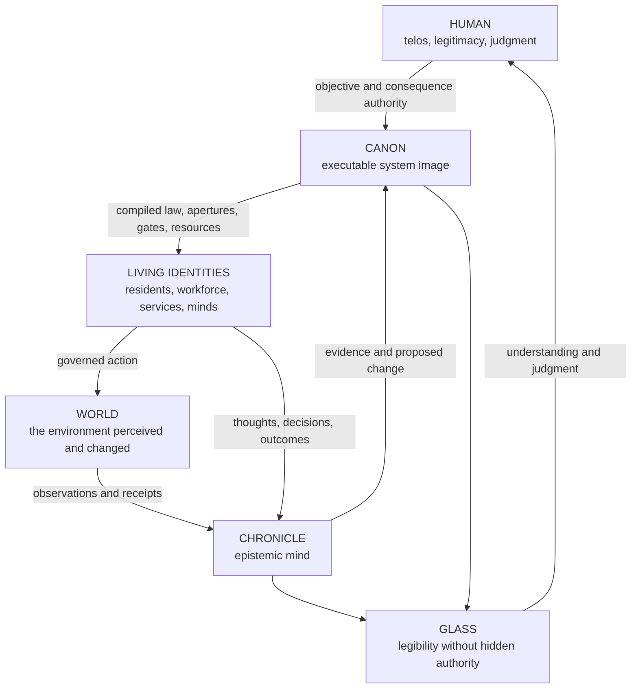
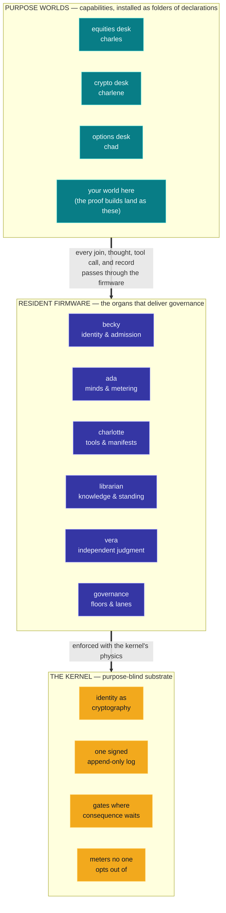

# Orreth

**A security-first, identity-anchored memory across spacetime — Universes of Ecosystems of Fields of Agents — that learns, teaches itself, and puts a human's hand on every consequential page.**

An agent today is only as good as its data, and its data is bounded by a context window. Orreth uses a
running universe as **memory that never fades** (configurable for years) and is **not lonely**
(collective, cross-agent, authorized). **Governance is its first application, not its purpose** — and by
now the substrate does more than remember: it **routes its own retrieval through competing strategies,
grades them on the record, tunes its own forgetting in measured bits, and graduates expensive minds'
craft down to cheap ones — with every promotion signed by a human.** We call the whole an
**adaptive, self-improving, living universe harness.**

> Three flows: **policy cascades down** (foundational, non-overridable) · **memory rises up** (pruned at
> every layer) · **retrieval escalates up by time-horizon** (Sourced + Verified). Identity is the immortal
> thread; the Universe is both the **foundation** (policy) and the **apex** (all-time memory).
> *Security first. Trust, but verify — at ecosystem scale.*



---

## The doors — see it, read it, run it, build on it

- 📖 **[docs.orreth.ai](https://docs.orreth.ai)** — the book: what Orreth is, the anatomy of a
  running world, an honest what-works-today register, and walked tutorials (every one run before
  it was written). [orreth.ai](https://orreth.ai) lands here.
- 🔭 **[demo.orreth.ai](https://demo.orreth.ai)** — a captured moment of the live universe, every
  view real.
- 🐍 **`pip install orreth-agent`** — the SDK (Apache-2.0): give any agent a permanent identity, a
  governed admission, signed memory, and a metered mind.
- 🐳 **`docker pull ghcr.io/iotlodge/orrethd`** — the kernel image; a two-tier world of your own
  stands from [three small files](https://docs.orreth.ai/build/first-world/).
- 🚪 **Ten minutes to a running universe**: the
  [quickstart](https://docs.orreth.ai/build/quickstart/) — clone this repo, one script.

---

## What is running, today, on one laptop

🟢 **Sixty-five design dives (`0000`–`0064`), every landed decision locked** (`docs/decisions/` + each
dive's own ledger) · the **Python reference proves the whole model — 371 conformance tests** · the
**Rust plane** runs it (six crates, `orrethd` — one binary, tier as a profile, conformance-green
against fixtures signed in Python and verified in Rust) · **one command** (`scripts/dev.sh start`)
raises a universe of six ecosystems, twelve fields, and a working population of governed agents,
serving its own glass at `/window` — where every render is a governed, tokened query, never a
side channel.

**The glass has three bodies now:**
- **The Living Brain** — the universe as anatomy and physiology: knowledge pierces the skull as
  provenance beams wearing the trust ladder, HITL pressure aches at a synapse only a human can
  fire, memory visibly consolidates up the pyramid, thinking tissue runs warm on the meter, and a
  replay scrub plays the last hour of fire at 60×.
- **The Constellation** — a true 3D orrery on the same hand-rolled projection (no libraries):
  ecosystems on inclined orbital planes no two alike, fields as moons, staff fields orbiting the
  sun itself, gold motes of memory drifting inward — drag to orbit, fly to a system, click to step
  onto a floor, and every body wears its crew: resident dots that open audiences, workforce
  sparks, farm-tool diamonds wearing their states.
- **The Spacetime Window** — every memory, in time: scrub any floor's history; every dot a signed
  record; "what did we believe then?" is a query.

**Nine residents run the place — and they have faces.** becky (IAM — issues every identity from a
pinned trust root) · vigil (the Warden — detection, content-blind, never enforcement) · the steward
(memory's metabolism) · governance (the floors) · **charlotte** the farm keeper (every tool an
identity with a pinned manifest; a changed byte walks the rug-pull door) · **the librarian** (one
mind, many seats, zero levers) · **ada** the wrangler (minds as identities with pinned deals; price
drift comes back as a decision, never an outage) · **grace** the smith (prompts and policies as
versioned assets; proposals with approval packages; the human holds the high lane) · and
**allen**, the cloud architect — the first resident whose *body is a tier*.

---

## How the kernel works — the anatomy in six pictures

*(Distilled from an outside architect's deep read of this repository. Every diagram below
describes machinery that exists today; the design canon behind each lives in `docs/design/`.)*

### 1 · The shape of the world

One recursive organism. A human seat above, living identities below, and five load-bearing
directions — each one a law:



| Direction | What moves | The law |
|---|---|---|
| **Down** | Canon, policy floors, charters, skills, resolved behavior | A child may tighten; it may never loosen inherited law. |
| **Up** | Chronicle, memory, evidence, run statistics, usage | Raw detail remains near life; distilled meaning rises. A parent never reaches in. |
| **Up on demand** | Retrieval remainder | Search local first, then escalate by time horizon and budget. Partial coverage must say what was not served. |
| **Narrower** | Authority | Root-chained capability delegation only attenuates scope, direction, time, action, and budget. |
| **Back to the human** | Consequence | Agents may detect, plan, propose, and argue. Consequential changes wait at gates; silence never approves. |

> **Every meaningful act in Orreth is a coordinate:**
> **Identity × Space × Time × Purpose × Authority × Epistemic standing × Cost × Consent**
>
> A chat turn is not enough. An answer without those coordinates is not institutional memory.

### 2 · The atom: a signed memory in spacetime

Every event becomes a content-addressed, DID-signed record on one log. Everything else — every
index, every search row, the glass itself — is a rebuildable projection. Governed purge erases
the body everywhere at once and leaves a signed stub proving something was destroyed:



> **The signed log is truth; every index and every glass is a rebuildable projection.** Seven
> retrieval strategies compete without creating seven realities; a projection can be destroyed
> and rebuilt; the worldline cannot be silently rewritten.

### 3 · How work happens: Objective · Intention · Observation · Thought

Work is not a call graph. It is a purpose graph that persists after every process is gone — and
only the sliver rides down to each seat: intent, budget, references, pinned behavior. Never the
whole plan.



| Rung | Originator | Meaning |
|---|---|---|
| **Objective** | Human | Why this world should change |
| **Intention** | Resident / orchestration seat | What bounded unit is delegated |
| **Observation** | Workforce | What was actually attempted or found |
| **Thought** | Model / skill | The cognition used inside the attempt |

Each rung reviews the rung below; no one grades their own yardstick. And the **Aperture** makes
"what could this thought see?" a lookup, not an investigation: every run pins the signed,
content-addressed opening it ran under.

### 4 · How memory rises without becoming mythology



No promise of lossless immortality — a promise of **honest, governed degradation**: a distortion
contract states what must survive and what may compress; a violating distillation is refused at
save; every distillation keeps a walkable `derived_from` chain; and reconstruction uncertainty is
measured and bounded by contract, not by accident. Learning is what makes safe forgetting
possible.

### 5 · What the machine believes: standing outranks relevance

Cryptographic provenance proves who said a thing, when, and whether it changed — never that it is
*true*. So knowledge wears its epistemic standing as architecture, and relevance never outranks
it:



A highly relevant recalled claim still ranks dead. An untrusted finding may speak — dampened and
labeled. Corroboration counts independent voices, not repeated echoes.

### 6 · The two books, one mind

The **Chronicle** is the universe's epistemic mind — what happened, why, who judged it. The
**Canon** is its executable system image — every policy, prompt, skill, standard, and dial,
versioned forever. The loop between them *is* the self-improvement, and a human gates every
consequential turn:



> **A Universe is a version of the Canon executing over the state of the Chronicle, through
> governed identities, against a world, under human purpose.**

If you build agent systems, the difference in one table:

| Conventional agent system | Orreth |
|---|---|
| Process/session is the apparent self | Identity is the self; processes are incarnations |
| Context window is memory | Context is a temporary aperture cut from governed memory |
| Prompt/config lives beside the run | Behavior is versioned Canon and is pinned into the run |
| Logs are operational exhaust | Chronicle is the institution's biography |
| Retrieval returns matches | Retrieval returns sources, fidelity, coverage, cost, and explicit remainder |
| Self-improvement edits the agent | Evidence proposes a sibling Canon version; another seat grades; a human gates consequence |
| Deletion removes a row | Purge walks lineage and every projection; the signed stub proves that something was destroyed |

And the compact mental model, in one column:

```text
                         HUMAN PURPOSE
                              │
                      Objective + gates
                              │
       ┌──────────────────────▼──────────────────────┐
       │                 THE CANON                   │
       │ policy · prompts · skills · charters · law │
       └──────────────────────┬──────────────────────┘
                              │  descends, tighten-only
                       signed apertures
                              │
       ┌──────────────────────▼──────────────────────┐
       │                LIVING WORK                  │
       │ identities · residents · agents · tools    │
       │ models · observations · thoughts · spend   │
       └──────────────────────┬──────────────────────┘
                              │  rises, pruned
                       signed receipts
                              │
       ┌──────────────────────▼──────────────────────┐
       │               THE CHRONICLE                 │
       │ what happened · why · who judged · lineage │
       └──────────────────────┬──────────────────────┘
                              │  evidence + measures
                      proposals and canaries
                              │
                       HUMAN CONSEQUENCE
                              │
                          CANON v+1
```

> **Orreth is a world in which intelligence may be distributed, but responsibility is never
> allowed to dissolve.**

---

## One kernel, many worlds — how governance reaches everything you install

The kernel is deliberately **purpose-blind**: identity as cryptography, one signed log, gates,
and meters — nothing at that layer knows what any agent is *for*. Between the kernel and your
purposes lives the layer most agent platforms don't have: **resident firmware**, the organs that
*deliver* the governance everything above them consumes.



**How a new world is born.** A capability arrives as a folder of *declarations* — prompts, a
manifest, a declared pipeline — never a line of platform code. Drop the folder in and the kernel
discovers the world at boot, raises its floor, welcomes its specialist at becky's gate, and draws
its entire room in the glass blind, from the manifest alone. From its first breath it is governed:
its agents join through the same door, its thoughts meter through the same gateway, its records
sign onto the same log, and its consequences wait at the same gates — because the firmware below
it is not optional and the kernel beneath *has no other way to run it*.

**And one razor keeps the layers honest:** capabilities stay editable in production — through
gates, as versioned siblings — because purpose is the human's domain. Resident firmware does not:
changing how the machine is *governed* is a release. **If you can change it in prod, it's
purpose. If it takes a release, it's firmware.**

This is the pattern the coming **proof builds** exercise: each proof is a purpose world —
embodiment, fleets, attestation, governed updates, energy budgets — installed on this same
kernel, governed by this same firmware, without a line of kernel change. The kernel matures by
being *used*.

---

## From substrate to estate — the recent eras, compressed

*(the full record is `docs/design/README.md` — sixty-five dives, each closed only when proven
live by a human in the glass; the standing proof register is
[`docs/design/the-honest-boundary.md`](docs/design/the-honest-boundary.md))*

- **The machine's own parts became governed assets** (0045–0047): prompts, rules, and sentences
  live on a versioned shelf, edited through one human-gated door; every objective is READ and
  PLANNED by a governed mind whose understanding rides the very card the human approves; changing
  firmware issues a new named release of the whole machine.
- **Capabilities decoupled from the machine** (0054–0056): whole purposes — three working trading
  desks — install by dropping a folder of declarations, render blind through typed panels, and
  lifecycle by a human's word; the console became a cockpit, everything ≤2 clicks, edited in place.
- **The estate learned to keep itself** (0057–0059, 0062): every floor's memory breathes with
  measured loss; the model registry watches a five-eyed market of 2,900+ minds as intelligence
  never authority; MCP tools join through one gate with secrets in zero records and rug-pulls
  caught by fingerprint; residents maintain their own supply lines and build container bodies for
  each other as attested deeds.
- **The stranger was designed for** (0060–0061, 0063): the canon vocabulary became a taught,
  clickable dictionary; the universe renders its own live schematic down to the physical hulls;
  thirty-six operating values became governed dials — declared in firmware, valued on the shelf,
  turned live with bounds that refuse with a teaching.
- **The machine got its public book** (0064, one day): [docs.orreth.ai](https://docs.orreth.ai) —
  fourteen pages, every tutorial walked before written, and the docs as the decoupling's forcing
  function: the kernel image published, the SDK on PyPI, a stranger's world from three files, an
  outside LangGraph agent admitted at a human gate and remembering across lives.

## Where it started becoming an institution — the earlier keystones

- **The physics of memory (0033).** Information theory made canon: distillation under **distortion
  contracts** (what must survive, refused at save), reconstruction uncertainty **bounded by
  contract, not accident**, and a runnable harness that measures recall fidelity and context
  efficiency — the science every later organ grades against.
- **The continuity universe & the Testament (0034–0035).** The second brain's true form —
  cognitive continuity infrastructure with an honest label canon ("this MAY have happened — two
  hints, not proof") — and survivorship designed at full gravity: a testament staged while you
  live, a passage where **silence may only contain**, custody that passes while identity never
  does, and a legacy glass that speaks *about* you, never *as* you. Designed, locked, built, and
  proven **in one day**.
- **The meaning axis (0022 Phase 2).** Hybrid retrieval where standing outranks noise and a
  recalled source's words rank *dead* — proven on the wire when a packed-soil question found the
  rammed-earth conversations in 1,207 hits.
- **The Living Brain (0036).** The default view. People who see it don't forget it.
- **allen and the Estate (0037).** Seed to standing resident **in one day**: a typed door where
  humans alone speak Objectives and agent asks carry walkable lineage or learn why not · a
  **deployment charter** that interrogates before any prod plan compiles (answers bind to
  workloads; "for the estate" is deliberate policy; history is offered, never inherited) · plan is
  free, **apply waits for a human**, four blast-radius classes take two signers · a real
  **brownfield walk**: the AWS CLI, read-only, adopted two live CloudFormation stacks (34
  resources) on the human's own key — and **the acceptance gate opened**. The charter's attributes
  (RTO · RPO · classification · retention) are the same ones that will map record classes to
  provisioned storage: *records retention as physics, not paperwork*.
- **The Stacks (0038).** Seven RAG variants — naive, rerank, multimodal, graph, hybrid, router,
  swarm — as **seven projections over ONE signed truth, never seven stores**: ingest once, purge
  reaches everywhere, any row torn down regrows identical from the log. A deterministic
  **Dispatcher** routes every ask by a versioned standard the librarian tends — every choice a
  signed record, an unbuilt row falling to the baseline *loudly*. Then the part that changes the
  game: **"run the tournament"** races every question through all seven rows, grades each pass on
  the 0033 axes, ranks standings that flag floors instead of averaging them away — and the first
  tournament **argued a promotion**: routing-standard v2, default to the graph row, adopted on a
  human's signature with v1 versioned behind it. *Ask → route → grade → rank → propose → a human
  signs.* And the rows meet the real memory: answers arrive **wearing their epistemic status** —
  quarantined knowledge speaks dampened and labeled ⟨untrusted⟩; recalled sources are simply dead.
- **The Chronicle and the Canon (0039).** Phase 2's constitution: **two books, one mind**. The
  Chronicle (Objectives · Intentions · Observations · thought:actions — DAG-hard, walkable
  forever) and the Canon (policies, prompts, skills, standards — forever-versioned, the genome).
  The loop between them IS the self-improvement: Chronicle evidence → Canon proposals → human
  gates → the Canon governs the next Chronicle. Built and proven the same day: a **privacy floor**
  that caught a smuggled sovereign record dressed as a document · the universe **quoting its human
  back to himself** with citations ("what has the human asked allen to do?" → his own words from
  the estate session) · **time as a retrieval dial** ("as of…", "since…") · a metabolism whose
  dials are editable Canon assets and whose every forgetting carries a **measured information
  loss** · and the finale: **the first graduation** — a craft crystallized at the smart tier,
  canaried at the cheap tier, standings confirmed, the mentee serving — with the refusal *and* the
  demotion paths proven beside it. Never silently dumber, in either direction, forever.

**Next: the proofs era** ([PROOFS.md](PROOFS.md)). From here the work is proof builds — purpose
worlds that mature the kernel by *using* it, each installed on the same kernel and governed by
the same firmware. Six proof worlds are seeded (embodiment · fleets · attestation · governed
updates · energy budgets — the roster with descriptions is in [PROOFS.md](PROOFS.md)); the first
proof to build is selected and announced separately.

---

## The center, and the mechanism

**The center — what Orreth *is*.** A memory substrate for **Living Identities**. An agent's process is
ephemeral (online / offline / reboot); its **identity is the immortal thread**, universe-unique, and
**memory is keyed to the identity, not the process.** Reboot is not death. Governance (drift → tune) is
the *first application* the substrate powers, not the point.

**The mechanism — how it's built.** One recursive primitive — the **Harness** — with `tier` as a property
(a **Tier Profile**), not three codebases. Children are Harnesses until the leaf **Field**, whose children
are living **Agents**.

- **Multiverse is free** — a Harness above Universes is just another Harness.
- **A 2-tier customer is free** — "just an Ecosystem with Fields" is a depth-2 tree.
- Depth is **capped at 3** (Universe / Ecosystem / Field) until proven out; expandable by design.
- **A field can BE a resident** — allen is a universe-parented field whose staff is his mind: the
  embodied tier, and the pattern generalizes.

> Harnesses all the way down, until agents. The only special node is the Field — where governance meets a life.

**The laws that make it trustworthy** (each one enforced structurally, most proven by a test that
tried to break it):

- **The signed log is the truth; every index is a rebuildable projection** — which is why seven
  retrieval strategies can compete without ever forking the truth, and why the purge's crypto-shred
  reaches every projection at once.
- **Nothing grades its own yardstick** — run records are scribe-authored; the organ that routes
  never grades its routing; the tournament argues and the human signs.
- **Consequence waits for humans** — gates with distinct-signer quorums, bars that never loosen,
  and "silence never approves." The loudest abort is a heartbeat.
- **Refusal wears one face** — authz-miss, budget-miss, and missing-record are indistinguishable;
  a prober learns nothing.
- **Lived time is monotone** — the universe rejects backdated memory (it refused its own author's
  test fixtures until they were honestly labeled as archives).
- **Bulk never enters the mind** — ML datasets and media live in class-allocated stores; memory
  holds signed pointers whose hashes catch a swapped warehouse loudly.

---

## The lineage — three projects, one fabric

| Layer | Project | Where it lives | Role |
|---|---|---|---|
| **Universe** (apex + recursive runtime) | **Orreth** | this repo | the recursive Harness runtime; tier = a profile |
| **Ecosystem** | **ecosystem.harness** (EH) | `../ecosystem.harness` | the governance loop, proven (61 tests, end-to-end). Its engine **lifts** into Orreth as the node core. |
| **Field** | **native Orreth** *(reference proof: CortexObserver)* | `../CortexObserver` (reference) | the leaf Harness where agents live. CO proved the pattern (commander, roster, farms, skills, memory); it informs, it does not drive. |
| **Agents** | LangGraph · AgentField · the orreth-agent SDK | (in each Field) | the workforce; DID-identified via becky → NANDA; built or leased; persistent selves that re-join through a governed door |

---

## Repo map — so you never chase a file

```
orreth/
├── README.md                 ← you are here
├── PROOFS.md                 ← the proofs era: how purpose worlds mature and verify the kernel
├── docs/
│   ├── vision/                ← the north stars (vision artifacts + hero images)
│   ├── design/                ← the dives, 0000–0064 — the vision made buildable, one keystone at a time
│   │   └── README.md          ← the dive sequence + index (start here for the how)
│   ├── decisions/             ← the ledger — every lock, dated, with its reasoning
│   └── guides/                ← the operator's path (superseded for newcomers by docs.orreth.ai)
├── contracts/                 ← the wire contracts (v0 JSON Schemas — Python validates directly; Rust is held to them via generated fixtures; sacred)
├── agents/
│   ├── PROVENANCE.md          ← the authorship ledger — every model's work named, quarantines recorded
│   ├── orreth-agent-sdk/      ← the FieldClient SDK — persistent identities that re-join as the same self
│   └── flavors/               ← lifeforce agents (prototype · LangGraph · AgentField sentinel)
├── backend/
│   ├── conformance/           ← the Python reference (371 tests) + console worker + live demos
│   └── plane/                 ← the Rust plane: 6 crates + orrethd (the daemon, serving its own glass)
├── infrastructure/            ← compose + CDK — one laptop, one universe, one command (and the demo site's stack)
└── scripts/                   ← dev.sh (the rig) · demo.sh (the reel)
```

**Start here:** `docs/vision/FUTURE-the-orreth.md` is the full vision · `docs/design/README.md` is
where it becomes buildable · **watch it live** at [demo.orreth.ai](https://demo.orreth.ai).

---

## Principles

- **Security first. Trust, but verify — foundationally, from the Universe down.** Universal policy is non-overridable; **retrieval is the #1 security surface.**
- **Identity is the thread; memory is the life.** The process is disposable; the identity and its memory are not.
- **The layers prune so the Universe holds only what matters** — and now the pruning is dialed by editable policy and graded in measured bits.
- **Skills are crystallized memory** — learn once at the expensive tier, prove at the cheap one, serve forever. Never silently dumber.
- **Retrieval spans spacetime — Sourced and Verified, or not at all** — and every answer wears its epistemic status.
- **Humans conduct; agents perform** — the tournament argues, the evidence is readable, and the human signs.

---

## License & provenance

**The source is public for review and evaluation; a license is deliberately not yet chosen** —
all rights reserved meanwhile. The SDK is the exception: `agents/orreth-agent-sdk` is
**Apache-2.0** and published as [`orreth-agent`](https://pypi.org/project/orreth-agent/); the
documentation ([orreth-docs](https://github.com/iotlodge/orreth-docs)) is CC BY 4.0 with MIT
examples. Every source file names its authoring model; `agents/PROVENANCE.md` is the ledger.

*This build is my résumé — I'm exploring senior agentic-infrastructure / architecture roles:
[jsbarth.com](https://jsbarth.com).*

---

*JB owns the vision. Claude owns the code and usability. We move at the speed of the ideas.* 🥂
