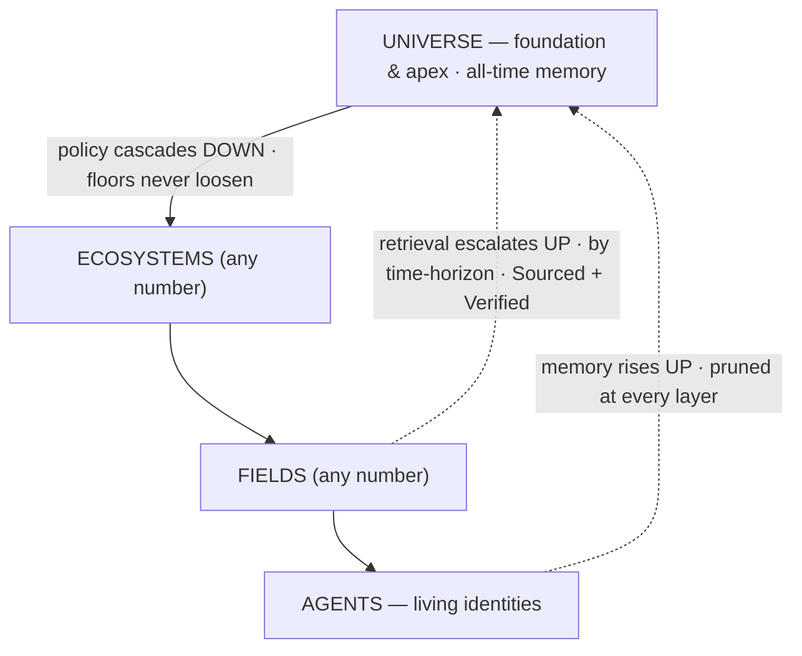

# Orreth

**A security-first, identity-anchored memory across spacetime — Universes of Ecosystems of Fields of Agents — that learns, teaches itself, and puts a human's hand on every consequential page.**

An agent today is only as good as its data, and its data is bounded by a context window. Orreth uses a
running universe as **memory that never fades** (configurable for years) and is **not lonely**
(collective, cross-agent, authorized). **Governance is its first application, not its purpose** — and by
now the substrate does more than remember: it **routes its own retrieval through competing strategies,
grades them on the record, tunes its own forgetting in measured bits, and graduates expensive minds'
craft down to cheap ones — with every promotion signed by a human.** We call the whole an
**adaptive, self-improving, living universe harness.**

> Three flows: **policy cascades down** (foundational, non-overridable) · **memory rises up** (pruned at
> every layer) · **retrieval escalates up by time-horizon** (Sourced + Verified). Identity is the immortal
> thread; the Universe is both the **foundation** (policy) and the **apex** (all-time memory).
> *Security first. Trust, but verify — at ecosystem scale.*



---

## What is running, today, on one laptop

🟢 **Forty design dives (`0000`–`0039`), every landed decision locked** (`docs/decisions/` + each
dive's own ledger) · the **Python reference simulator proves the whole model — 230 tests** · the
**Rust plane** runs it (six crates, `orrethd` — one binary, tier as a profile, conformance-green
against fixtures signed in Python and verified in Rust) · **one command** (`scripts/dev.sh start`)
raises a universe of six ecosystems, twelve fields, and a working population of governed agents,
serving its own glass at `/window` — where every render is a governed, tokened query, never a
side channel.

**The glass has three bodies now:**
- **The Living Brain** — the universe as anatomy and physiology: knowledge pierces the skull as
  provenance beams wearing the trust ladder, HITL pressure aches at a synapse only a human can
  fire, memory visibly consolidates up the pyramid, thinking tissue runs warm on the meter, and a
  replay scrub plays the last hour of fire at 60×.
- **The Constellation** — a true 3D orrery on the same hand-rolled projection (no libraries):
  ecosystems on inclined orbital planes no two alike, fields as moons, staff fields orbiting the
  sun itself, gold motes of memory drifting inward — drag to orbit, fly to a system, click to step
  onto a floor, and every body wears its crew: resident dots that open audiences, workforce
  sparks, farm-tool diamonds wearing their states.
- **The Spacetime Window** — every memory, in time: scrub any floor's history; every dot a signed
  record; "what did we believe then?" is a query.

**Nine residents run the place — and they have faces.** becky (IAM — issues every identity from a
pinned trust root) · vigil (the Warden — detection, content-blind, never enforcement) · the steward
(memory's metabolism) · governance (the floors) · **charlotte** the farm keeper (every tool an
identity with a pinned manifest; a changed byte walks the rug-pull door) · **the librarian** (one
mind, many seats, zero levers) · **ada** the wrangler (minds as identities with pinned deals; price
drift comes back as a decision, never an outage) · **grace** the smith (prompts and policies as
versioned assets; proposals with approval packages; the human holds the high lane) · and
**allen**, the cloud architect — the first resident whose *body is a tier*.

---

## The last three weeks — where it stopped being a database and started being an institution

- **The physics of memory (0033).** Information theory made canon: distillation under **distortion
  contracts** (what must survive, refused at save), reconstruction uncertainty **bounded by
  contract, not accident**, and a runnable harness that measures recall fidelity and context
  efficiency — the science every later organ grades against.
- **The continuity universe & the Testament (0034–0035).** The second brain's true form —
  cognitive continuity infrastructure with an honest label canon ("this MAY have happened — two
  hints, not proof") — and survivorship designed at full gravity: a testament staged while you
  live, a passage where **silence may only contain**, custody that passes while identity never
  does, and a legacy glass that speaks *about* you, never *as* you. Designed, locked, built, and
  proven **in one day**.
- **The meaning axis (0022 Phase 2).** Hybrid retrieval where standing outranks noise and a
  recalled source's words rank *dead* — proven on the wire when a packed-soil question found the
  rammed-earth conversations in 1,207 hits.
- **The Living Brain (0036).** The default view. People who see it don't forget it.
- **allen and the Estate (0037).** Seed to standing resident **in one day**: a typed door where
  humans alone speak Objectives and agent asks carry walkable lineage or learn why not · a
  **deployment charter** that interrogates before any prod plan compiles (answers bind to
  workloads; "for the estate" is deliberate policy; history is offered, never inherited) · plan is
  free, **apply waits for a human**, four blast-radius classes take two signers · a real
  **brownfield walk**: the AWS CLI, read-only, adopted two live CloudFormation stacks (34
  resources) on the human's own key — and **the acceptance gate opened**. The charter's attributes
  (RTO · RPO · classification · retention) are the same ones that will map record classes to
  provisioned storage: *records retention as physics, not paperwork*.
- **The Stacks (0038).** Seven RAG variants — naive, rerank, multimodal, graph, hybrid, router,
  swarm — as **seven projections over ONE signed truth, never seven stores**: ingest once, purge
  reaches everywhere, any row torn down regrows identical from the log. A deterministic
  **Dispatcher** routes every ask by a versioned standard the librarian tends — every choice a
  signed record, an unbuilt row falling to the baseline *loudly*. Then the part that changes the
  game: **"run the tournament"** races every question through all seven rows, grades each pass on
  the 0033 axes, ranks standings that flag floors instead of averaging them away — and the first
  tournament **argued a promotion**: routing-standard v2, default to the graph row, adopted on a
  human's signature with v1 versioned behind it. *Ask → route → grade → rank → propose → a human
  signs.* And the rows meet the real memory: answers arrive **wearing their epistemic status** —
  quarantined knowledge speaks dampened and labeled ⟨untrusted⟩; recalled sources are simply dead.
- **The Chronicle and the Canon (0039).** Phase 2's constitution: **two books, one mind**. The
  Chronicle (Objectives · Intentions · Observations · thought:actions — DAG-hard, walkable
  forever) and the Canon (policies, prompts, skills, standards — forever-versioned, the genome).
  The loop between them IS the self-improvement: Chronicle evidence → Canon proposals → human
  gates → the Canon governs the next Chronicle. Built and proven the same day: a **privacy floor**
  that caught a smuggled sovereign record dressed as a document · the universe **quoting its human
  back to himself** with citations ("what has the human asked allen to do?" → his own words from
  the estate session) · **time as a retrieval dial** ("as of…", "since…") · a metabolism whose
  dials are editable Canon assets and whose every forgetting carries a **measured information
  loss** · and the finale: **the first graduation** — a craft crystallized at the smart tier,
  canaried at the cheap tier, standings confirmed, the mentee serving — with the refusal *and* the
  demotion paths proven beside it. Never silently dumber, in either direction, forever.

**Next:** the lifecycle-synergy pass (how the three keystones interlock) · live-judge graduations
at real model tiers · the AWS-documentation supply line (farm → librarian → allen) · the Daylight
Glass light theme · the seven rows' standing projections at scale.

---

## The center, and the mechanism

**The center — what Orreth *is*.** A memory substrate for **Living Identities**. An agent's process is
ephemeral (online / offline / reboot); its **identity is the immortal thread**, universe-unique, and
**memory is keyed to the identity, not the process.** Reboot is not death. Governance (drift → tune) is
the *first application* the substrate powers, not the point.

**The mechanism — how it's built.** One recursive primitive — the **Harness** — with `tier` as a property
(a **Tier Profile**), not three codebases. Children are Harnesses until the leaf **Field**, whose children
are living **Agents**.

- **Multiverse is free** — a Harness above Universes is just another Harness.
- **A 2-tier customer is free** — "just an Ecosystem with Fields" is a depth-2 tree.
- Depth is **capped at 3** (Universe / Ecosystem / Field) until proven out; expandable by design.
- **A field can BE a resident** — allen is a universe-parented field whose staff is his mind: the
  embodied tier, and the pattern generalizes.

> Harnesses all the way down, until agents. The only special node is the Field — where governance meets a life.

**The laws that make it trustworthy** (each one enforced structurally, most proven by a test that
tried to break it):

- **The signed log is the truth; every index is a rebuildable projection** — which is why seven
  retrieval strategies can compete without ever forking the truth, and why the purge's crypto-shred
  reaches every projection at once.
- **Nothing grades its own yardstick** — run records are scribe-authored; the organ that routes
  never grades its routing; the tournament argues and the human signs.
- **Consequence waits for humans** — gates with distinct-signer quorums, bars that never loosen,
  and "silence never approves." The loudest abort is a heartbeat.
- **Refusal wears one face** — authz-miss, budget-miss, and missing-record are indistinguishable;
  a prober learns nothing.
- **Lived time is monotone** — the universe rejects backdated memory (it refused its own author's
  test fixtures until they were honestly labeled as archives).
- **Bulk never enters the mind** — ML datasets and media live in class-allocated stores; memory
  holds signed pointers whose hashes catch a swapped warehouse loudly.

---

## The lineage — three projects, one fabric

| Layer | Project | Where it lives | Role |
|---|---|---|---|
| **Universe** (apex + recursive runtime) | **Orreth** | this repo | the recursive Harness runtime; tier = a profile |
| **Ecosystem** | **ecosystem.harness** (EH) | `../ecosystem.harness` | the governance loop, proven (61 tests, end-to-end). Its engine **lifts** into Orreth as the node core. |
| **Field** | **native Orreth** *(reference proof: CortexObserver)* | `../CortexObserver` (reference) | the leaf Harness where agents live. CO proved the pattern (commander, roster, farms, skills, memory); it informs, it does not drive. |
| **Agents** | LangGraph · AgentField · the orreth-agent SDK | (in each Field) | the workforce; DID-identified via becky → NANDA; built or leased; persistent selves that re-join through a governed door |

---

## Repo map — so you never chase a file

```
orreth/
├── README.md                 ← you are here
├── docs/
│   ├── vision/                ← the north stars (vision artifacts + hero images)
│   ├── design/                ← the dives, 0000–0039 — the vision made buildable, one keystone at a time
│   │   └── README.md          ← the dive sequence + index (start here for the how)
│   ├── decisions/             ← the ledger — every lock, dated, with its reasoning
│   ├── guides/                ← the operator's path (01 Librarian flows · 02 Operator's Manual · 05 The Seven Rows)
│   └── articles/              ← the public series (01–04 published · 05–07 drafted) + assets
├── contracts/                 ← the wire contracts (v0 JSON Schemas — validated by BOTH implementations; sacred)
├── agents/
│   ├── PROVENANCE.md          ← the authorship ledger — every model's work named, quarantines recorded
│   ├── orreth-agent-sdk/      ← the FieldClient SDK — persistent identities that re-join as the same self
│   └── flavors/               ← lifeforce agents (prototype · LangGraph · AgentField sentinel)
├── backend/
│   ├── conformance/           ← the Python reference simulator (230 tests) + console worker + live demos
│   └── plane/                 ← the Rust plane: 6 crates + orrethd (the daemon, serving its own glass)
├── infrastructure/            ← compose + CDK — one laptop, one universe, one command (and the demo site's stack)
└── scripts/                   ← dev.sh (the rig) · demo.sh (the reel)
```

**Start here:** `docs/vision/FUTURE-the-orreth.md` is the full vision · `docs/design/README.md` is
where it becomes buildable · **watch it live** at [demo.orreth.ai](https://demo.orreth.ai).

---

## Principles

- **Security first. Trust, but verify — foundationally, from the Universe down.** Universal policy is non-overridable; **retrieval is the #1 security surface.**
- **Identity is the thread; memory is the life.** The process is disposable; the identity and its memory are not.
- **The layers prune so the Universe holds only what matters** — and now the pruning is dialed by editable policy and graded in measured bits.
- **Skills are crystallized memory** — learn once at the expensive tier, prove at the cheap one, serve forever. Never silently dumber.
- **Retrieval spans spacetime — Sourced and Verified, or not at all** — and every answer wears its epistemic status.
- **Humans conduct; agents perform** — the tournament argues, the evidence is readable, and the human signs.

---

*JB owns the vision. Claude owns the code and usability. We move at the speed of the ideas.* 🥂
