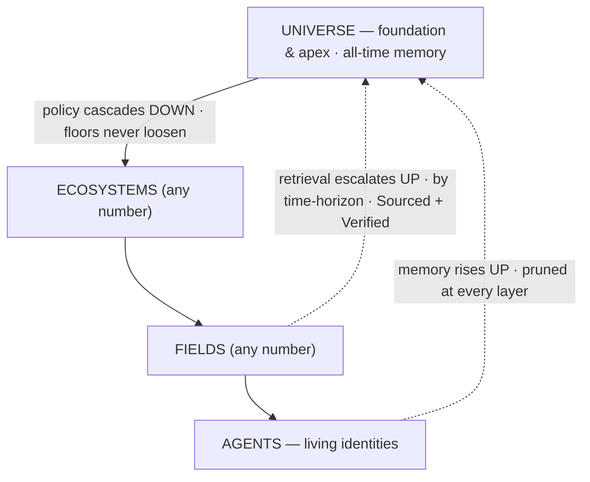

# Orreth

**A security-first, identity-anchored memory across spacetime — Universes of Ecosystems of Fields of Agents.**

An agent today is only as good as its data, and its data is bounded by time. Orreth uses the running
universe as **memory that never fades** (configurable for years) and is **not lonely** (collective,
cross-agent, authorized). **Governance is its first application, not its purpose.**

> Three flows: **policy cascades down** (foundational, non-overridable) · **memory rises up** (pruned at
> every layer) · **retrieval escalates up by time-horizon** (Sourced + Verified). Identity is the immortal
> thread; the Universe is both the **foundation** (policy) and the **apex** (all-time memory).
> *Security first. Trust, but verify — at ecosystem scale.*



---

## Status — the timeline

🟢 **Thirty-three dives (`0000`–`0032`), every landed decision locked** (`docs/decisions/` +
each dive's own ledger). The **Python reference simulator** proves the whole model — **132
tests** — and the **Rust plane** runs it: six crates at `backend/plane/`, conformance-green
against fixtures derived from the reference (byte-for-byte canonicalization, Python-signed
Ed25519 verifying in Rust). **`orrethd`** — one binary, tier as a profile — with trust-root
pinning, tamper-evident object-store bodies, and Postgres write-through. **One laptop = one
universe:** `scripts/dev.sh start` assembles the tree; the daemon serves its own glass at
`/window` (every render a governed, tokened query); `scripts/demo.sh` rolls the reel. The
full tour: [`docs/demos.md`](docs/demos.md) · the operator's path: [`docs/guides/`](docs/guides/).

- **2026-07-01 — the name.** **Orreth** locked; `orreth.ai` registered.
- **2026-07-02 — design phase complete.** Fourteen foundation dives (`0000`–`0013`): identity
  as the immortal thread, the retrieval contract, pruning as metabolism, the two clocks, the
  roll-up monoid, becky's capability chain, the cascade resolver, factories with birth
  certificates, HITL quorums where **bars are absolute**, the custodian reckoning.
- **2026-07-03 — the universe runs.** The Rust plane conformance-green; three tiers on one
  laptop; the first Window opens in the daemon's own glass.
- **2026-07-04 — the universe thinks.** The Model Plane (0016) meters the first governed
  thought; the Knowledge Loop (0014) admits the world quarantined at 0.0000 and promotes on
  receipts; the chassis (0015) runs its one immutable loop — the breaker parks failure as a
  knowledge assignment. Failure is fuel.
- **2026-07-05 — services become residents of history.** The Tool Farm (0018): every tool an
  identity with a worldline, hash-pinned by **charlotte**; a changed manifest walks the
  rug-pull door (CVE-2025-54136's move, refused structurally, proven live).
- **2026-07-07/08 — minds, audiences, and a growing world.** The Stable (0019): minds as
  identities with deals pinned by **ada**; the universal meter — every resident's cognition
  on the record, honest zeros shown. The Parlor (0020): the interoperability law — *agents,
  authorized, see data; humans must ask*. The recall walk lands on the wire (0014 §4, the
  poisoned almanac visibly dead). The Shipyard (0021): a universe that grows by conversation —
  ask becky for an ecosystem, real containers join the orrery. Persistent lifeforce agents
  re-join as the same selves through becky's door (0017).
- **2026-07-10/11 — the brain dives.** The Universe-Brain marathon: eight designs blessed and
  live in two days, fifteen JB locks. The Memory Construct (0022 — the signed log is the
  truth; every index a rebuildable projection; Phase 1 live). The Librarian (0023 — one mind,
  many seats, zero levers). Markers & the severity lanes (0024 — 100% of change graded; low
  auto-approves, high waits for the human). The Human Profile (0025 — your assertions enter
  trusted; the machine's beliefs about you enter untrusted). The Purge (0026 — governed
  erasure: containment at machine speed, destruction waits for humans, plural). The Fingertip
  (0027 — thought.graph concrete: the universe construct IS the node graph). Workspaces & the
  Improvement Engine (0028 — the glass grows rooms; one standing improver proposes siblings,
  never silent successors). Multimodal (0029 — upload is an ask; formats needing an eye are
  admitted honestly dark). Guides 01–02 ship; **demo.orreth.ai** refreshed with the dive.
- **2026-07-12 — the human takes their seat.** 0030: the four-rung ladder as canon —
  **Objective · Intention · Observation · Thought**, humans the only origin of Objectives —
  the plan gate (origin plans always wait for their human), the Objective ledger (an
  artifact of artifacts, recallable forever), place-as-spine navigation, a legible spacetime
  window. Every spoonful proven **as a human in the glass** — the standing rule since.
- **2026-07-13 — the mind becomes visible, and the universe gains a smith.** 0031: **grace
  the smith** embodies the improvement engine — prompts leave the code and become versioned
  assets on one shelf; proposals carry approval packages; the human adopts or declines at the
  gate, and a decline releases the lane. The choreography renders (composed by the seat that
  owns the flow, drawn blind by the glass) and the **walk of the work** opens every seat:
  what rode down, what it cost, who graded it, what came back — every line ending in a record
  hash. The metabolism lands: trust wears a review date — freshness triggers drop doubted
  knowledge to `investigating` (the rug-pull door now doubts; the human's challenge is a
  trigger too), and domain packages read as views over the record. 0032 (**the Serials
  Desk** — continuous acquisition: subscriptions as the human's standing word; the desk
  delivers, it never decides) drafted the same day, with article 04 — *The End of the Context
  Window* — finally written for the hero image that waited for it.

**Next:** the aperture (0031 spoonful 2 — waits on JB's data-scheme reveal, by design) ·
building 0032 once blessed · guides 03–04 · the meaning axis (0022 Phase 2: hybrid retrieval,
where the reactivation signal lands) · the League (PG-1), the funnel's Play step.

---

## The center, and the mechanism

**The center — what Orreth *is*.** A memory substrate for **Living Identities**. An agent's process is
ephemeral (online / offline / reboot); its **identity is the immortal thread**, universe-unique, and
**memory is keyed to the identity, not the process.** Reboot is not death. Governance (drift → tune) is
the *first application* the substrate powers, not the point.

**The mechanism — how it's built.** One recursive primitive — the **Harness** — with `tier` as a property
(a **Tier Profile**), not three codebases. Children are Harnesses until the leaf **Field**, whose children
are living **Agents**.

- **Multiverse is free** — a Harness above Universes is just another Harness.
- **A 2-tier customer is free** — "just an Ecosystem with Fields" is a depth-2 tree.
- Depth is **capped at 3** (Universe / Ecosystem / Field) until we prove it out; expandable by design.

> Harnesses all the way down, until agents. The only special node is the Field — where governance meets a life.

---

## The lineage — three projects, one fabric

| Layer | Project | Where it lives | Role |
|---|---|---|---|
| **Universe** (apex + recursive runtime) | **Orreth** | this repo | the recursive Harness runtime; tier = a profile |
| **Ecosystem** | **ecosystem.harness** (EH) | `../ecosystem.harness` | the governance loop, proven (61 tests, end-to-end). Its engine **lifts** into Orreth as the node core. |
| **Field** | **native Orreth** *(reference proof: CortexObserver)* | `../CortexObserver/CortexObserver` (reference) | the leaf Harness where agents live — designed fresh for Orreth. CO proved the pattern (commander, roster, farms, skills, memory) and informs interoperability; it does **not** drive the design |
| **Agents** | LangGraph · AgentField | (in each Field) | the workforce; DID-identified via becky → NANDA; built or leased |

---

## Repo map — so you never chase a file

```
orreth/
├── README.md                 ← you are here
├── docs/
│   ├── vision/                ← the north stars (private vision artifacts + hero mockups)
│   │   ├── FUTURE-the-orreth.md                    ← the canonical Orreth spec (memory-first)
│   │   ├── Orreth-spacetime-memory.(png|svg)       ← the hero: the memory pyramid
│   │   ├── use-cases.md                            ← the same machine, different costumes + "Build My First Universe"
│   │   ├── the-spacetime-window.md                 ← the apex payoff at its limit: a live cross-section of a world
│   │   ├── governed-human-oversight.md             ← humans as governed principals: scoped, directional, audited access
│   │   ├── Orreth-mockup.(png|svg)                 ← the orrery (pre-rebaseline · superseded by Orreth-agentic-hierarchy)
│   │   ├── Orreth-agentic-hierarchy.(png|svg)      ← the staffing view: agents run every layer; humans at the gates
│   │   ├── Orreth-spacetime-window-concept.(png|svg) ← the north star: the block, the hypersurface at T, the cut
│   │   ├── Orreth-the-end-of-the-context-window.(png|svg) ← article 04 hero: the block as lanes, floors as bedrock, a context window drawn to scale
│   │   ├── FUTURE-the-conductor-and-the-field.md   ← the EH-tier vision (+ image)
│   │   └── EH-FRONTEND-the-cross-field-pane.md     ← the EH single-pane sketch (+ image)
│   ├── design/                ← the dives, 0000–0032 — the vision made buildable, one keystone at a time
│   │   └── README.md          ← the dive sequence + index (start here for the how)
│   ├── decisions/             ← the ledger — foundation closed 2026-07-02; build-phase locks live in each dive
│   │   └── README.md
│   ├── guides/                ← the operator's path (01 Librarian flows · 02 Operator's Manual · more coming)
│   └── articles/              ← the LinkedIn series (01–03 published; 04–06 drafted) + assets
├── contracts/                 ← the wire contracts (v0 JSON Schemas — validated by both implementations; rule 9: sacred)
├── agents/
│   ├── PROVENANCE.md          ← the authorship ledger — every model's work named, quarantines recorded
│   ├── orreth-agent-sdk/      ← the FieldClient SDK — persistent identities that re-join as the same self
│   └── flavors/               ← lifeforce agents (prototype · LangGraph · AgentField sentinel)
├── backend/
│   ├── conformance/           ← the Python reference simulator (132 tests) + console worker + live demos
│   └── plane/                 ← the Rust plane: 6 crates + orrethd (the daemon) — conformance-green
├── infrastructure/            ← compose.yaml — one laptop, one universe, one command
├── scripts/                   ← dev.sh (the rig) · demo.sh (the reel)
└── (frontend/ — reserved; the Window's glass ships inside orrethd at /window)
```

**Start here:** `docs/vision/FUTURE-the-orreth.md` is the full vision. `docs/design/` is where
the vision becomes buildable, one schema at a time.

---

## Principles

- **Security first. Trust, but verify — foundationally, from the Universe down.** Universal policy is non-overridable; **retrieval is the #1 security surface.**
- **Identity is the thread; memory is the life.** The process is disposable; the identity and its memory are not.
- **The layers prune so the Universe holds only what matters.** Compression is the shape of the pyramid.
- **Skills are crystallized memory** — learn once, stop re-remembering.
- **Retrieval spans spacetime — Sourced and Verified, or not at all.**
- **Humans conduct; agents perform — and now, agents remember forever.**

---

*JB owns the vision. Claude owns the code and usability. We move at the speed of the ideas.* 🥂
