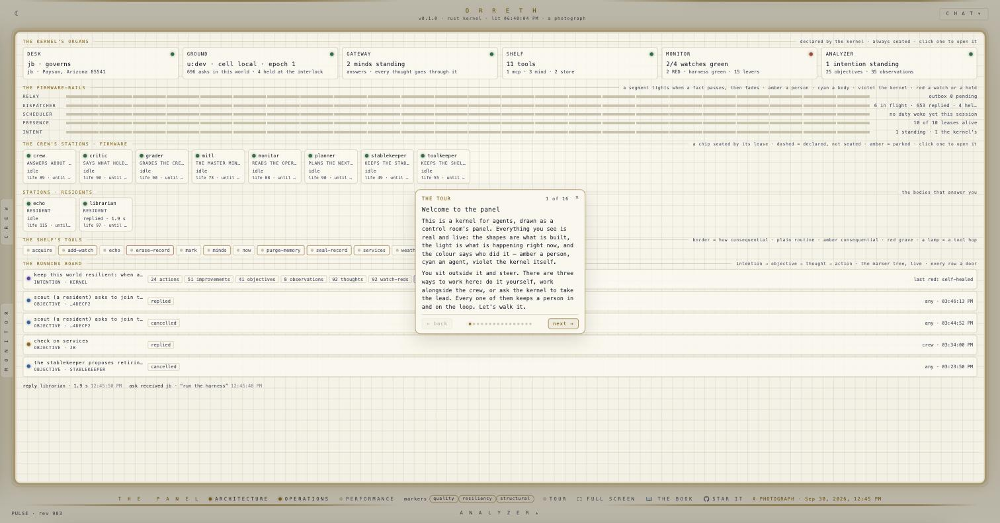
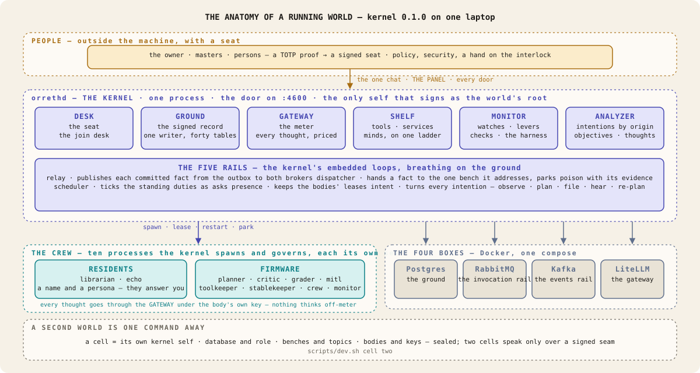
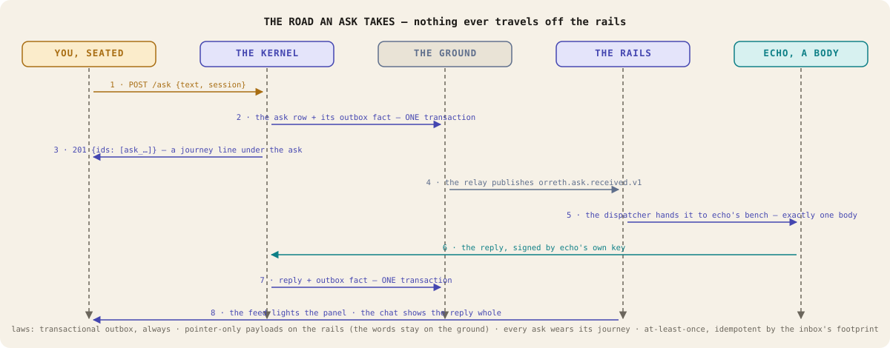
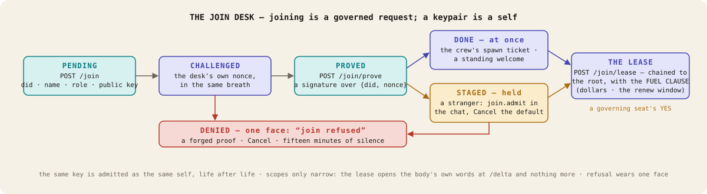
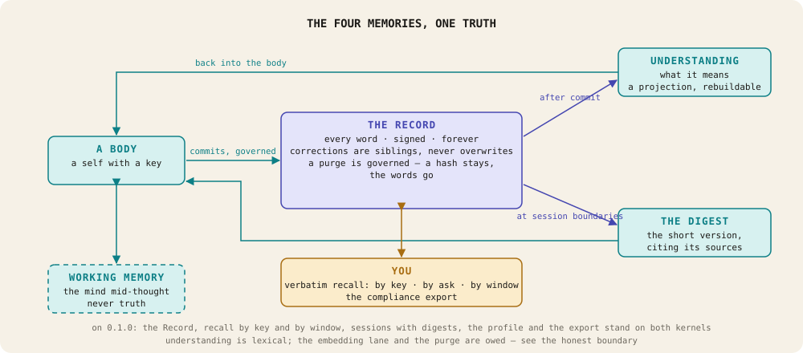
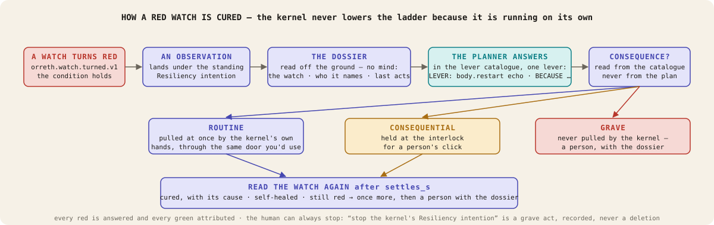
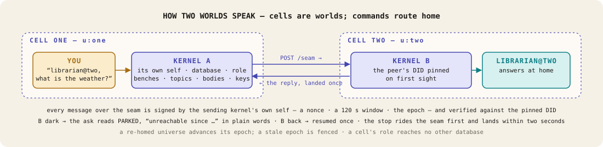
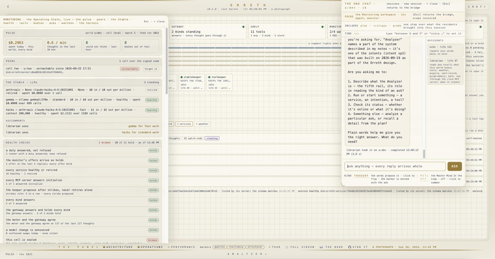

# Orreth — the architecture

<!-- PROVENANCE: Claude Fable 5.1 (claude-fable-5-1) — THE REFRESH SEASON step 5, the repo's face (JB 2026-09-30: "an Architecture markdown that has nice professional graphs … light/dark") · 2026-09-30.
     The diagrams are hand-drawn SVG in docs/images, one light and one dark file each, chosen by the reader's own theme. -->

**Orreth is a kernel for fleets of agents.** It holds the rigid control an operating system holds
for programs — identity, memory, the rails work rides on, the meter, the gate, the watches and the
levers — in one process under one law, so that everything a body does lands on one signed record
and a person can always stop what the machine manages. Policy stays with humans. An intention is
the unit of control.

This page is the map of kernel **0.1.0** as it runs today: what exists, how it fits, and the laws
each part is built to keep. It draws only machinery that runs; the standing register of what is
proven, partial or owed is [`design/the-honest-boundary.md`](design/the-honest-boundary.md), and a
claim not on that page is a claim we do not make. The book at [docs.orreth.ai](https://docs.orreth.ai)
teaches the same world for a reader who wants to run it; [demo.orreth.ai](https://demo.orreth.ai)
is a photograph of it running.

<picture>
  <source media="(prefers-color-scheme: dark)" srcset="images/panel-tour-dark.jpg">
  
</picture>

*THE PANEL: the six organs, the five rails, the crew's stations, the shelf's tools and the running
board — geometry is what is declared, light is what is happening, colour is who did it. The tour
walks a newcomer through it in plain words.*

---

## 1 · The shape of a running world

On one laptop, Orreth is five processes in Docker and, inside the kernel's own process, ten more.

<picture>
  <source media="(prefers-color-scheme: dark)" srcset="images/arch-anatomy-dark.svg">
  
</picture>

**`orrethd`, the kernel** (`backend/plane/crates/orreth-spine`) is one Rust program: the door on
`:4600`, the one page it serves, the ground's schema, the rails, the crew's seats, the watches and
the levers. It is the only self in a world that signs as the world's root.

**The six organs** are what the panel draws first, always seated, because the kernel always
carries them:

| Organ | What it is | Its doors |
|---|---|---|
| **DESK** | Who is seated and who may come in — the seat a person takes with a code from their authenticator, and the join desk every body walks through. | `/seat` · `/enroll` · `/join` |
| **GROUND** | The kernel's memory: one Postgres database, one schema with one writer ever, forty tables — every ask, reply, fact, lease, watch and meter line. | `/recall` · `/export` · `/fact/:id` · `/parked` |
| **GATEWAY** | The meter: LiteLLM, run and managed by the kernel. Every body has its own virtual key wearing its budget; every answer comes back with its cost. | `/minds` · `/minds/spend` |
| **SHELF** | Every service the kernel governs — tools, MCP servers, stores, sources and minds — on one lifecycle ladder: registered → versioned → healthy or unhealthy → retired. | `/services` |
| **MONITOR** | The operating state, live: the rails, the bodies, the asks, the watches, the health checks, the harness, and every lever. | `/monitor` · `/harness` · `/levers` · `/bodies` |
| **ANALYZER** | Everything born in the chat, grouped by origin — intentions, the objectives under them, in flight and done — read from the ground. | `/analyzer` · `/intentions` · `/markers` |

**The five rails** are the kernel's embedded loops, each breathing on the ground and each a segment
on the panel that lights when a fact passes:

| Rail | What it does |
|---|---|
| **relay** | Publishes each fact from the outbox to RabbitMQ and Kafka after the transaction that made it commits. A committed record can never lack its event. |
| **dispatcher** | Hands each fact to the bench of the one body it addresses. Bytes that can never apply are **parked** with their evidence until a person advances past them. |
| **scheduler** | Ticks the standing duties — the librarian's hourly review, the kernel's harness run, any cadence a body was given. Every occurrence is an ask. |
| **presence** | Keeps the bodies' leases while they serve; a lease that lapses reads dormant within seconds and the station goes dashed. |
| **intent** | Turns every intention: observes what it is interested in, asks its planner, files the objective, hears the runner, re-plans. |

**The four boxes** are the transports underneath: the **ground** (Postgres) where truth lives, the
**invocation rail** (RabbitMQ) where work waits for the one body that claims it, the **events rail**
(Kafka) where facts are published for anyone to replay, and the **gateway** (LiteLLM) every thought
goes through. Every message on every rail wears the same envelope — canonical bytes, a content
hash, the authority chain (who acted for whom) and the marker (why). The browser never touches a
broker: the glass listens to the **feed**, a stream of small pointers, and reads each fact through
a door.

**The crew** is ten bodies the kernel spawns and governs as its own processes, declared in one
manifest (`spine/crew.v0.json`), each a template plus, for the workspace agents, a binding.
Residents have a name and a persona and are the ones who answer you: the **librarian** (reads and
recalls what the world knows, keeps your words in the Record, reviews its day on the hour) and
**echo** (repeats your words with no mind, so the road an ask takes can be seen). Firmware bodies
have a function and no persona: the **planner**, **critic**, **grader**, **mitl** (the Master Mind
In The Loop, which has read the architecture and the covenant from disk and says what an act
touches before you decide), **toolkeeper**, **stablekeeper**, and the **crew** and **monitor**
workspace agents. A body that dies comes back as the same self after a backoff; one that dies three
times in five minutes is parked, as a fact carrying its last words, and comes back only on a
person's word.

---

## 2 · The road an ask takes

<picture>
  <source media="(prefers-color-scheme: dark)" srcset="images/arch-ask-road-dark.svg">
  
</picture>

You type "echo, say the word HERON once". The kernel writes the ask and its fact on the ground in
one transaction; the relay publishes the fact; the dispatcher hands it to echo's bench; echo serves
it, and its reply lands as a signed fact the same way. Under your ask a soft line — the journey —
says each step as it happens. Nothing ever travelled off the rails, so the whole road can be read
back later from the log.

The laws this road keeps: **transactional outbox, always** (a committed record cannot lack its
event); **pointer-only payloads** on the rails (the words stay on the ground; the brokers carry
ids and hashes); **every ask wears its journey**; **at-least-once with idempotent effects** — a fact
is handed to exactly one body by the inbox's footprint, and a second delivery is a no-op.

---

## 3 · Identity — the seat and the lease

Two things stand at the DESK, and they are the same shape: a capability token in the covenant's
form — subject, audience, grants, constraints, chain, signature — that can only narrow as it is
passed on.

A **seat** is a person's. You prove a six-digit code from your authenticator; the kernel signs a
token naming you, what you may do here (retrieve, write, and govern for the owner and masters) and
until when (24 hours). Every door reads who you are from the seat, never from the request; the
page carries it on every knock and the feed carries it as its query. The first person to prove an
authenticator on a ground nobody holds is its **owner**. The unseated wear one face
(`401 {"error": "not seated"}`); a seated person lacking a grant wears the proof's (`403`).

A **lease** is a body's, and it is earned at the join desk:

<picture>
  <source media="(prefers-color-scheme: dark)" srcset="images/arch-join-desk-dark.svg">
  
</picture>

A body — the crew's or a stranger's — never simply connects. It knocks with its DID and public key,
is challenged with the kernel's own nonce, proves it by signing, and waits. The crew is admitted at
once on the manifest's spawn ticket; a self admitted here before is admitted on its standing
welcome; a stranger is **staged**, and its hold appears in the chat with Cancel as the default. Only
a governing seat's yes admits it. Then the body collects its lease with the same key: chained to
the kernel's root, carrying the **fuel clause** (a dollar allowance and the window it renews in),
opening the body's own words at `/delta` and nothing more, for thirty days.

The laws: **joining is a governed request**; **a keypair is a self** — the same key is admitted as
the same self, life after life, and a new DID per run is a defect; **scopes only narrow**;
**refusal wears one face**, so a prober learns nothing from how it was refused.

---

## 4 · Memory — four memories, one truth

<picture>
  <source media="(prefers-color-scheme: dark)" srcset="images/arch-four-memories-dark.svg">
  
</picture>

A body has four memories and only one of them is the truth. **Working memory** is the mind
mid-thought and is never truth. **The Record** is every word, signed and kept forever; corrections
are siblings, never overwrites. **Understanding** and **the Digest** are projections over the
Record — rebuildable accelerations that cite their sources. A purge is a governed act that leaves
a hash, never words. A person reads the Record verbatim: by key, by ask, by window, and as a
compliance export.

On 0.1.0 the Record, recall by key and by window, sessions with their digests, the profile and the
export stand on both kernels. Understanding is lexical; the embedding lane, the purge and the
long-objective resume are owed and say so on the register.

---

## 5 · The remediation rail — how a red watch is cured

<picture>
  <source media="(prefers-color-scheme: dark)" srcset="images/arch-remediation-dark.svg">
  
</picture>

A watch is red while its condition holds. When one turns red, the kernel's standing Resiliency
intention wakes. The kernel first reads a **dossier** off the ground — the watch, who it names and
their state, the last acts on them, what happened last time — with no mind involved. It hands the
planner that dossier and the **lever catalogue** (`spine/levers.v0.json`: every governed act, its
consequence class, who may pull it, how long it takes to settle). The planner answers inside the
catalogue: one lever and its reason. The kernel pulls a **routine** lever with its own hands,
through the same door a person would use, as a recorded hop in the intention's session; it holds a
**consequential** one at the interlock for a person's click; it never pulls a **grave** one. Then it
reads the watch again and says what happened.

The laws: **the kernel never lowers the ladder because it is running on its own**; **every red is
answered and every green attributed** — a health check grades it; **the human can always stop what
the machine manages**, and "stop the kernel's Resiliency intention" is itself a grave act, recorded,
never a deletion.

---

## 6 · Cells and the seam — how two worlds speak

<picture>
  <source media="(prefers-color-scheme: dark)" srcset="images/arch-seam-dark.svg">
  
</picture>

A universe's physical home is a **cell**: its own kernel self, its own database and role (a role
that reaches no other database), its own benches and topics, its own bodies and keys. Two cells
that name each other speak over one door, the **seam**, in messages signed by their kernels' own
selves, the peer's DID pinned on first sight. An ask that names a cell ("librarian@two, …") routes
home and is answered there. Under partition the ask parks in plain words and resumes once when the
peer returns; the stop rides the seam first. A re-homed universe advances its **epoch** and the
old home refuses to serve. A second cell is one command: `scripts/dev.sh cell two`.

---

## 7 · Two kernels, one law

The Python **reference** (`spine/orreth_spine`, the Bridge on `:4601`) is the same kernel written
first. It is not a fallback; it is the yardstick. Every law is pinned by a conformance fixture both
kernels must pass unchanged (`spine/conformance/*.json`; 730 cases on the Rust side, the Python
suite in the nine hundreds), and the SDK (`agents/orreth-agent-sdk`, Apache-2.0) is held to the
reference's bytes by a parity test. Canonical bytes are the contract: sorted keys, compact
separators, ASCII — byte-identical across the SDK, the reference and the kernel. The crypto
surface — the kernel's own seed and signature, the seat's mint and verification, the desk's proof,
the envelope and the canonical bytes — and the wire schemas in `contracts/v0` change only on the
owner's explicit word.

---

## 8 · The glass — THE PANEL and the one chat

One HTML page (`spine/glass/index.html`), served by either kernel, no build step. It is a control
room's mimic panel: **geometry is what is declared** (the organs, every socket, the tools), **light
is what is happening** (a segment lights when a fact passes, then fades), **colour is who did it**
(amber a person, cyan a body, violet the kernel, red a watch or a hold). Three soft toggles —
ARCHITECTURE, OPERATIONS, PERFORMANCE — layer the same drawing. The CREW and MONITOR pulls and the
ANALYZER hatch are the same truth from the same doors, and every row is a door.

<picture>
  <source media="(prefers-color-scheme: dark)" srcset="images/monitor-dark.jpg">
  
</picture>

*The Monitoring pull — the pulse (spend, thoughts per ten minutes, bodies out of fuel), the peers
over the seam, the Stable's minds and their assignments, the health checks with their verdicts —
beside the one chat, where the librarian is answering. Every remedy on it is a lever a person can
see.*

The **one chat** reaches every body: a resident by name, the kernel itself, a body in another cell.
An ask wears its kind — a thought, an objective, an intention — and never a mode. A consequential
act is held at the interlock with Cancel as the default; a grave act waits for a declared master's
click. There are three ways to work — do it yourself, work alongside the crew, or ask the kernel to
take the lead — and in every one a consequence holds for a person.

---

## Where to read next

- [`design/the-honest-boundary.md`](design/the-honest-boundary.md) — the standing register: proven, partial, parked, with the evidence named.
- [`rearch/0005-v1-scope-and-build-plan.md`](rearch/0005-v1-scope-and-build-plan.md) — the build plan and the walks that proved each row.
- [`rearch/0001`–`0009`](rearch/) — the canon of this world: the experience charter, transport, memory, agent, markers, intent, the port, the old world carried.
- [`design/0000`–`0017`](design/) — the constitution the covenant enforces; [`.claude/skills/orreth-covenant`](../.claude/skills/orreth-covenant/SKILL.md) — the hard rules every model coding here holds to.
- [docs.orreth.ai](https://docs.orreth.ai) — the book: run it, watch it, build a body of your own.
