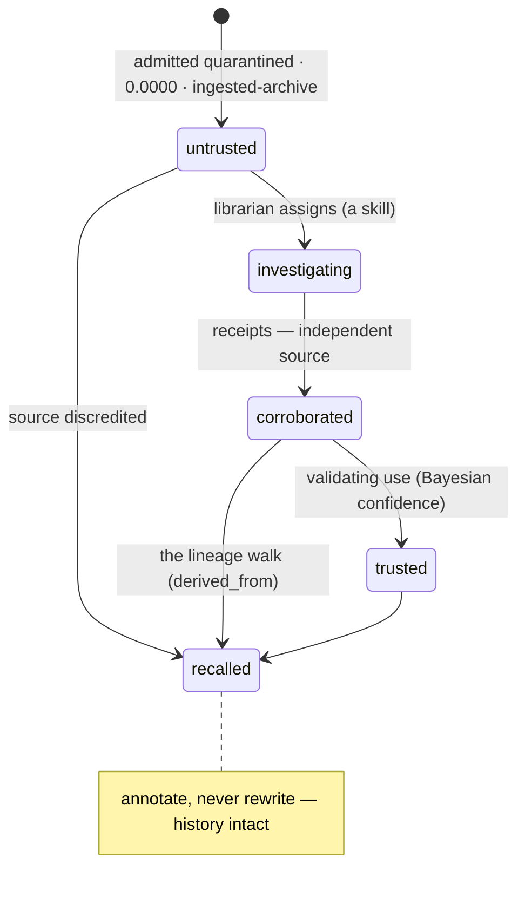

# 0014 — The Knowledge Loop (learning from the world)

*Design draft — proposed by Fable 5 from JB's Topic-1/Topic-3 dialogs (`../vision/the-knowledge-loop.md`
holds the vision; this is the shape). The self-correcting loop already learns from the universe's own
experience (0001 · 0005 · 0007); this dive teaches it to learn from the world — governed, quarantined,
recallable.*

---

## 1. The Knowledge Category

A first-class, versioned-by-universe-time corpus built around an **intent** ("cold-weather
architecture strategies"). Entries are MemoryRecords tagged to the category; **versioning is the
substrate's grain**: every improvement is a new signed record superseding its prior (`derived_from`
carries the lineage; annotate-never-rewrite). *What did we know about X, as of T* is a spacetime query.

```
KnowledgeEntry (a MemoryRecord body) {
  category      : slug            # the intent, as a queryable name
  claim         : text/object     # the knowledge itself
  source        : { did, ref }    # WHO the world was, when it spoke (the source registry)
  state         : untrusted | investigating | corroborated | trusted | recalled
  generation    : int             # hops from primary sources (model-collapse honesty)
  corroborated_by : [ContentHash] # the receipts that earned promotion
}
```

## 2. External sources as identities

Feeds hold DIDs and trust postures in a **source registry** (`did:web:tavily.com`,
`did:web:noaa.gov`, vendor MCPs). Provenance of the outside world: every entry names *which
identified source said this, where*. Without it, "verified" stops at our walls. Cloud-provider
MCPs enter here (the adaptive cross-cloud architect skills of JB's Topic 3).

## 3. The trust lifecycle (Topic 3, made mechanical)

External knowledge is **admitted quarantined**: `ingested-archive` provenance, **state
`untrusted`, confidence 0.0000**. Promotion is *earned*: investigation is a skill; a
corroborating independent source mints a new version at `corroborated` (the receipts ride
`corroborated_by`); sustained validating use reaches `trusted` (the Bayesian machinery is the
math; the state is the workflow). Rookie probation applied to knowledge — the pattern's third
application. **A universe that can see the whole web without believing it.**



## 4. The recall (the immune system's adaptive arm)

Discredit a source → every entry from it, and every version **derived** from those (the
`derived_from` walk), is enumerated and re-versioned to `recalled` — annotate-never-rewrite, the
lineage preserved, the poison visibly dead. Detection lenses: source discredit, intent mismatch,
and the **outcome lens** (0005: which knowledge versions do failing runs have in common?).
Consequential removals stage through 0012; discredit-beats-delete by default.

## 5. The organ, and what waits

The knowledge-acquisition organ is **becky-shaped — agent AND infrastructure** (JB's Topic-2
correction): deterministic retrieval when an agent asks; LLM synthesis (through the model plane,
0016) when a human asks. Full organ treatment lands with 0015's chassis. **Datasets as frozen
artifacts** (content-addressed slices pinned before distillation) land when the first training
consumer exists. Contract schemas follow the 0016 posture: once the shape survives real usage.

---

*Admitted quarantined · promoted on receipts · recalled by lineage · versioned by time itself.
The library becomes a culture, and the culture keeps its immune system.* 🥂
