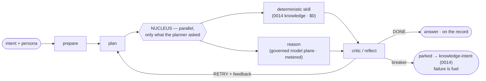

# 0015 — Orreth.agent: the Chassis (running)

*Design + first implementation — from JB's Topic-2 dialog (`../vision/orreth-agent-the-chassis.md`
holds the vision). The founding move applied to cognition: one loop whose architecture never
changes; Policy, Prompts, Skills, Persona are the profile.*

## The loop (implemented: `orreth_sim/chassis.py`)

- **Cognition is injected** (`think(class, prompt)`) — the same chassis runs on a stub in tests
  and the governed model plane (0016) in production. The loop never knows which.
- **The nucleus holds the plan and executes ONLY the planner's observations — in parallel**
  (least-privilege attention). Each observation is either a **deterministic skill** (instant,
  free — e.g., a 0014 KnowledgeCategory lookup) or a **reason** call through the governed door.
  The becky-shaped duality, visible in one fan-out.
- **The breaker doesn't fail — it PARKS**: the unsolved intent lands in memory tagged
  `knowledge-intent`, a handoff to the librarian (0014). Failure is fuel.
- **Every cycle is on the record** (trace now; RunRecords with context_hash as the loop matures)
  and every token is metered through the plane.

## Proven (2026-07-04)

Hermetic: parallel skill+reason observation, single-cycle completion, breaker-parks-as-intent
(42/42 suite). Live: persona "frost" answered a Leadville envelope question in one cycle —
3 parallel observations, the corroborated 0014 claim flowing verbatim into the answer at $0,
836 metered tokens total. The two loops met.

## Matured (2026-07-08)

- **Chassis-as-GraphSpec** (0008 compile target): `orreth_sim/graphspec.py` — the loop as
  a content-addressed, steward-signed artifact carrying its own narrative (sentence ↔
  node/edge bijection, kept by construction). `compile_chassis` binds ONLY the skills the
  spec names (least-privilege attention starts at the artifact) and refuses at SAVE — an
  unbound skill, a tampered id, a broken bijection — never at incident review. The schema
  hardens into `contracts/` only after 0008 is blessed.
- **RunRecords per cycle with context_hash** — landed 2026-07-04; every cycle of thought
  is a signed RunRecord pinned to the ResolvedContext it ran under.
- **The parked-intent → librarian → retry circuit closes automatically**:
  `librarian.retry_parked` sweeps every handled assignment still open, retries the intent
  with the commissioned knowledge as a lookup skill (claims wear their state honestly),
  and a DONE writes a `parked-closed` record deriving from the whole arc — the lot
  empties itself, receipted, annotate-never-rewrite.
- **Class escalation on critic uncertainty**: the `ladder` profile knob — every RETRY
  climbs one rung; doubt buys altitude, bounded by the profile. No ladder → fixed class,
  exactly as before. The ladder is data, like everything else.

## What matures next

Persona as cascaded soft standard.

*One chassis, many costumes, one immortal thread each.* 🥂
