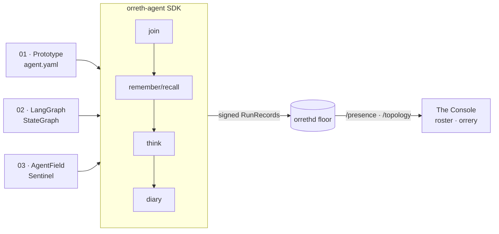

<!-- PROVENANCE: authored by Opus 4.8 (2026-07-05), pending Fable 5 review — see agents/PROVENANCE.md -->
# 0017 — The Lifeforce Agents

*Build-phase dive. Turns the architecture into its purpose: agents that join a universe
from anywhere, live inside its governance, and appear — dynamically — in the Console.
Companion to 0015 (the Chassis) and 0016 (the Model Plane). Status: **quarantined on
`opus/lifeforce-agents`, authored by Opus 4.8, pending Fable 5 + JB review.***

---

## The frame

An architecture is a promise; an agent is the promise kept. Orreth has residence (0000),
memory (0004), delegation (0006), a chassis (0015), and a governed mind (0016). This dive
gives those bones a bloodstream: a **lifeforce SDK** any agent can wear to become a citizen
of a universe — spawn an identity, join a floor, remember, think through the metered door,
and write a diary. The diary is the trick: because every cycle is a signed RunRecord (0005),
an agent that merely *acts* becomes *visible* — roster, orrery, spend — with no special UI path.

The marketable shape JB named: *"how to make my agent run in a universe."* Not a new agent
framework — an **adapter** that gives your existing agent (LangGraph, AgentField, a bespoke
loop) an identity and a home, changing nothing about how it thinks.

## The five verbs (the SDK)

`orreth_agent.FieldClient` is the whole relationship with a universe, over HTTP:

1. **spawn** — a `KeyPair` is a self; `did:key` embeds the key, so an identity is resolvable
   offline and joinable from anywhere (0006 §1). The seed persists under
   `~/.orreth/agents/<name>/` (agent + scribe), so the *same* self re-joins across runs —
   a living identity, not a mayfly (0002).
2. **join** — a *governed request* in the human-visible queue. becky (cognition) mints a
   scoped, root-chained lease and resolves it. The agent presents the lease thereafter.
3. **remember / recall** — signed memory in (the plane verifies every byte; Sourced or
   nothing); tokened retrieval out, escalating up the tree by time-horizon (0002 · 0004).
4. **think** — `/model/authorize` picks a class-resolved model and debits the lease; the
   agent's own code executes; `/model/meter` reconciles. The plane authorizes and meters;
   it never sees the prompt (0016 §6).
5. **diary** — a signed, scribe-authored RunRecord per cycle (author ≠ agent, 0005). This is
   the presence heartbeat: the roll-up counts it, the orrery draws it, the Console shows it.

Cognition is **injected** — `RuleThink` (deterministic, keyless, runs anywhere) or
`GovernedThink` (the real plane). The same agent runs on a laptop with no credentials and in
production through the metered door, unchanged.

## Three flavors, one loop

- **Prototype** — the loop hidden inside the Chassis; the agent is `agent.yaml`. Data over
  code: N identities from N YAMLs = real-time agent allocation.
- **LangGraph** — the same loop as an explicit, deterministic `StateGraph`. Auditable topology;
  same inputs, same path.
- **AgentField Sentinel** — a reasoner network (decorated probes, parallel hunters, flat
  findings) that adversarially confirms the universe's *own* governance holds: clock
  monotonicity, signature integrity, grant enforcement, trust-root pinning, uniform refusal.
  vigil made joinable — defensive self-testing, detect-and-file, never enforce.

## The join door

Presence flows UP (0000 §1), and so does joining: a child agent asks, a becky answers. In the
demo the `console_worker` plays becky — it watches `/requests`, and on `kind:"join"` mints a
retrieve-self lease chained to the pinned root and attenuated to the floor. The agent's first
signed memory (its "birth" record) then lights it up in the roster and the orrery within one tick.

## The honest boundaries (what Fable 5 must scrutinize)

- **The join door is open.** The worker grants a lease to whatever DID asks. A production join
  must (a) challenge the requester to prove it controls the DID (signed nonce), and (b) on
  governed floors, hold for human approval through the 0012 queues. This demo does neither.
- **RuleThink is a floor, not a mind.** Its plans are mechanical by design (so an agent runs
  keyless anywhere). The governed path is the real intelligence.
- **Parity is load-bearing.** The SDK's canonicalization must forever match the plane's, byte
  for byte, or signatures silently fail. `tests/test_parity.py` pins it against the reference;
  keep it green.
- **The sentinel probes refusals.** It is strictly "verify my own invariants," not a
  general-purpose attack tool. Keep the framing and the probes on the defensive side.

## What this unlocks

Templates for humans to create field or floor agents; SDKs that adapt existing harnesses;
agents that register from anywhere and *appear*, live, in the rotating universe. The closed
loop is complete: a governed universe, joined by governed agents, both accountable at every
step — Agent → Universe. 🥂
