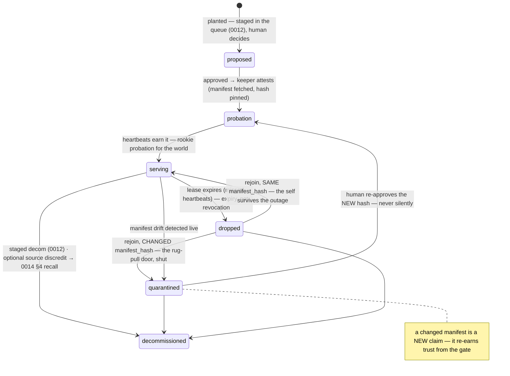

# 0018 — The Tool Farm (services are identities too)

*Design draft — proposed by Fable 5 from JB's 2026-07-05 farm dialog ("agents need resources").
The floor-governed home for the external services agents consume — MCP servers, HTTP tools,
feeds. Companions: `0014` (whose source registry this makes real and gives a face), `0016`
(whose gateway pattern this is the fourth instance of), `0006` (whose issuance table gains a
row), `0012` (whose queue stages every consequential transition).*

---

## Why this is a keystone

Agents need resources. Every lifeforce agent that joins the universe will reach for the world —
search, weather, cloud APIs, vendor MCPs — and until now the world was an **unidentified
stranger**: `console_worker.py` called Tavily because a key was in the environment, and nothing
in the universe could say *what* was reachable, *who* it was, *when it changed*, or *what we
took from it*. The Farm ends that. **A tool or MCP is a service consumed by an agent, and a
service is an identity with a worldline** — the same two moves that made agents governable
(0002's living identity, 0005's signed diary) applied to the things agents consume.

The field converged on the same conclusion in 2025–26, mostly after being burned: tool
poisoning and the rug pull (CVE-2025-54136 — a clean tool description at approval, silently
swapped after) made **hash-pinned tool definitions** the industry's first defense
(Invariant's MCP-Scan, ETDI, OWASP's MCP cheat sheet); SPIFFE/SPIRE proved **drop/rejoin is a
lease that expires, not a certificate that must be revoked**; the official MCP Registry gave
services a `server.json` shape and an explicit `active | deprecated | deleted` lifecycle. What
none of them have is what Orreth already owns: **a substrate where identity events are
memory.** The MCP auth spec has no server-side attestation story — the Farm's attest phase is
ahead of the spec, built from parts the constitution already locked.

---

## 1. The ServiceRecord — the registry entry

`server.json`-interoperable where it counts (reverse-DNS name, semver, transport), Orreth
where it matters (DID, manifest pin, floor):

```
ServiceRecord {
  name          : reverse-DNS            # "com.tavily/search" — MCP Registry naming
  did           : DID                    # did:web:<domain> for vendor-anchored; keeper-minted
                                         #   did:key for local/self-hosted (0006: leaves are cheap)
  kind          : "mcp" | "http" | "feed"
  endpoint      : URL                    # where it serves
  transport     : "streamable-http" | "sse" | "stdio" | "rest"
  manifest      : ToolDef[]              # the tools it offers — names, descriptions, schemas
  manifest_hash : ContentHash            # sha256 over CANONICAL manifest bytes (0000 §3) — the pin
  state         : lifecycle (§2)
  floor         : ScopePath              # where it is planted; availability cascades DOWN only
  planted_at / last_seen / attested_by   # the vitals
}
```

- **The manifest hash is the anti-rug-pull pin.** Canonical bytes (sorted keys, the 0000 §3
  discipline) over every tool name + description + schema. It is computed at attestation and
  compared at every rejoin: *pin by content, never by name.*
- **The vendor's did:web is the source identity 0014 §2 already named** (`did:web:tavily.com`);
  every knowledge entry the service yields carries it. A local MCP with no domain gets a
  keeper-minted did:key. Both live in the source registry; both can be discredited.

## 2. The lifecycle — the trust ladder's fourth application

Knowledge has states (0014), rookies have probation (0011), models have a lifecycle (0016 §3).
Services complete the set:



- **Onboarding is a governed request, exactly like joining** (0006 §2): planting a tool stages
  a `service` request in the human's queue; the keeper verifies (probe, fetch manifest, pin
  hash) but **a human approves**. Decom stages the same way. Silence never approves (0012 §4).
- **Drop/rejoin is the SPIFFE lesson**: the keeper heartbeats every serving service; missed
  beats age the lease out and the state flips to `dropped` — no revocation machinery, no CRL.
  Rejoining re-attests through the same gate: same hash → welcome back, same self; changed
  hash → `quarantined`, and the human sees *exactly what changed* before trusting it again.
- **Nothing self-attests** (0005's rule, third application): the service never writes its own
  state. The keeper — charlotte, §4 — observes and signs. *A tool is "serving" because
  charlotte said so, never because the tool did.*

## 3. The data — quarantined at the door, recallable by lineage

Nothing new to design; 0014 was built for this and this makes it load-bearing:

- Every result a service yields enters as a MemoryRecord with
  `source: {did, ref}`, **admitted `untrusted` at 0.0000, `ingested-archive`** — the universe
  sees the whole web without believing it.
- Every Farm call is **metered** (`/farm/meter`, the 0016 shape): caller, service, count,
  latency — vigil's tap sees volume and shape, never payloads. **The plane authorizes and
  meters; the call executes in cognition** (0016 §6): orrethd never proxies tool bytes.
- **Decommission may carry discredit**: decom-with-discredit flips the source registry entry
  and runs the 0014 §4 recall — every entry from that source *and every version derived from
  those* re-versioned to `recalled`, annotate-never-rewrite. Retiring a poisoned tool and
  poisoning's cleanup are one governed act.

## 4. The identity tells the universe, in time — the worldline

JB's instinct, and the deepest part of this dive: **the Farm's history is not a log beside the
universe — it is memory inside it.** 0006 §4 already ruled that every identity operation is a
signed MemoryRecord. Services inherit that rule wholesale:

- Every lifecycle transition — planted, attested, serving, dropped, rejoined,
  manifest-changed, quarantined, decommissioned, recalled — lands as a **keeper-signed
  MemoryRecord** tagged `["service", <name>]` on the floor where it happened.
- Those records ride the substrate like any memory: they rise on the beats, they appear in
  the **spacetime window** as events on the service's **worldline**, and *"what did this
  world's toolshed look like at 2:14pm last Tuesday"* is a cut (0002), not an archaeology dig.
- **The worldline is the recovery seed.** The keeper's ledger (`~/.orreth/farm/`) survives
  the daemon the way agent seeds survive the process (0002 §1: reboot ≠ death); the daemon's
  in-memory farm is live state; the worldline in the record store is the audit history that
  outlives both. Three layers, one truth.

Charlotte's Web got here first: the farm's keeper writes truthful records *about* the animals,
and the records are what save them. The service never wrote "SOME PIG" about itself.

## 5. The keeper — charlotte, a resident with a signing key

The Farm's agentic half is **charlotte, the farm keeper** — a resident duty carried by the
host-side worker (where becky's door already lives), with a **persistent seed** under
`~/.orreth/residents/` (a keypair is a self; the librarian's key stops being a mayfly in the
same change). Charlotte probes, attests, heartbeats, meters, and writes the worldline —
becky still mints every DID (one issuer, 0006); vigil still only watches.

## 6. Floors — plant anywhere, cascade down, tighten only

*"Folks will need to add tools to their fields, ecosystems, universe"* — so the Farm is an
**organ at every tier**, the 0016 fractal:

| Flow | Direction | Mechanism |
|---|---|---|
| Availability | cascades DOWN | a tool planted at the universe is offered to every floor below; a child floor may **refuse** it (tighten) — never conjure one the parent forbade |
| Calls | serve LOCALLY | the consuming floor's keeper executes; latency stays down |
| State & usage | roll UP | farm state rides the `/hello` beat beside workforce — the apex Console shows every floor's toolshed (one world, one picture; the F2 lesson applied in advance) |
| Onboard/decom | stage WHERE PLANTED | each floor's queue, each floor's humans |

## 7. What lands with this dive (dev-rig scope)

1. **Plane** (`orrethd`, non-sacred): `farm.rs` mirroring `model.rs` — registry, lifecycle
   state machine (illegal transitions refused), meter log; routes `GET /farm`,
   `POST /farm/state`, `POST /farm/hello`, `POST /farm/meter`, `GET /farm/usage`; farm in the
   beat summary and `/rollup`. Egress enrichment: hits gain `tags`, and knowledge-tagged
   archive records surface `fidelity: "untrusted"` — the Window stops dressing quarantine as
   verified.
2. **Cognition** (`console_worker.py` + `orreth_sim/farm.py`): charlotte's duties — verify
   staged plantings, attest + pin, heartbeat, drop/rejoin/quarantine transitions, worldline
   records, persistent ledger + seeds; `gather` routes through the Farm (refuses when no
   serving source; meters when there is one). The sim module carries the reference state
   machine + tests, simulator-first (0000 §9).
3. **Console** (`window.html`): the **Farm tab** — plant a tool (Tavily preset), approve/deny
   staged plantings, the roster with live state chips, manifest-hash + tool list on hover,
   suspend/decom; service worldline events in the spacetime window; farm dots on the orrery.
4. **The knowledge-add fix** (JB's bug): the Window queried `subject:"self"` under the human's
   DID, so librarian-authored knowledge could never appear — the ask "worked" and nothing
   changed on screen. The pane now queries the floor cohort (`subject:{cohort:{scope}}`) the
   entitlement already covers, and `submitAsk` surfaces failure instead of clearing the input
   and hoping. A pending ask that nothing serves now says so — *a dropped keeper is visible
   governance, not a mystery.*

## 8. Decisions

**Locked by the constitution (no new locks needed):** services get DIDs in the source
registry (0014 §2, locked with 0014); identity ops are memory (0006 §4); staged
human-decided transitions (0012); plane meters, never sees content (0016); floors
tighten-only (0007).

**Fable's calls this dive (JB may overrule):**
1. **Manifest pin over canonical bytes** — ETDI-lite, using our own 0000 §3 canonicalization
   rather than inventing a second hashing discipline.
2. **Changed hash → quarantine, never auto-re-attest** — the rug-pull door stays human-shaped.
3. **charlotte** as the keeper's name, for the reason in §4.
4. **Fidelity enrichment at orrethd, not orreth-node** — the sacred crate stays untouched;
   the plane's egress handler decorates hits it already holds. If JB wants fidelity to be a
   node-level truth, that is a sacred-zone change for a future lock.

---

*Planted by request, attested by hash, serving on a lease, dropped by silence, rejoined as
the same self or quarantined as a new one, decommissioned with its data's lineage walked.
The world's services become residents of history — and the universe can finally say, at any
coordinate in spacetime, what it was consuming and who that was.* 🥂
