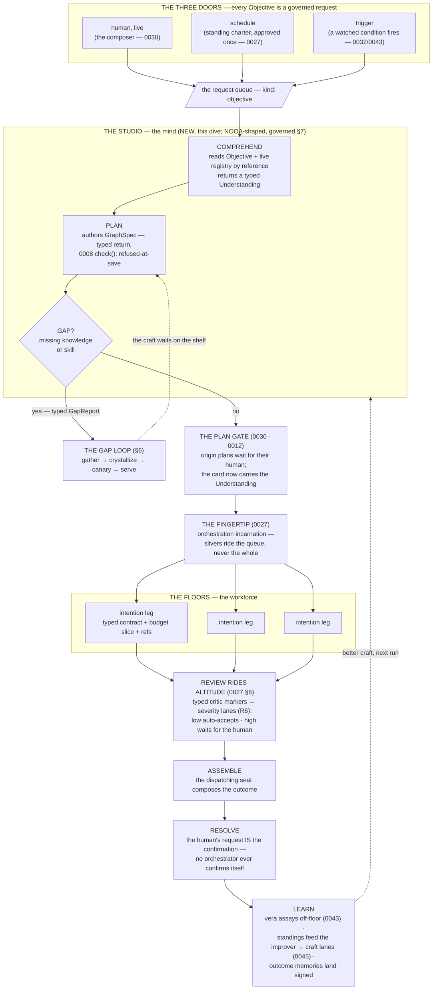
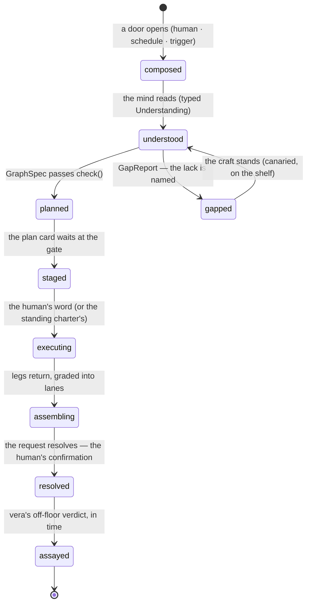
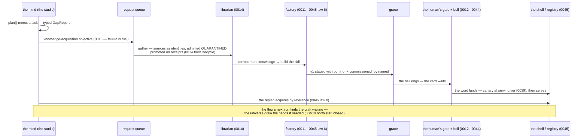
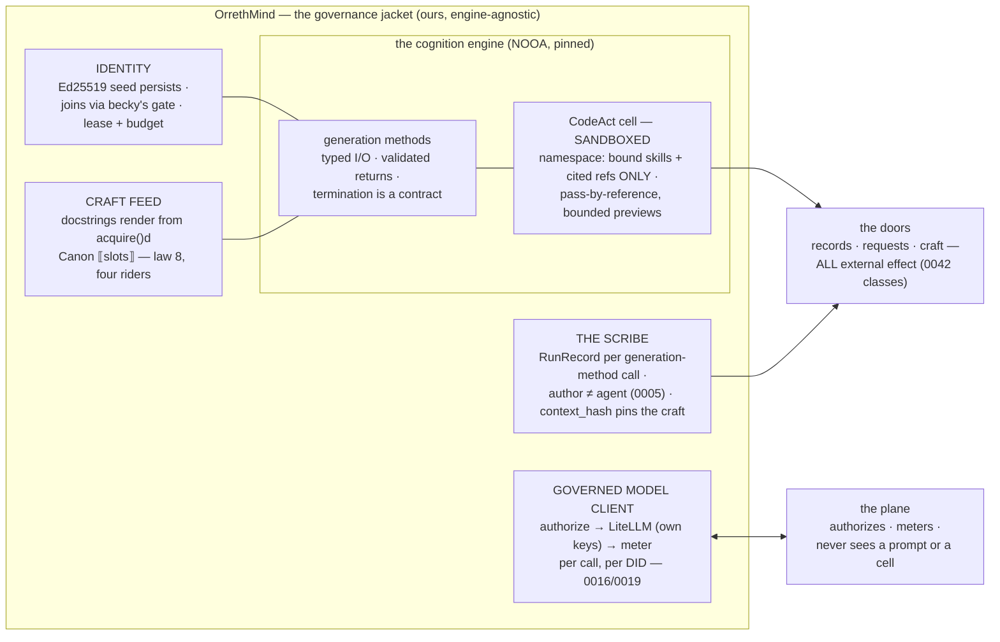

# 0047 — The Universe Learns to Think

<!-- PROVENANCE: Fable 5 (claude-fable-5) — designed with JB 2026-08-07, from the
NOOA deep-dive session (arXiv:2607.20709, NVIDIA-NeMo/labs-OO-Agents) and JB's
seed the same day. Status: DRAFTED — awaiting JB's locks (§9). -->

*Drafted 2026-08-07 · Fable 5 with JB · status: **BUILDING — locks 1+2
approved as recommended (JB, 2026-08-07: the `nooa` engine pinned-and-jacketed;
the studio as one seat on the universe floor) · sp1 LANDED+PROVEN the same day
· locks 3–6 open (§9)**. Companions: `0008` (GraphSpec — the plan's type), `0012` (gates),
`0014` (the knowledge loop), `0015` (the chassis + the parking lot), `0016`/`0019`
(the plane and the universal meter), `0027` (the fingertip — the only executor),
`0030` (the human's seat, the plan gate), `0040` (the Faculty — its north star is
this dive's demand; its build stays parked), `0042` (the deed — effect classes),
`0043` (the Observatory — the off-floor yardstick), `0045` (the Craft Room —
commission and supply line), `0046` (the voice this dive gives a mind to).*

---

## 1. The seed (JB, 2026-08-07, after the NOOA deep dive)

> "The governance is clear while the ability to manage an objective through its
> results lifecycle feels very NOT READY — a lack of a reproducible cognition
> harness. Today, I don't have a sense that Orreth is intelligent."

And the demand, in full: Orreth must deliver Objectives **applied live by a
human** or **assigned as a schedule or trigger to a Resident/Agent** — and when
analysis of an Objective finds **missing knowledge or skills, the universe
creates the knowledge and makes the skills**. That last sentence is 0040's
north star verbatim; what was missing was a mind capable of *noticing the lack*.
This dive is where the designs start working together.

## 2. The honest finding — what the code says today

Walked on 2026-08-07, file and line:

- **Planning is arithmetic.** `curate_plan()` (`console_worker.py:3114`) fans an
  Objective over floor topology and slices the budget evenly. No model reads
  the Objective at planning time on the wire.
- **An intention carries only its own sentence** — `{of, intent, budget, refs}`
  and prose. Delivery is graded by reading prose.
- **The mind's only seam is flat text.** Cognition everywhere is
  `think(class, prompt) -> str`; the planner's observations are recovered by
  parsing `OBSERVE …:` lines (`chassis.py:88`), the critic's verdict by parsing
  `DONE:`/`RETRY:`.
- **Judgment is truncated and lossy.** vera's judge receives the work as
  `json.dumps(o)[:900]` and a verdict that fails to parse is
  "LOST — voided, never scored" (`console_worker.py:6705-6717`).

Forty-six dives made cognition *governable* — identity, meter, gates, scribes,
assay, epoch, craft. That was the right order: the skeleton before the mind.
The skeleton is done. The mind is a stub.

## 3. What NOOA proved, and the fusion law

NVIDIA's Object-Oriented Agents (NOOA) demonstrated — 97.9% zero-shot interface
fluency across ten models, SWE-bench 82.2% from a 253-line agent at half the
tokens of its rivals — that six capabilities on one surface make current models
dramatically more capable *and cheaper*:

| NOOA capability | The Orreth lack it answers |
|---|---|
| **Typed I/O** — signatures are contracts, returns validated, failures re-prompted | `OBSERVE:` parsing · LOST verdicts · prose-graded intentions |
| **Validated termination** — no completion without a type-valid result | unsupported "done" declarations; the plan that can't prove it planned |
| **Pass-by-reference** — live objects, bounded previews; data scale bounded by runtime, not context | the `[:900]` judged work · the 2,000-char grounding ceiling |
| **Code as action** — the model computes by writing Python over its inputs | single-shot flat-text thoughts that cannot inspect anything |
| **Object state** — durable, model-visible fields, not transcript archaeology | context rebuilt from strings every call |
| **Model-callable harness APIs** — context and events as APIs | none |

NOOA has **no governance at all** — no identity, no meter, no independent
verification, an unbounded in-process action surface. The fusion law of this
dive, one line:

> **NOOA-shaped cognition inside; Orreth doors at every boundary.
> Code as action for thinking; governed requests for consequence.**

## 4. The laws

1. **The mind is a citizen, never a self-replacement.** The cognition object is
   a *chassis*; the self is the persisted Ed25519 keypair that wraps it
   (rule 1 — the F1 mayfly lesson, kept at this door too). The mind joins
   through becky's gate, holds a lease, and re-joins as the same self.
2. **Typed thought or no thought.** Every mind-facing boundary is a typed
   contract. The planner's return type is a GraphSpec that must pass 0008's
   `check()` — **refused-at-save becomes the mind's return validator**: it
   cannot say "planned" without emitting an artifact that survives the law.
   Verdicts, critic markers, gap reports, and understandings are typed returns;
   a validation failure re-prompts the model. The LOST verdict becomes
   structurally impossible.
3. **Every thought is authorized and metered.** Each model call inside the mind
   is `authorize → execute (caller's own keys, LiteLLM) → meter`, per call,
   under the mind's DID (0016/0019 untouched). The plane picks the stall from
   the class ladder and never sees a prompt or a cell.
4. **A typed return is a floor, not a verdict.** Type-valid is *well-formed*,
   not *true*. Scribe-signed RunRecords per generation-method call
   (author ≠ agent, 0005); vera assays off-floor (0043). Nothing self-attests,
   including the new mind.
5. **Code as action for cognition; doors for consequence.** CodeAct cells run
   sandboxed, and their namespace holds **only** floor-bound skills and cited
   refs — never open imports, never credentials. A cell that computes is
   metered thinking; a cell that would touch the world doesn't exist — every
   external effect exits solely as a governed request wearing its 0042 effect
   class, through the gates, on the record.
6. **Craft served, never embedded.** The mind's prompts are its docstrings, and
   its docstrings render at build time from `acquire()`d Canon records
   (⟦slots⟧, law 8 + all four riders). The mind's firmware is readable and
   releasable in the Craft Room like every resident's — a mind whose driving
   words are invisible would reopen the exact trust gap 0045 closed.
7. **The gap is fuel, mechanically.** Plan-time gap analysis returns a typed
   GapReport; each gap becomes a **knowledge-acquisition objective** riding the
   organs that already exist — 0015's parking lot, 0014's quarantined gather,
   0045's commission, 0039's canary. The replan finds the craft waiting.
   0040's north star stops being prose and becomes a closed loop (§6).
8. **Pass-by-reference ends the truncation era.** The mind and the judges hold
   whole records and live registry snapshots; prompts carry bounded previews.
   Where a ceiling bounds *judgment* (the judged work, the plan's evidence),
   it falls. Where it bounds *chat* (the parlor kit), it stays — right-sized
   is not the same as truncated.
9. **One engine, still.** The mind **authors** GraphSpec; only 0027's fingertip
   executes across seats, and the request queue remains the only transport
   between seats (0040's law, verbatim: no second execution engine exists or
   ever will). CodeAct loops live *inside* one seat's cognition — a way of
   thinking, never a way of dispatching.
10. **The mind is reproducible or it doesn't ship.** A capability bench lands
    in conformance beside the suite — NOOA's 88-test pattern, made ours:
    deterministic on a stub `think`, live-fired per model class on the rig.
    Every thought is replayable: craft pinned by `context_hash`, model and
    version named in the RunRecord, event history on the signed log. This is
    the "reproducible cognition harness" of JB's seed, answered directly.

## 5. The lifecycle of an Objective — where the designs work together

Three doors, one law: **every Objective is a governed request**, whoever or
whatever composes it.

- **The human, live** — the composer (0030). The origin plan waits for its
  human, exactly as today.
- **The schedule** — a standing incarnation (0027 §4): the charter is approved
  **once** at a human gate; instances then flow on the beat, each metered
  within the charter's budget, each on the record.
- **The trigger** — a watched condition stages an Objective the way the
  serials desk stages a delivery and the Observatory stages a finding
  (0032/0043): the condition fires, the Objective lands in the queue wearing
  its cause, and detection wears no levers — consequential instances still
  gate.

An Objective may be **assigned** — to a resident (its charter checked; outside
charter, the 0046 referral law answers honestly and names who keeps it) or to a
citizen agent (entitlement checked at dispatch, refusals uniform).

The states an Objective wears, end to end:

## 6. The gap loop — the universe grows the hands it needs

JB's vision sentence, made mechanical. Every organ below already exists; this
dive gives the loop its *detector* and closes it.

Two honesty rules ride the loop:

- **The gap loop is itself governed.** An acquisition objective is a normal
  Objective: budgeted, gated where consequential, on the record. A mind cannot
  commission unbounded gathering any more than a human can.
- **A gap unfilled is a plan honestly smaller.** If the gate declines the
  skill, the plan re-authors *without* it and says so on the card — never a
  silent degradation (0039's never-silently-dumber, applied to plans).

## 7. The mind's anatomy — the governed NOOA jacket

The engine is NOOA's (pinned, hash-declared like a stall); the **jacket is
ours** and engine-agnostic — 0000's "lift the contract, port the engine" hedge
applied to cognition. If NOOA churns or dies, the jacket re-homes.

Runtime shape: the mind runs as its own host-side citizen process (the flavors'
pattern — `agents/flavors/03-mind/`, containerized on the dev rig), never
inside the plane, never inside the worker. Cells execute under the sandbox
posture locked in §9. Per-method model classes map onto the ladder:
comprehend ≈ `medium`, plan ≈ `high`/`xhigh`, gap-check ≈ `medium` — each
`authorize` picks the stall, the stable's lifecycle law unchanged.

## 8. The convergence map — which design supplies which organ

| Design | The organ it supplies in this lifecycle |
|---|---|
| 0008 | GraphSpec — the plan's **type**; `check()` as the planner's return validator; the sentence↔node bijection the plan card will one day wear |
| 0012 | the gates — plan gate, gap-loop gates, HITL-inside-flow |
| 0014 | the knowledge loop — quarantined gather, sources as identities, promotion on receipts |
| 0015 | the chassis lineage + **the parking lot** — failure is fuel; the breaker parks, never lies |
| 0016 · 0019 | the plane and the universal meter — every thought authorized, executed on the caller's keys, metered, rolled up |
| 0027 | the fingertip — the only executor; slivers, review-rides-altitude, standing incarnations (the schedule door) |
| 0030 | the human's seat — origin plans wait; the request's resolution is the only completion confirmation |
| 0032 · 0043 | the trigger door's precedent (staged findings, detection wears no levers) and the off-floor assay that grades the mind's work |
| 0039 · 0041 | canary/graduation for wire-born skills; the epoch ceremony that releases the mind's own firmware |
| 0040 | the north star this dive closes; the one-engine law; the Faculty package stays parked as the *product* form of what the studio proves |
| 0042 | effect classes — the only exit from a cell to the world |
| 0045 | the Craft Room — Canon-served docstrings (law 8), the commission that crystallizes gap-born skills, the room where the mind's words stay readable |
| 0046 | the voice — the mind's plan card and referrals speak from real grounding, in charter |

## 9. Decisions — staged for JB's locks

1. **The engine**: adopt the `nooa` package (version-pinned, declared like a
   stall, jacketed per §7) — **recommended** — or build a minimal CodeAct
   engine in the SDK. The jacket is ours either way; the hedge is structural.
2. **Where the mind lives**: one new seat — **the studio** — on the universe
   floor now (recommended), with 0040's e:planner ecosystem raised later as
   the product form. The Lab's glass (0040 §3) stays parked; only the planning
   *mind* un-parks.
3. **Sandbox posture**: cells in the flavor's container with NOOA's sandbox
   extras; namespace = bound skills + cited refs only; no network from cells
   (the doors are the network). To lock: whether the dev rig relaxes this.
4. **The retirement of `curate_plan()`**: the arithmetic planner becomes the
   declared fallback (unfueled floors, dark registry) — labeled on the plan
   card, never silent. Lock the label's wording.
5. **The worker question**: NOOA-shaped agents *executing* intentions on the
   floors is legitimate under law 8 — and deliberately **not this dive**.
   Parked as its own future dive; the planner earns the pattern first.
6. **Phasing** (§10): Phase A before Phase B, sp1 may start on JB's word ahead
   of the other locks (it has no new dependencies).

## 10. The spoonfuls

**Phase A — the mind stands.**

| # | Spoonful | Proof |
|---|---|---|
| 1 | **Typed thoughts** — structured, validated returns on the existing `governed_thought` seam: vera's verdicts and the critic's markers become typed (validation failure re-prompts; LOST becomes impossible); no new dependencies · **LANDED 2026-08-07** (locks 1+2 approved same day): `orreth_sim/typed.py` — the law (strict parse → ONE re-ask carrying the named error → the honest breaker, attempts counted); vera's raw `speak` bench lane (every ask metered BEFORE it is spoken, voids counted in `out["voided"]`, `asks` on the signed verdict); the chassis critic sim+SDK (a faceless word earns one re-ask, then an honest RETRY — never a guessed DONE); wire: `verdict-reask` firmware genesis-seeded at its birth (the 0045 extraction's precedent — later changes take the ceremony) + `_assay_floor`'s re-ask lane; suite 291→304 · **TWO FINDS ON THE LIVE ROUND**: (1) the first real assay since the Canon extraction LIT a latent 0045 break — `craft(u_port, …)` with no `u_port` in `_assay_floor`'s scope — fixed in the same spoonful; (2) the hardened examiner then measured the pre-0047 planner honestly: the deterministic legs scored **0.03 against the objective's own declared rubric** ("fails to name real numbers from the floors' own records") — the dive's thesis, read off the instrument sp1 just hardened | **PROVEN**: conformance — malformed→re-ask→typed with BOTH asks charged and `asks: 2` on the record; void only AFTER a real re-ask; the meter refusing mid-re-ask halts the beat loudly · LIVE — a real 6-verdict round, **zero LOST**, sonnet-5 bench at f:prod, 5 verdicts under the objective's declared rubric, `asks: 1` on today's signed records (the judges dressed their words right first ask — the malformed lane stands suite-proven, labeled honestly) — ✓ RAN |
| 2 | **The jacket and the bench** — `OrrethMind` in the SDK (identity · governed client · craft-fed docstrings · scribe per method · sandbox) + the capability bench in conformance (stub-`think` deterministic; live-fire per class) | the bench green on the stub; one live-fired method authorized, metered, and scribed under the mind's own DID |
| 3 | **The studio comprehends** — the mind's first duty: Objective → typed Understanding, read from the live registry by reference; the plan card carries it | as a human: compose an Objective and see, at the gate, what the universe *understood* before a single leg runs |
| 4 | **The planner authors** — plan() returns GraphSpec through `check()`; the fingertip executes it; `curate_plan()` demoted to labeled fallback | a real Objective planned by the mind, refused-at-save exercised (a bad plan refused loudly), the walk of the work naming the spec's hash |

**Phase B — the mind grows hands.**

| # | Spoonful | Proof |
|---|---|---|
| 5 | **The gap loop closes** — GapReport → acquisition objective → librarian gathers → commission crystallizes → canary → the replan finds the craft waiting | 0040's north-star walk, end to end, proven as a human: an Objective the universe *couldn't* do, done — every joint on the record |
| 6 | **The standing doors** — schedule and trigger objectives; the standing charter approved once at the gate, instances metered within it; assignment to a resident/agent with charter/entitlement honesty | a scheduled Objective delivering on the beat with no human click after the charter; a trigger firing one from a watched condition |

**Parked, named**: the worker flavor (§9.5) · the Lab's glass and the Faculty
package (0040, still awaiting its stamp — the studio is its first organ, not
its replacement).

## 11. Gap register (§11 law, standing)

*found → written → homed.*

- **The examiner's boot beat runs on a sparse map** (found 2026-08-07, sp1's
  live round): a worker's first assay beat fires before the main loop has
  discovered the rig's floors, so `_judge_bench` sees no outside bench and
  the round refuses — then the 300s cadence is spent. Honest, but a wasted
  round on every restart. Home: a small hardening (wait for the map, or
  don't consume the cadence on a refusal) — not sp1's scope.

---

*A human states an intent — or a schedule keeps it, or a condition fires it.
The universe reads it with a mind, plans in a type it must prove, notices what
it lacks, grows the missing hands through gates, works the plan in slivers,
grades the work with a yardstick it doesn't hold, and resolves only at the
human's word — every thought metered, every word of its craft readable in the
room. The governance was never the point; it was the ground the mind could
finally stand on.* 🥂
