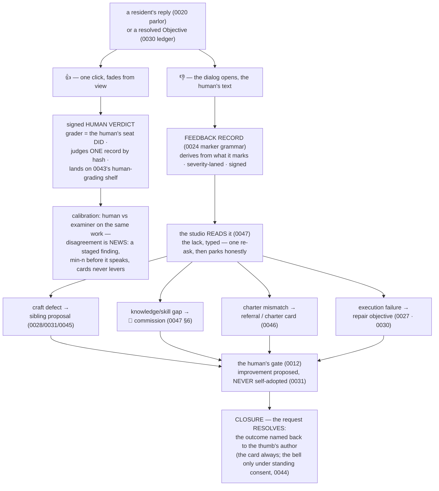

# 0048 — The Thumb (the human answers back)

<!-- PROVENANCE: Fable 5 (claude-fable-5) — seeded 2026-08-09 from JB's
     morning word, drafted the same hour. TRIAGED BY JB the same morning:
     built BEFORE the dogfooding era opens ("we should have this in place
     before we start eating our own dogfood"), ahead of Farm + Stable, which
     follow as likely the last adjustments before the proofs. -->

**Status: 🟢 BLESSED (JB, 2026-08-09) — triaged FIRST, the gate before
dogfooding; all four §8 locks landed the same morning, each on the
recommended path. Spoonfuls begin on JB's word.**

## 1. The seed — JB's words

> "As Humans interact with Residents/agents I would like them to be able to
> give feedback and that feedback (if applicable) should ALSO improve the
> respective resident or completed objective. My thought is simple (please
> upgrade as needed): when a resident provides a response or when an
> objective is completed, maybe we have a thumb up (OK) and thumb down
> (Not OK). When human clicks thumb up, it quietly disappears from view and
> records. If human selects thumb down, a small dialog opens under the thumb
> to allow human to enter text; this goes back into Orreth to address the
> feedback."

0047 closed the loop where the *machine* notices its own lacks (the studio
reads, names gaps, grows craft). What 0047 does not have — JB's find — is
the loop where the *human* names the lack. This dive is that loop: the
explicit half of the Mirror (0034 sp3 assessed conversations *implicitly*;
the thumb is the human saying it *out loud*). Two ears, one law: human ↔
resident interaction improves the universe.

## 2. The law

**Feedback is a signed record and a governed request — never a mutation.**

- A thumb judges **one record, by hash** — the exact reply or the exact
  resolved Objective, not a vibe about a resident. It derives from what it
  marks (0024's marker grammar) and never mutates it.
- No anonymous thumbs: the grader is the human's seat DID, signed. A thumb
  from nowhere is a thumb refused.
- Feedback never edits a resident directly. It fuels **proposals that wait
  at gates** — improvement is proposed, never self-adopted (0031), even
  when the proposer is the human the machine serves. (The human's *edit*
  already has its own one-motion door — 0045. The thumb is judgment, not
  authorship; the distinction is load-bearing.)
- **Feedback is a request, and a request resolves.** A thumbs-down never
  vanishes into a suggestion box: its lineage links to what it spawned, and
  the outcome — adopted, commissioned, declined-with-the-why — lands back
  on the author's card. Silence never resolves it (0012's law, applied to
  the humblest request in the universe).

## 3. The two thumbs

**👍 — the quiet word.** One click. In the glass it fades immediately (JB's
design, kept verbatim). On the record it is loud: a signed **human verdict**
on the judged record's hash, landing on the same shelf as vera's verdicts
(0043 sp2 built the human-grading shelf for exactly this — it has been
waiting for its door). Weight beyond the record itself: the human verdict is
**ground truth for calibration** — where the human and the examiner disagree
about the same work, the *disagreement* is news: a staged finding, cards
never levers (min-n before it speaks, so one thumb never indicts vera).

**👎 + text — the loud word.** The dialog under the thumb (JB's design,
kept) captures the human's sentence. That sentence becomes a **feedback
record**, graded into the severity lanes (0024), and then — the upgrade —
it is READ the way an Objective is read: the studio (0047) types the lack
and routes it to the organ that can answer it:

| The lack, as typed | The route | The organ |
|---|---|---|
| craft defect — "it answers in the wrong shape/tone/depth" | a sibling proposal, evidence citing the feedback record | the improver's lanes (0028 · 0031 · 0045) |
| knowledge/skill gap — "it doesn't know X" | a 🌱 commission, `born_of` the feedback | the gap loop (0047 §6) |
| charter mismatch — "wrong resident answered / refused wrongly" | a referral note or charter card | scope-honesty (0046) + the roster |
| execution failure — "the objective's outcome is wrong" | a repair objective, staged at the gate, linked to the original | the fingertip (0027) + 0030's ledger |
| unreadable / none of the above | parks honestly with the text intact, on the human's own queue | the parking lot (0015) |

The mind proposes the route; the law disposes — every consequential route
above terminates at a human gate.

## 4. The lifecycle

## 5. What already exists (this dive is mostly doors, not organs)

Deliberately small — every heavy organ is built and proven:

- the human-grading shelf: **0043 sp2, built, waiting** ·
- typed reading + routing: **0047, closed whole** ·
- proposals/lanes/releases: **0028 · 0031 · 0045, live** ·
- commissions: **0045 sp6 + 0047 sp5, live** ·
- gates + resolution law: **0012 · 0030, live** ·
- the bell under consent: **0044, live**.

New surface: the two chips in the glass (parlor exchange cards + resolved
objective cards), the worker's feedback door, the router leg in the studio's
tend loop, and the closure card. Zero plane changes expected (the 0020
decoupling precedent); no rule-9 territory.

## 6. Honesty rules

- A thumb costs the human nothing at the door; everything it *spawns* is
  budgeted and metered as usual — a feedback storm cannot commission
  unbounded work (0047's gap-loop rule, inherited).
- A declined route still resolves, with the why on the card — never a
  silent discard (0039's never-silently-dumber, applied to listening).
- The thumb's text enters the record as the human's own words, quoted —
  the studio's typing annotates, never rewrites (0024: the auto lane's
  first resident was "remember this," quoted; the thumb follows it).

## 7. Spoonful sketch (four, small)

1. **The record** — thumb/feedback record shapes in the sim + conformance
   laws (one-record-by-hash, signed-seat-only, marker grammar, resolution
   required).
2. **The chips** — glass + worker doors: 👍 fades/records, 👎 opens the
   dialog, the card shows "heard — on the record" with the request id.
3. **The routing** — the studio's read leg + the four routes + honest
   parking; proposals/commissions land at real gates.
4. **The closure + calibration** — outcome-to-author cards; human-vs-vera
   disagreement findings behind min-n. Proven as a human in the glass
   (0030's standing rule) — JB thumbs a real reply down and watches his
   sentence become a staged proposal.

## 8. The locks — ALL FOUR LANDED (JB, 2026-08-09, each on the recommended path)

- **L1 — surfaces, v1: BOTH.** Parlor replies and resolved Objectives wear
  the thumbs from day one — every place a human receives the machine's work
  can answer back.
- **L2 — 👍 feeds calibration: YES, behind min-n.** Human verdicts land on
  the shared shelf; a human-vs-examiner disagreement finding stages only
  after a declared minimum of overlapping verdicts (v1: 5) — one thumb
  never indicts vera. Disagreement is news; cards never levers.
- **L3 — closure: card always, bell under EXISTING consent.** The outcome
  lands on the author's own queue in the glass; the bell rings only for a
  human already holding standing 0044 consent. No new consent machinery.
- **L4 — the name: The Thumb.**
