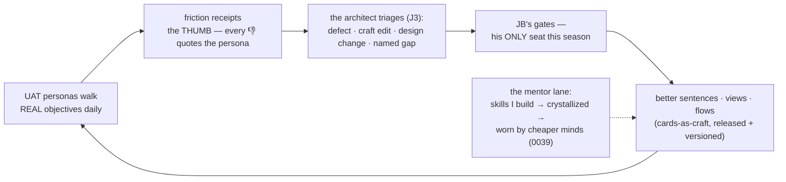

# 0049 — The Legible Machine (the season charter: human interoperability)

<!-- PROVENANCE: Fable 5 (claude-fable-5) — drafted 2026-08-11 from JB's
     briefs of 2026-08-09/10/11; EXPANDED same day from JB's full read-back
     (the remediation force · the Trading Desk proving purpose · the
     Capabilities pull · Farm/Stable/Pulse depth · the central-control law).
     Status: CHARTER v2 — for the prioritization session; nothing locked. -->

**Status: 🧭 CHARTER v2 — 2026-08-11, awaiting the prioritization session.**

## 1. The frame — JB's north star, verbatim

> "The architecture years were about making the machine honest; these next
> weeks are about making it legible. Those are different crafts, and the
> second one has a different judge — not the conformance suite, but a person
> who's never heard the words 'worldline' or 'epoch' and just wants to know
> where their ask is and what's being asked of them."

The season's purpose (JB): *bring the loops and the architecture into a
cohesive and usable state* — humans create lists, vet objective management,
oversee what runs, assess reports of what completed, and move fluidly.
**All of Orreth is influenced by this phase.** Every proof uses REAL-WORLD
objectives that exercise the logic/planning/gap/critic chain, and every
message the UI speaks is human language — never machine or policy speak.

**JB's role this season: locks and gates only.** He does NOT generate lists
or vet usability — the remediation force (§3) does that and answers to me;
he decides at the gates the season stages for him.

## 2. The boundary — base vs applied vs craft

The dividing question for every item:

> **Does it change what the machine IS (base) — or what the machine KNOWS,
> SERVES, or DELIVERS (applied purpose)?**

- **[BASE]** — doors, laws, meters, lifecycle mechanics, views. WE build
  these; the base is finite and this season aims to FINISH it.
- **[APPLIED]** — skills, knowledge, packages, personas' content, desks,
  reports. **Orreth builds these through its own organs** — dogfooding
  begins inside the season.
- **[CRAFT]** — the machine's *words to humans* (card texts, notes,
  refusals, reports) as versioned Canon/craft (0045): tuning them is an
  edit at a gate, not a code change. The hinge of the season (§7).

**A season-wide law, restated for enforcement (JB, 2026-08-11):** *no
resident or agent hardcodes an LLM call or a tool call — everything flows
through the central control points*: minds through the **Stable/plane**
(0016/0019, already law), tools and MCPs through the **Farm's gateway**
(0018 — to be made total this season), knowledge through the **librarian**
(0014/0023). Any hardcoded call found during the season is a defect, not a
convenience.

## 3. The remediation force — who builds this

JB's directive: Fable owns the approach and fields **a fleet of agents,
each wearing a different lens**. The force:

| Seat | Who | Duty |
|---|---|---|
| **The architect** | me (Fable) | designs, builds base + craft, triages every receipt, answers to JB's gates |
| **The UAT personas** | human-skilled agents (§5-J) | own ALL usability list-generation and vetting: walk real objectives as humans who don't know the machine; file every non-fluid moment — too many clicks, too many navigations, approvals that could be packaged — through the thumb (0048); empowered to propose **improve, change, or REMOVE** (redundancy across tabs is real); push metrics anywhere they help a human read state/progress/performance — *beyond JB's own insights, deliberately* |
| **The lens agents** | specialized agents per thread | a Farm lens, a Stable lens, a navigation lens, a telemetry lens — each sweeps its organ and reports gaps to the architect |
| **The mentor** | me again, in 0039's oldest law | **the season IS the Mentor/Mentee proof at scale**: I build the skills, crystallize them, and the machine's cheaper minds wear them — features and capabilities get ADDED as the build discovers them, and what only a frontier mind can do becomes a named skill a lesser mind inherits |

## 4. The proving purpose — the Trading Desk (JB's flagship)

The season's applied-purpose north star, JB's own words: inside
CortexObserver live the commander and the agents — **three named Trading
Desk agents (Trading · Options · Crypto), each with its own STUDIO**
(prompt tuning/engineering inside the active graphs, replay, beautiful
professional graphs). Mature, effective LangGraph agents that are already
"an illustration of an Orreth Objective — same flow, different applied
policies, skills, reports."

**The bar: equal to or BETTER results from Orreth, with at least all the
features of those agents and their studios.** Explicitly NOT lift-and-shift
— **Fable builds these as Objectives IN Orreth**, through the machine's own
doors. Called out by name:

- the **watchlists**, and the **schedulers that drive the watchlists**
  (0047's standing charters are the scheduler organ — proven, waiting)
- each desk's **studio view** — tune/engineer the prompts of the active
  graphs, replay runs (0045's craft room + 0043's flight recorder are the
  organs; the desk studio is their applied face)
- the **report packages** (ZIP downloads on report creation — reference
  ZIPs offered by JB; the CortexObserver repo is readable at
  `~/PycharmProjects/CortexObserver/` for ground truth)

The Trading Desk is the first **Capability** (§5-C2) and the proof that
Orreth is a *platform of worlds*: same flow, different applied purpose.

## 5. THE BIG LIST — ten threads, every item tagged

Priorities PROPOSED (P1 opens · P2 mid · P3 closes or waits) — set together
at the prioritization session.

### Thread A — the Human lifecycle of an Objective
| # | Item | Tag | P |
|---|---|---|---|
| A1 | **The Objective Journey** — one living view per objective: composed → understood → planned → **waiting on you** (glowing) → executing → assembling → resolved → assayed; where it is NOW, what this approval means, every artifact a door | BASE | P1 |
| A2 | **CANCEL — covenant rule 11**: the human can always STOP what the machine manages, all four vectors; a governed recorded act; pause/resume where reversible. Drafted for JB's lock (§9-L2) | BASE | P1 |
| A3 | **Reply channels** — every gate card takes words back; replies route like thumb feedback | BASE | P1 |
| A4 | **Plain-speech cards** — what happened · what's asked · what each button does · what happens next; evidence shown, never bare hashes | CRAFT | P1 |
| A5 | **The Objective Report** — human-readable close-out + browsable archive; report formats as commissioned craft | BASE+CRAFT | P2 |
| A6 | **The one inbox** — everything waiting on the human, prioritized, ages visible, safe bulk decisions, **approvals that belong together PACKAGED as one word** (JB's find) | BASE | P2 |

### Thread B — Human-focused navigation & fluidity
| # | Item | Tag | P |
|---|---|---|---|
| B1 | **Purpose-first navigation** — a human layer over the organ tabs: *Ask · Approve · Watch · Review · Govern*; **tab redundancy audited by the UAT personas — improve, change, or remove** | BASE | P2 |
| B2 | **Lists** — humans curate worklists of objectives: create, order, watch as a set, report as a set | BASE | P2 |
| B3 | **Every mention is a door** — any id/name anywhere → the thing itself; breadcrumbs; human-term search | BASE | P2 |
| B4 | **Metrics everywhere they help** — state/progress/performance numbers wherever a human persona says they'd help them understand; the personas decide where, beyond JB's own list | BASE | P2 |
| B5 | **The first ten minutes** — onboarding, hover-explains, the glossary, the guided first objective | CRAFT | P3 |

### Thread C — the Studio & the Capabilities pull
| # | Item | Tag | P |
|---|---|---|---|
| C1 | **Studio embodiment** — calling card, parlor seat, orrery/brain presence (allen's pattern) | BASE | P1 |
| C2 | **THE CAPABILITIES PULL (the Panel Pull, revealed)** — JB's design: a pull lever on the RIGHT side of the glass; humans **Create/Install packages** there; an installed package's architecture ATTACHES to the lever; pulled open (sized by contents) it is **the portal of installed applied-purpose worlds** — non-Machine/non-Engine — e.g. the Trading Desks, each with its own Studio view. "It should feel atop Orreth": the Machine below, the Capabilities above. Where the universes/ecosystems/fields applied-to-a-purpose LIVE for the human | BASE | P1 |
| C3 | **Desk studios** — per-capability studio view: tune/engineer prompts of the active graphs, replay runs (0045 + 0043 organs, applied face) | BASE+CRAFT | P2 |
| C4 | *(boundary)* **Software Developer faculty** — own deep dive after the season; prereqs: lock-3 sandbox · rule-9 session · repo effect classes | — | held |

### Thread D — Profiles & Personas (both directions)
| # | Item | Tag | P |
|---|---|---|---|
| D1 | **Hook up Profiles** (0025) — residents know who they're talking to, with provenance | BASE | P2 |
| D2 | **Personas OF residents** (JB, explicit): humans can DEFINE a resident's persona — voice, register, depth — as craft on the shelf; plus per-human voice (0046's deferral) | BASE+CRAFT | P2 |
| D3 | **The Mirror's full loop** (0034 seed) — conversations assessed → profile AND resident-asset feedback | BASE | P3 |

### Thread E — the Farm (0018): the TOOL STORE, made total
| # | Item | Tag | P |
|---|---|---|---|
| E1 | **Organize as the store** — "if Farm is where we store tools/MCPs, organize it that way": catalog by kind/purpose, plant/pause/resume/drop/rejoin in plain speech | BASE | P2 |
| E2 | **Operational telemetry** — per-service calls, latency, cost that SURVIVE restarts; standing spends in one ledger (the Tavily lesson institutionalized) | BASE | P2 |
| E3 | **The gateway made total + its features** (a lock, §9-L6): every tool/MCP call through the farm gateway — then the gateway can carry **security/guardrails, LLM-features on tool calls, LiteLLM capabilities** (JB's question, answered at the Farm dive) | BASE | P2 |
| E4 | **The missing stalls named** — e.g. allen has NO AWS-documentation tooling in the Farm (his standing TODO); the lens agent sweeps for every resident whose duty lacks its tool | BASE+APPLIED | P2 |
| E5 | Wire-level recall walk · node-level fidelity (0018 opens; fidelity needs JB's lock) | BASE | P3 |

### Thread F — the Stable (0019): who thinks with what
| # | Item | Tag | P |
|---|---|---|---|
| F1 | **The association view** — "Humans see what LLM is associated to what Resident or Object — I don't see this at all": every resident/organ/desk ↔ its mind, its class, its recent spend, in one legible map | BASE | P2 |
| F2 | **Knowledge classes S · M · L · XL** (JB's original Stable ask, now due): pick a class and the mapping AUTO-ADJUSTS across every point of use — Small maps smalls everywhere; select Medium, all adjust | BASE | P2 |
| F3 | **The Mentor lane** — the mentor model/skill level is HUMAN-APPLIED in the Stable and managed SEPARATE from the active fleet: it exists to mentor (0039), so class auto-mapping never touches it; the override is the human's hand | BASE | P2 |
| F4 | **Budget lifecycle** (JB's 0047 architecture: re-init on verified allotment + replenishment, >2-in-X → HITL, work WAITS) — lands WITH the rule-9 session | BASE | P2 |
| F5 | Stall/deal ergonomics — lifecycle from the glass, price-drift cards legible | BASE | P2 |

### Thread G — the Knowledge Base mind & curation (the librarian)
| # | Item | Tag | P |
|---|---|---|---|
| G1 | **Inbound curation desk** — quarantine visible, promotion queue for the human's word, source trust from the glass | BASE | P2 |
| G2 | **Outbound curation desk** — publishing/deeds reviewed before the wire; exchange classes as human choices | BASE | P2 |
| G3 | **The browsable library** — search, lineage, what's recalled and why | BASE | P2 |
| G4 | **The stacks speak human** — dispatcher choices as sentences («hybrid — no shape matched» never reaches a parlor again) | CRAFT | P1 |
| G5 | Upload ergonomics + the parked eye revisited (a vision mind at ada's gate) | BASE | P3 |

### Thread H — Observability, Pulse & telemetry
| # | Item | Tag | P |
|---|---|---|---|
| H1 | **The living atlas** — the spine as a live view, objectives visibly flowing across organs | BASE | P2 |
| H2 | **Pulse rebuilt** — JB, candid: "messy and not really helpful (important yes but not helpful)". The UAT personas define what a human actually needs from a pulse; redundancy with other tabs resolved — improve, change, or remove | BASE | P2 |
| H3 | **Observatory in plain speech** — verdicts linked to judged content; the dial explained; tier chips humanized | CRAFT | P2 |

### Thread I — Governance & the workshop
| # | Item | Tag | P |
|---|---|---|---|
| I1 | **Governance tab legibility** — craft, wearers, releases, arguments as guided human flows | CRAFT | P2 |
| I2 | **Workspace declutter** — panel priority, collapse, "what she's saying" above the furniture | BASE | P1 |
| I3 | **The registry as the card catalog** — browse who wears what, with meaning | BASE | P3 |

### Thread J — the UAT force (the tuning engine)
| # | Item | Tag | P |
|---|---|---|---|
| J1 | **The UAT personas stand up** — human-skilled agents own usability vetting end-to-end (JB out of the loop by design): real objectives walked daily, every friction filed through the thumb with words; improve/change/REMOVE proposals; metric-placement proposals | APPLIED | P1 |
| J2 | **Cards-as-craft** — the machine's human-facing sentences become versioned craft; receipts route (0048 sp3) into craft-edit gates: **the legibility loop closes and the season improves itself** | BASE+CRAFT | P1 |
| J3 | **UAT → architect pipeline** — receipts triaged by me into: fix now (defect) · craft edit (words) · design change (staged for JB) · named gap (the developer dive's fuel) | BASE | P1 |

## 6. What Orreth delivers THROUGH itself ([APPLIED] — dogfooding is the season)

- **The Trading Desk** (§4) — the flagship: three desks + studios +
  watchlists + charter-driven schedules + report packages, equal-or-better
- The UAT personas and their walk scripts (commissioned skills)
- At least one **new RAG row by objective** (JB's standing example)
- Report formats, glossary entries, knowledge packs — as commissioned craft
- **Every skill I build that a cheaper mind could wear gets crystallized
  and graduated (0039)** — the Mentor/Mentee proof is not a demo, it is the
  season's delivery mechanism

What the machine cannot yet deliver becomes a NAMED gap — the developer
faculty's backlog, evidence-priced.

## 7. Orchestration — how the season runs

1. **The hinge first (J2 + A4):** sentences onto the shelf; tuning becomes
   editing at gates. Everything after compounds.
2. **The lifecycle spine (A1 + A2 + A3 + C1):** Journey, Cancel, replies,
   the studio's face.
3. **The UAT force stands up early (J1 + J3)** and walks daily from then on
   — receipts accumulate WHILE the organ threads build.
4. **The Capabilities pull (C2) lands mid-season** so the Trading Desk (§4)
   has its home when it arrives.
5. **Organ dives ride as dives** (E · F · G · H · B · D), each: design →
   JB's locks → spoonfuls → proofs walked naive on REAL objectives.
6. **The Trading Desk closes the season** — the flagship proof that the
   platform serves worlds, delivered through the machine's own doors.
7. Every dive closes whole — register, atlas, era. Many small closes.

## 8. The reference shelf

- CortexObserver (readable): `~/PycharmProjects/CortexObserver/` — the
  Trading Desk ground truth; JB's report ZIPs on request at the desk dive
- The objective-atlas §5 (where-a-change-lands) — the build's map
- The honest-boundary — every claim this season makes lands there

## 9. The locks this charter stages for JB

- **L1 — the priorities**: the P-map above, reordered by his hand.
- **L2 — covenant rule 11 (CANCEL)**, draft: *"The human can always stop
  what the machine manages. Every managed objective, standing duty, and
  reflex offers a governed cancel/rest; cancellation is a recorded act,
  never a deletion; in-flight work stops at the next safe boundary and says
  what it left undone."*
- **L3 — cards-as-craft scope**: which sentence families enter the shelf
  first (gate cards · parlor notes · reports · refusals).
- **L4 — the UAT charter**: how many personas, which objective families,
  spend ceiling, receipt cadence.
- **L5 — the Capabilities pull's shape**: right-side lever, install/create
  flows, what "feels atop Orreth" means in the glass (JB explains his full
  vision at the dive).
- **L6 — the total gateway**: every tool/MCP call through the Farm's
  gateway + which gateway features land (guardrails · LLM-features on tool
  calls · LiteLLM capabilities).
- **L7 — the Stable's classes & the Mentor lane**: S/M/L/XL auto-mapping
  semantics + the mentor's separateness from the fleet.
