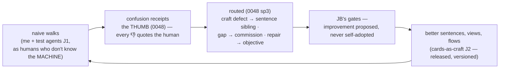

# 0049 — The Legible Machine (the season charter: human interoperability)

<!-- PROVENANCE: Fable 5 (claude-fable-5) — drafted 2026-08-11 from JB's
     briefs of 2026-08-09/10/11. Status: CHARTER DRAFT — the big list, for
     JB and Fable to prioritize TOGETHER; nothing below is locked. This is
     a SEASON charter, not one dive: threads become dives on JB's word. -->

**Status: 🧭 CHARTER DRAFT 2026-08-11 — awaiting the prioritization session.**

## 1. The frame — JB's north star, verbatim

> "The architecture years were about making the machine honest; these next
> weeks are about making it legible. Those are different crafts, and the
> second one has a different judge — not the conformance suite, but a person
> who's never heard the words 'worldline' or 'epoch' and just wants to know
> where their ask is and what's being asked of them."

The season's purpose (JB): *bring the loops and the architecture into a
cohesive and usable state* — humans create lists, vet objective management,
oversee what runs, assess reports of what completed, and move fluidly. The
machine already keeps its promises; now it must keep them **in the human's
language**.

## 2. The boundary — base adjustments vs applied purpose

JB's line: "a fine example of being close to the end of base." The dividing
question for every item below:

> **Does it change what the machine IS (base) — or what the machine KNOWS,
> SERVES, or DELIVERS (applied purpose)?**

- **[BASE]** — doors, laws, meters, lifecycle mechanics, views. WE build
  these, by hand, through dives. The base is finite and this season aims to
  FINISH it.
- **[APPLIED]** — skills, knowledge, packages, report formats, personas'
  content, new RAG rows. **Orreth builds these through its own organs**
  (objectives → commissions → gates). Part of this season's proof is
  deliberately delivering some of them *through the machine* — dogfooding
  begins inside the season, not after it.
- **[CRAFT]** — a special middle: the machine's *words to humans* (card
  texts, notes, refusals, reports). These become versioned Canon/craft
  (0045's law), so tuning them is an EDIT AT A GATE, not a code change.
  This is the hinge the whole season turns on — see §5.

## 3. THE BIG LIST — ten threads, every item tagged

Priorities are PROPOSED (P1 opens the season · P2 mid · P3 closes or waits)
— we set them together.

### Thread A — the Human lifecycle of an Objective
| # | Item | Tag | P |
|---|---|---|---|
| A1 | **The Objective Journey** — one living view per objective: composed → understood → planned → **waiting on you** (glowing) → executing → assembling → resolved → assayed (0047's states become UI); where it is NOW, what this approval is in the sequence, every artifact a door | BASE | P1 |
| A2 | **CANCEL — the covenant amendment**: the human can always STOP what the machine manages, across all four vectors (objective cancel · charter rest/revoke · reflex deactivate · in-flight leg recall); a governed act with its own record; pause/resume where reversible. Drafted for JB's lock as covenant rule 11 | BASE | P1 |
| A3 | **Reply channels** — every gate card takes words back, not just approve/decline; replies route like thumb feedback (0048's loop, widened to the gates) | BASE | P1 |
| A4 | **Plain-speech cards** — every card says: what happened · what is asked of you · what each button does · what happens next; evidence shown, never bare hashes (calibration shows the works and the words; tamper shows the diff) | CRAFT | P1 |
| A5 | **The Objective Report** — a human-readable close-out per objective (what was asked · what was done · by whom · cost · verdicts · artifacts) + the browsable archive of past objectives | BASE+CRAFT | P2 |
| A6 | **The one inbox** — everything waiting on the human in one prioritized place, ages visible, safe bulk decisions | BASE | P2 |

### Thread B — Human-focused navigation & fluidity
| # | Item | Tag | P |
|---|---|---|---|
| B1 | **Purpose-first navigation** — a human layer over the organ tabs: *Ask · Approve · Watch · Review · Govern*; the organs stay for the builder's eye | BASE | P2 |
| B2 | **Lists** — humans curate worklists of objectives (projects/batches): create, order, watch as a set, report as a set | BASE | P2 |
| B3 | **Every mention is a door** — click any id/name anywhere → the thing itself; breadcrumbs; search across records in human terms | BASE | P2 |
| B4 | **The first ten minutes** — naive-human onboarding: hover-explains for machine words, a glossary the glass serves, the guided first objective | CRAFT | P3 |

### Thread C — the Studio (agreed 2026-08-09)
| # | Item | Tag | P |
|---|---|---|---|
| C1 | **Studio embodiment** — calling card, parlor seat, orrery/brain presence (allen's pattern); "who read my ask" gets a face to talk to | BASE | P1 |
| C2 | **Panel Pull** for the studios of 0040 — JB explains at the dive (deliberately not pre-designed) | BASE | P2 |
| C3 | **Reading/plan cards in plain speech** — the studio's understanding shown as sentences a human would say | CRAFT | P1 |
| C4 | *(boundary marker)* **Software Developer faculty** — its own DEEP DIVE after this season; prereqs: lock-3 sandbox · the rule-9 session · repo effect classes. Listed here only so the season leaves room for it | — | held |

### Thread D — Profiles & Personas
| # | Item | Tag | P |
|---|---|---|---|
| D1 | **Hook up Profiles** (0025) — the living portrait finally feeds behavior: residents know who they're talking to, with provenance ("you told me" vs "I observed") | BASE | P2 |
| D2 | **Personas** (0046's deferral comes due) — residents wear a voice per human; persona as soft-standard (0015), content as craft | BASE+CRAFT | P2 |
| D3 | **The Mirror's full loop** (0034 seed) — conversations assessed → profile observations AND resident-asset feedback | BASE | P3 |

### Thread E — the Farm (0018, twice deferred)
| # | Item | Tag | P |
|---|---|---|---|
| E1 | **Lifecycle from the glass** — plant/pause/resume/drop/rejoin with plain speech; the PAUSE lever the Tavily incident asked for | BASE | P2 |
| E2 | **Spend & health worldlines** — per-service calls and cost that SURVIVE restarts (the meter's per-process reset was a finding); standing spends (subscriptions · act-reflexes · keep-fresh) in ONE ledger with costs | BASE | P2 |
| E3 | Wire-level recall walk · node-level fidelity (0018's open items; fidelity needs JB's lock) | BASE | P3 |

### Thread F — the Stable (0019, twice deferred)
| # | Item | Tag | P |
|---|---|---|---|
| F1 | **Stall & deal ergonomics** — model lifecycle (candidate→serving→sunset) from the glass, price-drift cards legible | BASE | P2 |
| F2 | **The budget lifecycle** (JB's 0047 architecture): re-init on verified larger allotment AND replenishment, bounded by >2-in-X-period → HITL with work WAITING — lands WITH the rule-9 session (the poisoned ledger lives there) | BASE | P2 |

### Thread G — the Knowledge Base mind & curation (the librarian)
| # | Item | Tag | P |
|---|---|---|---|
| G1 | **Inbound curation desk** — what enters: the quarantine visible, a promotion queue for the human's word, source trust managed from the glass | BASE | P2 |
| G2 | **Outbound curation** — what leaves: publishing/deeds reviewed before the wire; 0023's exchange classes surfaced as human choices | BASE | P2 |
| G3 | **The browsable library** — knowledge as a shelf a human can walk: search, lineage, what's recalled and why | BASE | P2 |
| G4 | **The stacks speak human** — dispatcher choices explained in sentences (JB's screenshot: «hybrid — no shape matched» is machine-speak in a parlor) | CRAFT | P1 |
| G5 | Upload ergonomics (0029) + the parked eye revisited (a vision mind at ada's gate unparks image-reading) | BASE | P3 |

### Thread H — Observability & telemetry (0043 uplift)
| # | Item | Tag | P |
|---|---|---|---|
| H1 | **The living atlas** — architecture telemetry: the spine as a live view, objectives visibly FLOWING across organs (the brain's soul, aimed at the machine's anatomy) | BASE | P2 |
| H2 | **Pulse uplifts** (JB's item — scope at the dive) | BASE | P2 |
| H3 | **Observatory in plain speech** — verdicts linked to the judged content; the dial explained; instrument-vs-log-truth chips humanized | CRAFT | P2 |

### Thread I — Governance & the workshop
| # | Item | Tag | P |
|---|---|---|---|
| I1 | **Governance tab legibility** — craft objects, wearers, releases and arguments as guided flows in human words | CRAFT | P2 |
| I2 | **Workspace declutter** — the librarian's room (JB's screenshot): panel priority, collapse, "what she's saying" surfaced above the furniture | BASE | P1 |
| I3 | **The registry as the human's card catalog** — browse who wears what, with meaning not just names | BASE | P3 |

### Thread J — the test instrument (the tuning engine)
| # | Item | Tag | P |
|---|---|---|---|
| J1 | **Human-like test agents** (authorized 2026-08-09) — naive personas walking REAL objectives through the glass; their confusion filed through the THUMB (0048) — every 👎 a tuning receipt with words | APPLIED | P1 |
| J2 | **Cards-as-craft** — the machine's human-facing sentences become versioned craft on the shelf (0045), so tuning receipts route (0048 sp3) into craft-edit proposals at gates: **the legibility loop closes and the season improves itself** | BASE+CRAFT | P1 |

## 4. What Orreth delivers THROUGH itself this season ([APPLIED] — dogfooding begins)

Deliberately routed through the machine's own doors, not hand-built:
- The test-agent personas and their walk scripts (commissioned skills)
- At least one **new RAG row** by objective ("add a new RAG architecture,
  reference this…" — JB's own example, run for real)
- Report formats and glossary entries as commissioned craft
- Knowledge packs the library needs for the season's domains

Each one exercises: objective → studio reads → plan gate → work → thumbs →
tuning. What the machine cannot yet deliver becomes a NAMED gap — fuel for
the developer-faculty dive that follows the season.

## 5. Orchestration — how the season runs

1. **The hinge lands first (J2 + A4):** card sentences move from code
   literals to craft on the shelf. From then on, tuning is *editing at a
   gate*, and every later thread's work compounds instead of hard-coding.
2. **The lifecycle spine next (A1 + A2 + A3 + C1):** the Objective Journey,
   Cancel, replies, and the studio's face — the human's seat at the center.
3. **The instrument starts early (J1):** the moment Journey + thumbs stand,
   test agents walk daily and receipts accumulate WHILE we build the rest —
   the season tunes itself as it goes.
4. **The organ threads ride as their own dives** (E Farm · F Stable · G
   Library · H Observatory · D Personas · B Navigation), each the usual way:
   design → JB's locks → spoonfuls → **proofs walked naive** (the standing
   rule: proven as a human who doesn't know the machine).
5. **Each dive closes whole** — register, atlas, era — the season is many
   small closes, never one long open state.

## 6. The locks this charter stages for JB (nothing moves without them)

- **L1 — the priorities**: the P1/P2/P3 map above, reordered by JB's hand.
- **L2 — covenant rule 11 (CANCEL)**, draft wording: *"The human can always
  stop what the machine manages. Every managed objective, standing duty,
  and reflex offers a governed cancel/rest; cancellation is a first-class
  recorded act, never a deletion; in-flight work stops at the next safe
  boundary and says what it left undone."*
- **L3 — cards-as-craft scope**: which sentence families enter the shelf
  first (gate cards · parlor notes · reports · refusals).
- **L4 — test-agent charter**: how many personas, what objective families,
  spend ceiling, and where their receipts land.
- **L5 — the season's era arithmetic**: one era per closed dive (as ever) —
  the charter itself carries no era.
