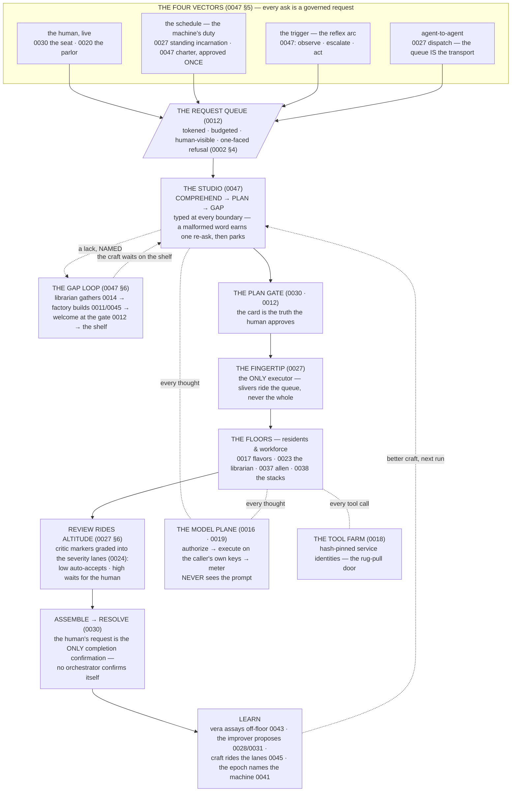
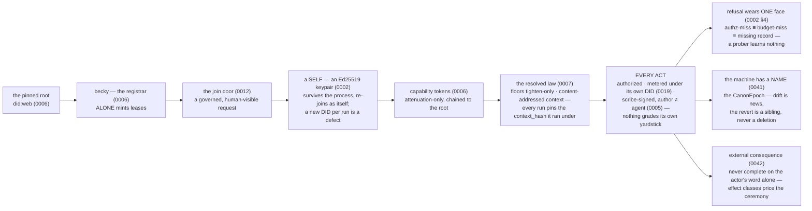
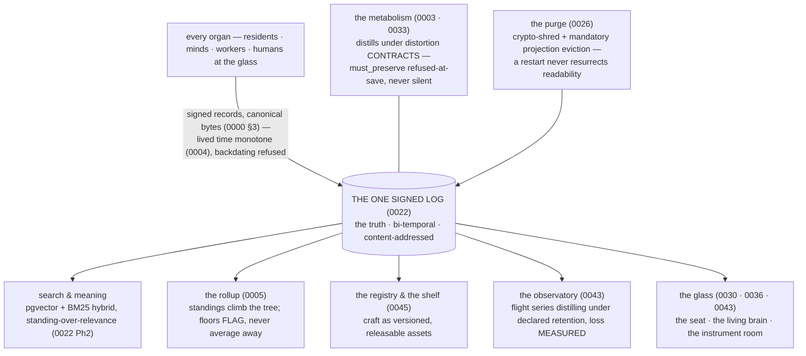
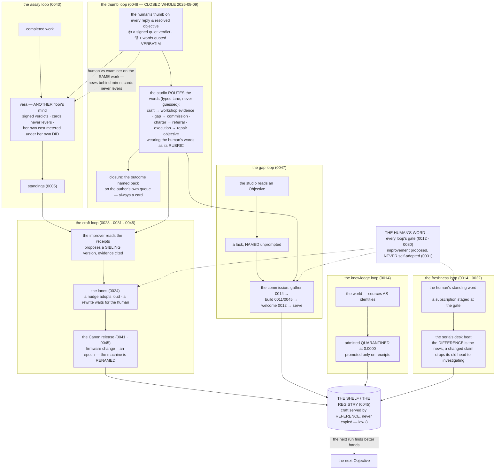

# The Objective Atlas — how the designs interoperate to serve an Objective

<!-- PROVENANCE: Fable 5 (claude-fable-5) — seeded 2026-08-09 at JB's word:
     "going forward I'll be giving you objectives and having something to
     reference that shows how the designs interoperate to support objectives."
     Deliberate shape: ONE standing atlas, not 47 retrofitted graphs — the
     interoperation lives BETWEEN the designs, so it gets one page that stays
     current, the way the-honest-boundary.md keeps the claims. -->

Forty-eight designs, one machine. Each dive doc holds its own organ's law;
this page holds the *wiring* — how those organs pass an Objective hand to
hand, which loops improve the machine between runs, and where in the code a
change lands when a proof says the base must move. Written for the
objective-giving era (JB, 2026-08-09): requests now enter Orreth through its
own doors and are completed by its own loops.

The per-design one-line index stays in [README.md](README.md)'s dive
sequence table — this page never duplicates it.

## 1. The spine — an Objective, end to end

Every ask is a governed request. Four vectors open the door (0047 §5, JB's
own naming); one queue carries everything; the mind reads before the law
disposes; consequence waits for a human; and the learning loops close behind
the resolution.

The states an Objective wears end to end are drawn once, in
[0047 §5](0047-the-universe-learns-to-think.md) (the stateDiagram) — this
atlas points there rather than forking the picture.

## 2. The trust spine — why any of it can be believed

Everything in §1 rides this chain. No organ acts outside it; that is the
whole product.

## 3. The one truth and its projections

Rule 7 — one world, one picture — is enforced by construction: there is one
signed log, and every view is a rebuildable projection over it. Seven RAG
flavors, the brain, the observatory, the registry: projections, never second
truths. The purge reaches all of them; drop any index and it rebuilds from
the log.

## 4. The loops — how the machine improves between runs

JB's phrase: *the loops of Orreth*. Five stand today; all converge on one
shelf, and every adoption in every loop waits for a human word — improvement
is proposed, never self-adopted (0031).

## 5. Where a change lands — the workshop map

For the proving era: when an objective walked through §1 exposes a base gap,
this table says where the change goes and what proves it. (The three latest
standing finds all landed this way: `u_port` in the worker, the unfueled
lease at becky's mint, the poisoned ledger parked at rule 9.)

| The organ | Design(s) | Code home | The proof |
|---|---|---|---|
| the plane — authorize · meter · serve · gates | 0016 · 0019 · 0012 | `backend/plane/crates/orrethd` | plane build + `/health`; **rule 9 guards** `orreth-node` · `orreth-store` · crypto crates · `contracts/v0` — JB's explicit word per change |
| the glass — seat · brain · observatory · parlor | 0030 · 0036 · 0043 · 0020 | `backend/plane/crates/orrethd/src/window.html` (`include_str!` — a glass change requires a **plane rebuild**) | Chrome on the rig, both lights, screenshots |
| the worker — doors · beats · composers · firmware reads | nearly every dive's wire face | `backend/conformance/console_worker.py` | live on the rig (`scripts/dev.sh`; worker doors at :4562) |
| the sim laws — the executable model | every dive | `backend/conformance/orreth_sim/` | `backend/conformance/tests/` — 311 green, **run from `backend/conformance`** (repo root mis-collects) |
| the SDK — chassis · client · the mind's jacket | 0015 · 0017 · 0047 | `agents/orreth-agent-sdk/` | its `tests/` (20) + `test_parity.py` — byte-parity is the contract (0000 §3) |
| the residents & flavors — incl. the studio | 0017 · 0037 · 0038 · 0047 | `agents/flavors/` (the studio: `03-mind/`) | joins at becky's gate as the same self; proves in the parlor/glass |
| floor profiles — tiers as data | 0004 · 0009 | `backend/plane/profiles/` | the shipyard grows them; the orrery shows them |
| the rig itself | — | `scripts/dev.sh` (Docker-first: universe :4500 · eco :4501 · field :4502) | the orrery agrees with the roster agrees with the rollup (rule 7) |

## 6. Maintenance law (STANDING — JB's word, 2026-08-09)

Mirroring the honest-boundary's law: **a dive or a proof that adds an organ,
opens a door, or reroutes the spine updates this atlas in its closing
commit.** An atlas that lags misleads with confidence — worse than no atlas.

JB's blessing carried the why, and it binds the proving era specifically:
*"we do need to be sure to keep these updated as we work the proofs that
will make alterations… nothing works perfectly out the gate; we're in new
industry space, and the reports, views, sustained active state is what does
the verification — outcome focused."* The proofs will move the base; the
atlas moves with them, in the same commit.
