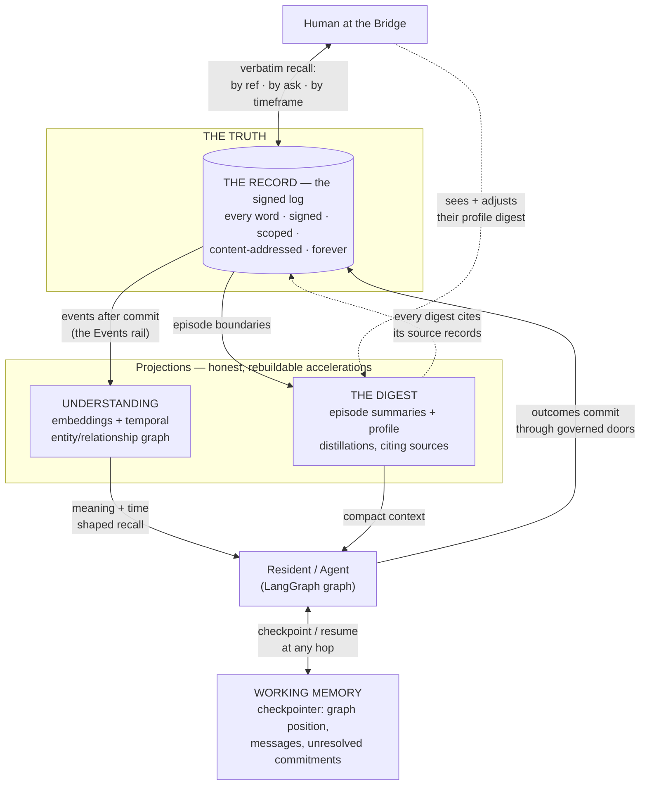
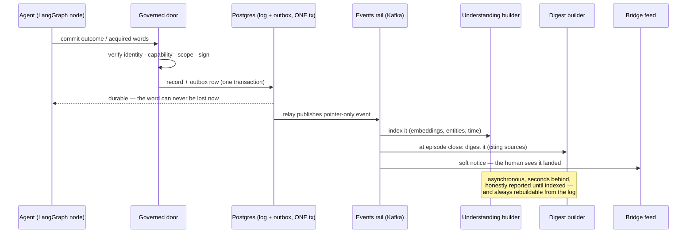
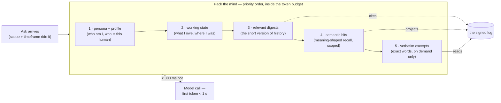
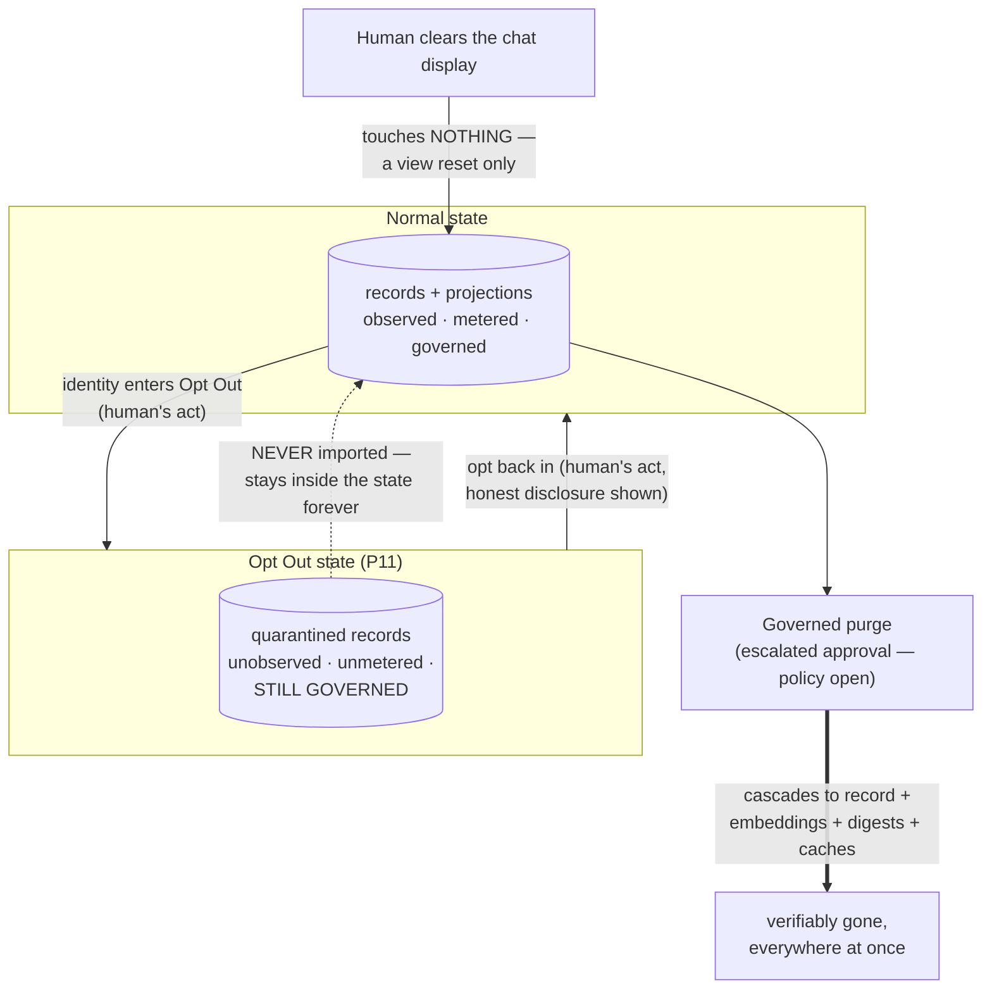

# 0003 — The Memory Architecture

**Status: LOCKED — JB approved 2026-09-16** ("Very nice document… I like
it", Redis stance endorsed: has a place but needs justification which
warrants the overhead). The memory revamp JB licensed, designed against
the locked Experience Charter (0001) and Transport Architecture (0002).

**Input honored:** JB's research aid `tmp/agent-memory-architectures-
langgraph.md` (2026-09-16, eleven candidate systems) — its layering model
and evaluation method are adopted; its products are adopted as *patterns
and engines*, never as truth-holders. JB's named addition — **compression**
— is designed in as the fourth memory.

---

## The thesis

Orreth does not need to buy a memory system — **it already owns the best
long-term memory substrate in this field**: a signed, content-addressed,
scoped, tamper-evident log with provenance on every word. None of the
eleven surveyed systems has that. What Orreth was missing is everything
*around* the log: guaranteed recall, meaning-shaped retrieval, compressed
context, and resumable working state — plus honest wiring into LangGraph.

So: **four memories, one truth.** Three of the four are projections over
the signed log — rebuildable, never a second truth (the standing law:
projections over one signed log, never N truths).

## The picture

The arrows carry no authority: every read and write crosses a governed
door with current identity and capability. If a projection burned down
tonight, tomorrow it is rebuilt from the log and nothing is lost — that
property is what makes the accelerations honest.

## The four memories

| Memory | Plain words | Mechanism | Truth? |
|---|---|---|---|
| **Working** | "what I'm doing right now" | LangGraph checkpointer (Postgres-backed), thread = the conversation or objective run | Never — outcomes must land as signed records |
| **The Record** | "every word, forever" | The signed log itself — verbatim, episodic | THE truth |
| **Understanding** | "what it means" | Semantic projections: embeddings + entity/relationship/temporal graph | Projection |
| **The Digest** | "the short version" | Compressed summaries at episode boundaries, always citing sources | Projection |

### 1. Working memory

| | |
|---|---|
| **What** | The agent's live state: graph position, messages in flight, pending work, unresolved commitments — the mind mid-thought. |
| **How** | The LangGraph checkpointer, Postgres-backed, namespaced per agent identity; thread id = the conversation worldline or objective run. |
| **Why** | So a 500–1000-hop objective survives any crash, restart, or pause and resumes *exactly* — and so each model call stays inside a useful context budget. |
| **When** | Written at every hop; read at resume and at every model call; compacted at episode boundaries; retained for the life of the thread — but never the truth of anything. |

- The checkpointer holds graph position, messages, pending work — so a
  500–1000-hop objective **resumes exactly** after crash, restart, or
  pause. Durable, but never authoritative: any outcome that matters
  commits as a signed record through a door.
- **Unresolved commitments live as structured state**, never only inside a
  rewritten narrative summary (adopted from the aid) — a resumed agent
  knows precisely what it owes.
- Compaction happens at task/episode boundaries (see the Digest), so the
  model's context stays inside budget while the thread lives for months.

### 2. The Record — verbatim memory, the charter's hard promise

| | |
|---|---|
| **What** | Every word ever acquired, said, produced, or decided — full replies, conversation worldlines, sources, outcomes — with provenance on each. |
| **How** | Signed, scoped, content-addressed records written through governed doors; immutable; lineage-chained (a correction is a sibling, never an overwrite). |
| **Why** | The charter's promise: residents never forget, and a human can recall *every single word* that was acquired for them. Provenance is what makes recall trustworthy, not just possible. |
| **When** | Written at every durable outcome and acquisition, at the moment it happens; read on any recall — by ref, by ask, by timeframe; expires never; leaves only by governed purge. |

- **Verbatim recall is a guaranteed operation.** Every acquired word,
  every full reply, every conversation worldline is recallable
  byte-exactly, by reference, by thread, and by time ("between X and Y").
  This is the charter's bar: *a human who asked a resident to acquire
  knowledge can recall every single word that was acquired.*
- **Clear-display never touches it** (P14). Purge exists — but as governed
  erasure that **cascades to every projection**: embeddings, digests,
  caches (the proven purge-reaches-the-projection law stands).
- **Opt Out (P11):** records born in an opt-out state are quarantined to
  that state's scope forever; opting in imports nothing.

### 3. Understanding — semantic memory

| | |
|---|---|
| **What** | What the record *means*: embeddings for similarity, entities and relationships for structure, validity intervals for time. |
| **How** | Projections built by Events-rail consumers after commit; vectors wear their embedding model; the temporal graph derives from record timestamps + lineage. Graphiti is a candidate engine, never a truth-holder. |
| **Why** | Verbatim answers "what exactly was said"; Understanding answers "what do we know about X" and "what was true then vs now" — the recall shapes a conversation actually needs. |
| **When** | Built asynchronously within seconds of commit (lag honestly reported until indexed); read at every semantic recall and context pack; rebuilt from the log whenever needed. |

- Embeddings and an entity/relationship projection over the log; **vectors
  wear their model** (the standing embedding-truth law). *(P5 sp2: the
  projection's v0 is lexical — Postgres full-text, stemmed and ranked,
  wearing `tsvector:english` on every row — until an embedding lane
  exists; lineage + validity intervals landed with it, so MEM-4's two
  truths answer today.)*
- **Temporal honesty comes nearly free**: records are immutable,
  timestamped, and lineage-chained, so "what is true now" vs "what was
  true then" are both answerable — the capability Graphiti/Zep exists to
  provide, here as a projection. Graphiti remains a candidate *engine* for
  this projection if building it ourselves proves expensive; either way it
  is rebuildable from the log and holds no independent truth.

### 4. The Digest — compression (JB's addition)

| | |
|---|---|
| **What** | The short version: episode summaries, task recaps, profile distillations — each citing the records it compresses. |
| **How** | Background Events-rail consumers write digests at episode/task boundaries (stable event ids ⇒ retries never duplicate); digests are records too — signed, scoped, rebuildable. |
| **Why** | JB's compression requirement: context cost must stay bounded as history grows for years. A resident with a decade of memory still packs its mind in milliseconds — without ever losing a word beneath. |
| **When** | Written when an episode or task closes and when a profile learns; read at every context pack ("the short version first"); the verbatim opens on demand; rebuilt from the log at any time. *(P5 sp3: a session's roll is the first episode boundary; the v0 digest is extractive and deterministic — byte-identical on rebuild, a superseding sibling when the episode grew — and cites every source; the pack reads it first.)* |

The pattern is the one Fable itself runs on: **compact the working view,
keep the full transcript.**

- Rolling digests are produced at episode/task boundaries by background
  consumers on the Events rail (stable event ids ⇒ retries never duplicate
  a memory).
- **A digest always cites its sources** (record refs). It accelerates; it
  never replaces. Any answer served from a digest can open the verbatim
  beneath it — every word a door.
- Digests are rebuildable from the log; a rebuilt digest must carry the
  same substance (a provable property, tested below).
- Profile distillation (what the human likes, how they work) is a digest
  family written to the human's profile — visible and adjustable by them.

## How a word becomes memory — the write path

**Why this order matters:** the human-facing success depends only on the
signed commit — never on a broker or an index. Everything downstream is
acceleration that can lag or die and be rebuilt, with zero words at risk.

## Packing the mind — context assembly

When an agent begins or continues work it packs, in priority order, within
a declared token budget: persona + profile → working state and unresolved
commitments → the relevant digests → semantic hits → verbatim excerpts on
demand. Hot digests are cached; the pack must meet the charter's
sub-second feel. **This is where compression pays**: context cost stays
bounded as history grows for years.

**When the budget runs out, the digest wins and the verbatim waits** — the
answer says so honestly, and every compressed claim keeps its door to the
exact words. The budget bounds cost; it never bounds recall.

## The LangGraph seam

- **Checkpointer:** standard Postgres checkpointer, namespaced by agent
  identity; thread ids = conversation worldlines / objective runs.
- **The OrrethStore:** an implementation of LangGraph's Store interface
  backed by the kernel's doors. `put` → a signed, scoped record with
  provenance; `get` → verbatim by ref; `search` → the Understanding
  projection. Agents get native LangGraph memory ergonomics; the kernel
  keeps governance, metering, scope, opt-out, and purge. **A namespace is
  a label; the door is the enforcement** (access is capability-checked at
  read time, never by namespace convention alone).
- **Extraction/consolidation** (LangMem-style) runs as background Events
  consumers writing THROUGH the OrrethStore — governed, deduplicated,
  provenance-carrying.
- **Learned behavior is never silent.** Any "learned instruction" or
  prompt refinement lands as a versioned craft-edit through the gate —
  visible in Workspace Engineering, never a quiet mutation of a persona.

## Verdicts on the surveyed systems

| System | Verdict |
|---|---|
| LangGraph Store + LangMem | **Adopt the interfaces and patterns** — Store backed by Orreth; LangMem-style extraction as governed consumers |
| Graphiti / Zep | Candidate **engine** for the temporal-graph projection; never a truth-holder; hosted Zep rejected (unsigned external truth) |
| Hindsight | Adopt the **retain / recall / reflect distinction** as vocabulary for memory operations; adapter itself not needed |
| Mem0 / Supermemory | Rejected as stores; their extraction ideas inform profile distillation |
| Letta / MemFS | Reference architecture only (a second runtime) |
| Deep Agents file memory | The instinct is right, but Orreth already has governed procedural memory: **skills/prompts/playbooks are craft artifacts** on the shelf, versioned — not loose files |
| Cognee / MemOS / EverOS / A-MEM | Watch list; nothing they hold that the log + projections cannot |

## The lifecycle — quarantine, purge, and what never happens

**What never happens:** a display clear that erases · a projection that
outlives its purged source · an opt-out word that leaks in on opt-in · a
silent forgetting of any kind. Forgetting in Orreth is either impossible
or governed — nothing in between.

## Who remembers what

- **A resident** recalls its own worldline and whatever its scope and
  capabilities grant — never more (the privacy floor stands: profile reads
  proven by eviction).
- **A human** recalls everything they were ever shown, verbatim, from the
  Bridge — and their profile is theirs to see and adjust.
- **MITL** carries the Orreth ontology as a curated digest + understanding
  over the repos and canon — the deepest reader, same laws.
- **The kernel** remembers uniformly for everyone — it is the memory, and
  it thinks in none of it (P9).

## Sessions — the human's worldlines (block 9 — JB's lock, 2026-09-18)

A **session** is a conversation worldline owned by the human identity —
nothing new in the four memories, only a name and its doors:

| Door | Words or click | What happens |
|---|---|---|
| **roll** | "new session" / "new topic" | a fresh thread id; the current session becomes working-not-active — every word stays in the Record |
| **list** | "list my sessions" / the previous-sessions link | the human's worldlines, newest first, each with its span and its last words |
| **load** | "load session x" / click | the thread resumes exactly (working memory) and the chat shows it |
| **read** | selecting an agent into a session | the agent reads **that session's** shown results, plus its own worldline — never another session, never another human's (the privacy floor) |

A session's artifacts (results, includes' outputs, acquired sources) are
Record entries referenced by the session; "clear display never erases"
applies to sessions as to everything. Time-scoping ("between X and Y")
crosses sessions: recall by time is a lens over all of the human's
worldlines.

## Performance obligations (from the charter)

| Operation | Target |
|---|---|
| Verbatim recall by ref | < 100 ms |
| Semantic recall, scoped | p95 < 500 ms |
| Context pack, hot | < 300 ms (inside the 1 s first-token budget) |
| Consolidation lag (word acquired → semantically findable) | p95 < 30 s, honestly reported until indexed |
| Recall latency vs corpus growth | flat — indexes and digests absorb growth; NO sweep ever reads the whole log |

The old metabolism disease (O(floors × records) sweeps) is cured
structurally: memory work rides the Events rail; nothing polls the corpus.

## Memory proofs (the roadmap)

- **MEM-1 Total recall:** acquire a document through chat; recall every
  word byte-exactly — by ref, by ask, by timeframe.
- **MEM-2 Resume:** kill an agent mid-objective at hop N; it resumes as
  itself, at N, owing what it owed, duplicating nothing.
- **MEM-3 Digest honesty:** every digest cites sources; an answer served
  from a digest opens its verbatim; a rebuilt digest carries the same
  substance.
- **MEM-4 Changing facts:** "what is true now" and "what was true then"
  both answered correctly (the aid's test, on our temporal projection).
- **MEM-5 Quarantine & purge:** opt-out memories never leak on opt-in;
  a governed purge reaches embeddings, digests, and caches — proven.
- **MEM-6 Growth:** corpus ×10, recall latency flat.
- **MEM-7 Roll & recall (P20):** roll a session, work a second, load the
  first — every artifact recalled by the session; an agent selected into
  a session sees only that session's results; nothing spills.
- Plus the aid's remaining dimensions: distant dependencies, concurrent
  writers, learning-from-failure — folded into the harness.

## Explicitly open (for JB)

- **Purge policy:** residents never forget, yet governed erasure exists —
  who may purge what, and with which escalation (L2? L3? MITL)?
- **Cross-human recall:** a resident serving two humans — the privacy
  floor's exact shape in the new chat (today: profile reads are scoped;
  confirm this survives fan-out and shared scopes).
- **Graphiti build-vs-adopt** for the temporal projection — decide by
  proof cost, behind the projection contract.
- **Retention defaults** per record class (chat, acquired sources, hop
  events) — the log keeps all; the question is index and digest depth.

## What this document binds

Memory serves the charter's promises: nothing acquired is ever lost,
nothing recalled is ever partial unless it says so, nothing learned is
ever silent, and nothing grows slower as it grows older. The log is the
only truth; every other memory is an honest, rebuildable acceleration of
it.
