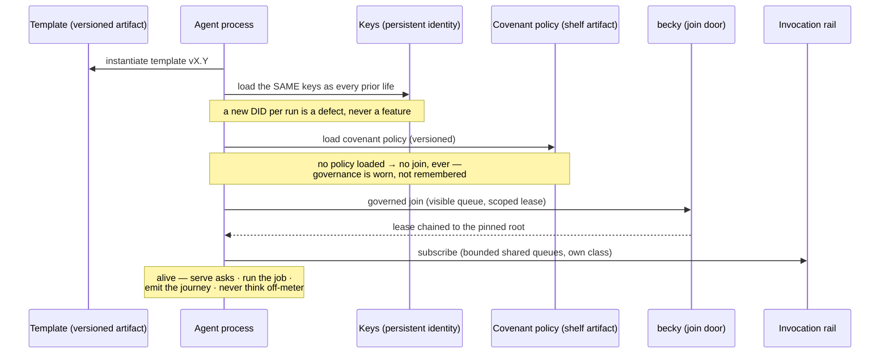
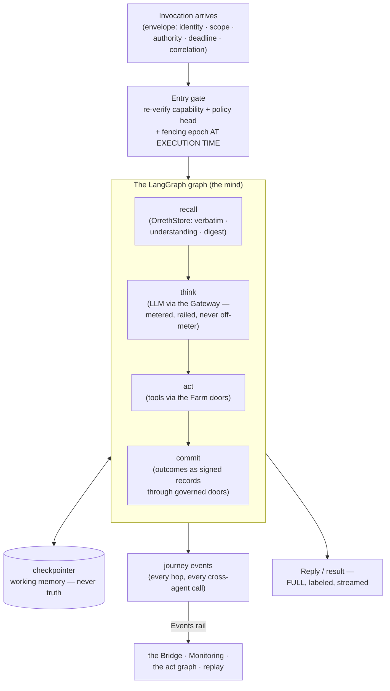
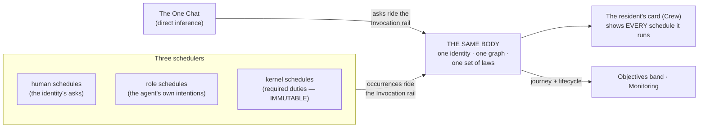

# 0004 — The Agent Architecture

**Status: LOCKED — JB resolved both narration slots and approved
2026-09-16** (Human↔Agent = the One Chat contract, already narrated;
agent-on-behalf-of = attribution and traceability, chain design ratified,
verified at testing as AG-7). Designed against the locked Experience
Charter (0001), Transport (0002), and Memory (0003). **Amended 2026-09-18
(block 9, JB's lock): the third kind — firmware agents; the draft shelf;
skill allocation by need.**

---

## The thesis

**One governed body for every mind.** The default agent is a LangGraph
graph wearing an Orreth identity — born from a versioned template, loading
the covenant as policy before it may join, speaking only through governed
doors, remembering only through the four memories, and emitting its
journey so nothing it does is unseen. The graph is the engine; Orreth is
the trust plane around it. Intelligence varies per agent; the body's laws
never do.

## Birth — the template and the boot

| | |
|---|---|
| **What** | A resident/agent instantiated from a **versioned template artifact** — the graph shape, its knobs, its persona seed, its declared capabilities. |
| **How** | Templates live on the shelf like any craft: versioned, diffable, workshop-editable in Workspace Engineering, stamped by the factories. Deploy = instantiate template vX.Y under a placement profile. |
| **Why** | JB's direction: rapid redeploy, version control, engineering at graph level, clean seams. A fleet of hundreds stays legible because every body is a known template at a known version. |
| **When** | Born at install (Crew pull) or factory output; upgraded by lineage (a new version is a sibling, the identity persists); retired by governed rest — never deletion. |

## The body — anatomy of a resident

Laws of the body, restated from the locks:

- **Doors, never sockets**: a node never opens a connection to another
  agent or store — cross-agent calls ride the Invocation rail through a
  door; recall and commit go through the OrrethStore and kernel doors.
- **The meter is universal**: all cognition through the Gateway; rails
  (guardrails, pins) apply in that lane as landed in the rail-and-stamp
  work.
- **Authority is re-verified at execution time** — enqueue-time authority
  is never trusted (0002's law).
- **The journey is emitted, always** — no invisible second runtime (P7,
  P13).
- **Refusal wears one face** outward, while dial/quota/craft gates teach.

## The two sides — inference and the job

| | Side A — direct inference | Side B — the automation job |
|---|---|---|
| **What** | Serving a human's ask from the chat, live | Role-specific automation: scheduled work, standing duties, reflex responses |
| **Triggered by** | The One Chat (fan-out included) | Three schedulers: **the human** (what the identity schedules) · **the role** (what the agent schedules for itself — its intentions, observations, research) · **the kernel** (kernel-required duties, embedded-firmware class) |
| **Visible where** | The chat thread + journey text | **In the resident's own card** (every schedule lives in its runner — P16) + the Objectives band + Monitoring |
| **Changeable?** | Per ask | Human- and role-scheduled: CRUD through gates. **Kernel-critical: IMMUTABLE** — visible, never editable |

Both sides are the same body under the same laws — the difference is only
who asked. This is the continuity JB named: CRUD on a schedule IS CRUD on
the Operating State, and nothing the kernel runs hides from the resident
card that runs it.

## The covenant as loadable policy

- The covenant becomes a **versioned policy artifact on the shelf**. Every
  agent — residents, factory outputs, Fable's own subagents during builds
  — loads it at boot. Loading is provable (the join records the policy
  version worn); an agent without it never joins.
- Policy updates are lineage: a new covenant version is announced on the
  Events rail; agents pull and verify (the standards law); the Crew card
  shows which version each resident wears.
- This turns governance from architecture-you-hope-holds into **a fact on
  every identity** — and it is felt in the UI exactly as JB asked.

## The fleet's standing specialists

- **The LLM-lifecycle watcher** (name retired from "stable"): watches
  provider retirements and silent drift; escalates through the chat with
  the interlock; can roll all agents' model assignments to prevent
  incidents; owns the **A/B test harness** that regression-tests every
  graph template version against golden sets on schedule — the answer to
  the real-world "model changed without an announcement" threat.
- **allen · security · warden**: wear the placement/risk policy (P10) —
  affinity, secret-fate-sharing, cost-aware metal, what-if reasoning.
- **MITL — the Master Mind In the Loop**: the specialist of Orreth. The
  **Orreth ontology** (deep knowledge of Orreth itself, curated as digest +
  understanding over the repos and canon) · its own brain · repo access
  for deep investigations · **the factories**: it creates skills, prompts,
  and agent templates as governed, versioned artifacts whose results get
  leveraged. Summoned by the soft MITL toggle; answers the "expected
  impact of this change?" door in Workspace Engineering.

## The third kind — firmware agents (block 9 — JB's lock, 2026-09-18)

Residents are named and wear a persona; installed agents differ only in
mutability. **Firmware agents are the third kind: the same body of laws,
no persona, named by their function** — planner · gap analyzer · critic ·
grader · debater · analysis — and the workspace agents bound to the pulls.

- **A keypair is still a self.** "No name" means no human name and no
  persona — never no identity. Every firmware agent is a DID born from a
  versioned template, wearing the covenant, joining through becky's door,
  thinking on the meter, emitting its journey. Nothing about the body
  changes; only the wearer's face.
- **Two callers.** The human calls one directly — as an **include** on the
  chat's top edge (a soft link or the typed word), applied as a single step
  over whatever the residents brought into the chat. The kernel calls one
  as a duty when a flow needs it. Either way the call rides the Invocation
  rail and **wears the authority chain**: H → the residents whose results
  are read → the firmware agent. "Who planned this" is always answerable
  (AG-7's chain, unchanged).
- **One body, per-pull bindings.** The workspace agents are ONE
  workspace-firmware template with a **binding** per pull — policy ·
  prompt · skill allocation — that makes it the Crew's agent, Monitoring's
  agent, Workspace Engineering's agent. Bindings are versioned artifacts
  like everything on the shelf; the harness A/B-tests each. Seven pulls
  are seven bindings, not seven selves to govern.
- **The grader is scribe-class.** A grader, critic, or gap analyzer never
  grades its own yardstick (covenant rule 2): its verdicts are records
  whose author is the firmware agent and whose subject is another
  identity's work; a firmware agent asked to judge its own output refuses.
- **Skills are allocated by need.** The **Orreth Skill** — the ontology of
  Orreth in massive detail — is one versioned artifact; the factories
  allocate **subsets** of it per resident and per firmware agent, each
  allocation versioned, asserted, and assured by MITL. Not every DID knows
  everything (compartmentalization is a security posture, not an
  inconvenience).
- **Where they show.** In the chat as includes and as workspace
  conversants (0001 P19); in the main view as the lines between residents
  and floors — the firmware in flight (the orrery direction, designed with
  the WOW work); in their own cards like any body.

## The factories

| | |
|---|---|
| **What** | The governed production line for skills, prompts, policies, and agent templates. |
| **How** | MITL (or a human in Workspace Engineering) drafts → the artifact lands as a versioned craft through the gate → the A/B harness proves it → assignment through Controls. Factory outputs are ordinary artifacts — nothing born in a factory skips a gate. |
| **Why** | JB's direction: reuse of inventoried, versioned templates; the frontier mind crystallizes capability for the fleet; the self-delivery road. |
| **When** | On demand (a human asks), on gap detection (MITL proposes — the human approves in chat), and eventually as the objective-driven loop matures. |

**The draft shelf (block 9).** While a human creates or updates an agent,
prompt, skill, policy, or binding, the draft lives in **their profile**
(S3/local) — never in Orreth's brain or template inventory. **Cutting a
version is the gate**: only then does the artifact join the shelf, linked
by version to every operating instance that wears it. Unversioned means
higher risk; the kernel never holds it. In Workspace Engineering every
kind of metadata an agent wears — skills · tools · prompts · persona ·
policies — carries an **"Agent Assistance"** soft link into that agent's
versioning, where MITL helps author the next cut.

## Human↔Agent — RESOLVED (JB, 2026-09-16: already covered)

JB confirmed the standing narration covers it: **the One Chat contract IS
the Human↔Agent law.** The human speaks to every agent through the one
chat — typed words equal to clicks, fan-out with role lenses, scope on
the edges. Agents speak to the human only through the chat and its soft
notices — results labeled by producer, journey text, interlocks
in-thread. Every word plain, friendly, complete — the full reply, always.
An agent never initiates toward the human outside its standing duties or
an active ask.

## Agent on behalf of — RESOLVED (JB, 2026-09-16): attribution is the point

JB's words, captured: when automation or a request is executed or created,
**an attribute tells humans who created it and who requested it** —
residents and agents 'request' on behalf of the original request; **graphs
pass to graphs** as part of bigger planned requests; **traceability and
handoffs must hold** when looking at metadata, audit, or compliance.

The design (Fable's sketch, ratified by JB as "might already be covered
naturally" — it now explicitly is):

- Every envelope carries the **authority chain**: origin human → each
  delegating identity in order (`H → A → B → …`). Created-by and
  requested-by are always distinct, named attributes.
- Metering and showback attribute to the **origin**; each hop's blast is
  bounded by the **narrowest scope in the chain**; delegation depth is a
  governed dial.
- The chain renders in the journey text, the record metadata, the audit
  trail, and the compliance export — the human always sees *why* an agent
  is working, not just that it is.
- JB's testing marker honored as **proof AG-7** below.

## Proofs (the AGENTS roadmap)

- **AG-1 The resident speaks** (= transport M3): a template-born LangGraph
  resident, invoked via RabbitMQ, streams a FULL reply to the Bridge with
  journey text and the L2 interlock.
- **AG-2 The same self**: kill and respawn — same DID, same memory, same
  lease lineage; a new DID per run fails the suite.
- **AG-3 No policy, no join**: an agent that skips the covenant policy is
  refused at becky's door — provably.
- **AG-4 Two sides, one card**: a kernel-scheduled duty and a
  role-scheduled intention both appear in the resident's card; the
  kernel-critical one refuses edit; CRUD on the human one changes the
  Operating State.
- **AG-5 Role lenses**: a fan-out ask to two specialists returns two
  distinct, labeled, downloadable results; an on-demand summary cites
  both.
- **AG-6 The harness catches drift**: a deliberately degraded model
  assignment fails the scheduled A/B run and escalates through the chat
  before any human notices by hand. *(P4 sp4: the harness, the record,
  and the escalation on the rail are built and proven; the SCHEDULED run
  waits for the scheduler — the named gap.)*
- **AG-7 The chain survives the handoff** (JB's marker): a planned request
  that passes graph → graph → graph carries its authority chain end to
  end — visible in the journey, the record metadata, the audit trail, and
  the compliance export. A broken or truncated chain fails the suite.
- **AG-8 The include wears the chain:** a planner/critic/grader applied
  from the chat over two residents' results carries H → resident →
  resident → firmware end to end; the grader refuses to grade its own
  output (scribe-class), provably.
- **AG-9 The draft shelf holds:** an unversioned draft never appears in
  the template inventory nor in any recall; the cut version does, linked
  to its instances; a running instance keeps its version until re-cut.

## Explicitly open

- MITL toggle semantics fine detail + factory governance depth — design
  lands with the MITL build phase, inside the resolved on-behalf-of law.
- Template schema v0 (the exact declaration shape) — lands with the first
  build spoonful, through the factories.
- ~~Whether the scheduler is a kernel organ or a duty of a standing
  resident~~ — **DECIDED and BUILT (P4 sp5): a kernel organ** —
  `scheduler.py`, three kinds (human · role · kernel), occurrences on
  the Invocation rail as asks to the runner, every schedule in its
  runner's card, rest recorded never deleted, the kernel kind immutable
  with one plain face.
- ~~The **binding schema** and the include invocation shape~~ — **v0
  LANDED (P4 sp2/sp3):** an include is an ask targeted at a firmware
  body in the same session (its input = the session's results, labeled;
  the chain names what it read); a binding is `bindings/<pull>.v0.json`
  {pull · name · prompt · skills · policy} applied to the one workspace
  template at birth. The factories' governed cut of both (versioned,
  A/B-assured) is still to come.

## What this document binds

Every mind in Orreth wears the same body of laws: born from a versioned
template, the same self in every life, covenant worn before joining, doors
for every word in and out, the journey always emitted, both of its sides
visible in its own card. Capability may differ; accountability never does.
