# 0005 — V1 Scope and the Build Plan

**Status: ACTIVE — the halt is LIFTED (JB, 2026-09-16: "I want to lift the
hault… and let you get to slicing and building"), conditioned on this
plan.** Building happens ONLY on the `rearch/foundation` line under the
locked canon (0001–0004). The old main stays frozen as the record;
demo.orreth.ai and docs.orreth.ai stay untouched until JB says otherwise;
the sacred crates (`orreth-node`, `orreth-store`, crypto, `contracts/v0`)
still change only with JB's explicit per-change approval. The new line
replaces main only when JB and Fable both believe it ready. **The kernel's
language is decided in 0008 (2026-09-21): Rust by Phase 7, the port measured
by the conformance suite this line grows from now; the bodies stay
LangGraph processes the kernel spawns.**

## The coverage checklist (why lifting is safe)

| Necessary item | State |
|---|---|
| Experience Charter — the felt spec, 18 principles | **0001 LOCKED** |
| Transport — four rails, Bridge feed, laws, SLOs | **0002 LOCKED** |
| Memory — four memories, one truth, proofs | **0003 LOCKED** |
| Agents — the governed body, two sides, covenant-as-policy, attribution chain | **0004 LOCKED** |
| Language & the port — kernel Rust (`orrethd`) by P7 · bodies LangGraph · glass one page · the conformance-suite law | **0008 LOCKED 2026-09-21** |
| Process — design→phases→spoons, two-agent testing, docs in close loops | Locked in the direction record |
| V1 razor | This document applies it |

**Charter verdicts still open default to Fable's proposals for the build —
each cheap to reverse, JB may veto any at sight:** ~~the Objectives floor
hatch as the lifecycle band~~ (block 11: **the ANALYZER**, 0007) · the Atlas as the main window's third lens ·
the aggregate schedule view in Monitoring · PULSE as the heartbeat ribbon
· "every click has a sentence."

## The V1 razor, applied

**In V1** — everything Orreth needs to *fulfill a human objective multiple
times, monitor it, provide analytics on it, and manage its lifecycle*:

- The transport spine (outbox → RabbitMQ + Kafka → Bridge feed) per 0002.
- The four memories and the OrrethStore per 0003.
- The LangGraph resident template, covenant-as-policy, and a starting crew:
  a conversationalist with real tools (the "temp outside" bar), the
  LLM-lifecycle watcher with the A/B harness, an allen-class
  infrastructure resident. MITL v0 with the impact door.
- The Bridge: landing page, the One Chat (full contract), the Analyzer
  hatch (block 11 — Objectives is not a pull), and the seven pulls
  arriving in phases.
- The human walk: JB in the glass at every phase close; the friction
  register turns his narration into polish · bug · feature lists (the
  Playwright walker RETIRED 2026-09-21 — see its charter).
- The Rust kernel by Phase 7 (0008), the conformance suite growing one
  fixture per wire change from intent sp1 on.
- Docs and article screenshots produced inside every close loop.

**Out of V1** (parked, named): voice (V2) · multiverse portal · full
enterprise IdP federation (the seam is declared; minimal implementation) ·
the six embodied proof repos · any site/campaign refresh until release.

## The phases

```mermaid
flowchart LR
    P0["Phase 0<br/>THE RIG & THE BASELINE<br/>measure old world (M0) ·<br/>new dev rig (brokers up) ·<br/>playwright agent chartered"]
    P1["Phase 1<br/>THE SPINE<br/>outbox/inbox + envelope (M1) ·<br/>events shadow (M4-lite) ·<br/>Bridge feed v0 (M6-lite)"]
    P2["Phase 2<br/>THE RESIDENT SPEAKS<br/>template v0 + covenant policy ·<br/>OrrethStore v0 · AG-1/M3:<br/>full reply, streamed, with tools"]
    P3["Phase 3<br/>THE BRIDGE v0<br/>landing page · One Chat whole<br/>(fan-out, scope edges, inline results) ·<br/>Objectives band · Esc law"]
    P4["Phase 4<br/>THE FEEL & THE FLEET<br/>focus + sessions · the includes<br/>(first firmware bodies) · Crew workspace<br/>+ cards · Monitoring + its agent ·<br/>harness v0 · leases (M2)"]
    P5["Phase 5<br/>MEMORY WHOLE<br/>understanding + digest full ·<br/>MEM-1..6 · recall in chat<br/>('between X and Y')"]
    P6["Phase 6<br/>GOVERNANCE FELT<br/>MFA/L3 · MITL v0 + impact door ·<br/>compliance export w/ AG-7 chains ·<br/>placement policy v0"]
    P7["Phase 7<br/>SCALE & SEAL<br/>cells + partition (M7) ·<br/>isolation (M8) · hardening ·<br/>THE PORT (0008): orrethd carries the spine<br/>against the conformance suite ·<br/>the release wave, replacing main"]
    P0 --> P1 --> P2 --> P3 --> P4 --> P5 --> P6 --> P7
```

Each phase is a sprint (or two), sliced into spoonfuls at its open, and
CLOSES only when: its proofs pass · JB walks its
experience specs green in the glass (the register carries what felt wrong) ·
its wire changes have their conformance fixtures (0008) · its docs section is
written · its screenshots are banked. **Phase 2 is the soul checkpoint** — the charter's first-class
bar: *a resident actually chats — tools included, the full reply, streamed
— and the librarian can tell JB the temperature outside.*

## The process (standing, per the direction record)

- **Two hands, one human**: Fable builds; **JB tests in the glass** — he
  builds real things end to end in the UI and narrates; Fable turns the
  narration into the friction register and the polish · bug · feature
  lists, then the cures. The Fable Playwright walker is RETIRED
  (2026-09-21: one lean walk cost a third of a five-hour window — the
  charter carries the numbers); regressions are the suite's; screenshots
  come from JB's walks.
- **Docs in every close loop** — the new main's book grows with the build,
  never after it.
- **Slicing**: spoonfuls stay one-sitting sized; every spoonful lands
  whole (built + proven) or confesses PARTIAL by name.
- **The wound rule** (the halt's lesson): a performance or experience
  wound found mid-build STOPS THE LINE — it is fixed or explicitly
  triaged with JB before the next spoonful. Never again a footnote.

## Phase 0, sliced (the immediate work)

## Phase 1, sliced (opened 2026-09-16)

- **sp1 — the durability boundary (M1)** ✅ **LANDED 2026-09-16**:
  `orreth_spine/outbox.py` + `inbox.py` — state and publish-intent commit
  in ONE transaction (no state without its event, no event without its
  state); the relay is at-least-once with the crash-between-publish-and-
  mark window proven harmless; the inbox makes effects ONCE (5 deliveries
  → 1 counter move, duplicates confessed by the meter); aggregate
  ordering per aggregate with **gaps refusing to guess** (GapDetected
  names expected vs got); the outbox budget refuses BY NAME (backpressure
  honest); success never depends on the sink. The envelope grew its
  optional `aggregate` {type,id,sequence}. **The whole SOL M1 fault
  schedule runs as deterministic tests — 20 green in 0.22 s** — and CI's
  spine job now stands up a real Postgres service (SPINE_REQUIRE_PG=1: a
  missing ground FAILS, never silently skips). M1's stop-condition
  honored: no distributed transaction anywhere.
- **sp2 — the events shadow (M4-lite)** ✅ **LANDED 2026-09-16**:
  `sinks.KafkaSink` (topic = the envelope's TYPE — schema families,
  never per-identity; key = the aggregate id, so order holds exactly
  where it matters) + `projector.py` (offset commits ONLY after the
  database transaction; poison bodies PARK visibly with their evidence
  and the projector stops at them — never a silent loss). Proven live on
  the real rail: **project → replay-from-zero → burn-and-rebuild, all
  three views equal to the domain's own truth**; wire duplicates fold to
  one effect; a crash between apply and offset-commit redelivers
  harmlessly; poison parked with reason + raw bytes. Suite 24 green; CI
  gains the events rail as a real Kafka service (SPINE_REQUIRE_KAFKA=1 —
  absence FAILS, never skips).
- **sp3 — the Bridge feed v0 (M6-lite)** ✅ **LANDED 2026-09-16**:
  `bridgefeed.py` — the one place the glass connects. One SSE endpoint;
  notices are POINTER-ONLY ({rev, kind, ref, message_id, at} — never
  bodies, never broker credentials; the browser never touches a broker);
  monotone revisions with a bounded ring; **gap repair rides SSE's own
  Last-Event-ID** (close the laptop, facts land, reconnect — nothing
  missed); a gap beyond the ring answers **`resync` honestly** instead of
  pretending continuity; the gateway DECLARES its topics (a
  subscribe-before-first-fact race found and cured in-hour). **Measured
  end to end: commit → notice in the glass client in 124 ms** (bar: 1 s).
  Suite 30 green. PHASE 1 — THE SPINE — IS WHOLE: ground → rail →
  projection → the human's soft notice, every law tested on real
  services in CI.
## Phase 2 — THE RESIDENT SPEAKS (opened 2026-09-16)

- **sp1 — the body is born** ✅ **LANDED 2026-09-16**: the resident body
  v0 exactly per canon 0004's boot graph — born from a **versioned
  template artifact** (declared format or refused); **the same self in
  every life** (persistent Ed25519 seed; AG-2 proven: respawn wears the
  same DID, the join ledger counts lives 1, 2); **the covenant policy is
  a real versioned artifact** (`spine/policy/covenant-policy.v1.json`,
  12 rules) and **no policy = no join, ever** (AG-3 proven; the join
  records the policy version + hash it wears, signed). The mind is a
  real **LangGraph StateGraph** (hear → think), deliberately small: it
  proves the **FULL-reply law** — every word of the ask returns verbatim.
  The road: ask lands with its event in ONE tx → the **dispatcher**
  (events consumer) turns the committed fact into a RabbitMQ command →
  the resident serves through the durable inbox — **journey + reply rows
  AND their events in one transaction, ACK only after commit**; a
  replayed command road leaves the reply untouched; a stale command
  (unknown ask) is a TERMINAL, visible refusal, never a crashloop; the
  **authority chain rides every hop** (person → resident on journey and
  reply — AG-7's seed live). The Bridge feed carries received → journey
  → reply, completion last. Suite 36 green.
- **sp2 — the mind arrives** ✅ **LANDED 2026-09-16**: `gateway.py` —
  the metered lane ("no mind thinks off-meter": every thought lands a
  meter line — did · model · tokens in/out; the kernel never sees the
  prompt); `store.py` — the **OrrethStore v0** (memories land
  content-hashed WITH their event in one tx; verbatim get; word-match
  search — honestly v0, Phase 5's projection replaces its innards behind
  the same call); the resident graph grew **recall** (its own worldline
  + matching memories packed as notes) and **think** now rides the
  gateway when the template declares a mind — a mindless template NEVER
  touches the gateway (proven). The **librarian** is born
  (`librarian-resident.v0.json`, Haiku 4.5) and **thought for real,
  live**: recalled a seeded fact, cited it by marker, answered
  completely, metered 792 in / 106 out. One walk-wound paid in-hour:
  v0 search matched whole sentences (found nothing) → word-based; the
  honesty law had already held (she refused to invent the memory she
  couldn't find). Suite 40 green. NAMED DEFERRAL: token-by-token
  streaming to the glass lands with the Bridge (P3) — the feed's
  pointer-only law forbids content in notices, and the lawful design
  (delta rows on ground + pointer notices) waits for a glass to stream
  INTO.
- **sp3 — THE SOUL CHECKPOINT** ✅ **LANDED 2026-09-16, PHASE 2 WHOLE**:
  `tools.py` — the governed tool door (a template DECLARES its tools or
  the door refuses WITH a teaching; the mind never even sees an
  undeclared tool; every call journaled: who, what, when, ok); the
  acting mind (`gateway.think_acting` — a real Anthropic tool-use loop,
  every round metered, every act through the door); **the L2 interlock
  mechanically real**: a consequential act HOLDS (`awaiting-confirm`,
  the "Are you sure… cancel is the default" reply, a confirm.needed
  event, the act provably NEVER ran), a deliberate yes releases it
  through the door ("Done, on your word"), anything else cancels — both
  paths proven end to end over the rails. Two wounds in-hour: the
  Exception.args collision (Python's base Exception OVERWRITES `.args`
  — the held tool-args became a list; renamed `tool_args`) and the
  clarifying-question dodge (the mind asked "where are you?" instead of
  using the tool's default — cured in the tool's own words: "call with
  NO arguments… never ask the human where they are first").
  **THE LIVE WALK: "What's the temperature outside?" → "Right now it's
  62.8°F outside where you are, though it feels a touch warmer at about
  63.5°F. A pleasant enough day, I'd say." — the weather tool journaled
  ✓, 860 in / 43 out metered, the full road.** The sentence that started
  the halt is a passing test. Suite 45 green.

## Phase 3 — THE BRIDGE (opened 2026-09-16 · **CLOSED WHOLE 2026-09-17**, JB's lock: every named claim walked green on the human path; the left scope edge — universe · ecosystems · fields multi-select — owed to P4, where a second world first exists)

- **sp1 — the glass exists** ✅ **LANDED 2026-09-16**: `glass.py` — the
  glass server (the page, the SSE feed, and the human-path doors: POST
  /ask · GET /ask/<id> with the journey notes · POST /confirm where
  **an absent approve key means cancel**) + **BridgeRig**, the whole dev
  Operating State in one object (relay + dispatcher + librarian + glass,
  started together, stopped whole — `python -m orreth_spine.glass` →
  http://127.0.0.1:4600). `glass/index.html` — the Bridge v0 in the
  cockpit theme: hull frame + amber strips + the starfield window +
  ORRERY·BRAIN·ATLAS sill + OBJECTIVES floor + **the One Chat sliding
  out of the ceiling** (glassy, framed), journey soft-lines live under
  each ask, the full reply rendering in place, the interlock in-chat
  with **Cancel (default) holding focus — Enter can never confirm**, and
  **[Esc] returning the bridge from anywhere** (SPEC-ESC-01's cure).
  Every notice is a pointer; the glass fetches truth through the doors.
  Proven over HTTP alone: the human path end to end, and a cancel whose
  journal shows the act NEVER ran. THREE test-suite wounds paid
  in-hour, each a small production lesson: fresh dispatcher groups
  replayed ALL topic history (the tests had the growing-corpus disease;
  cured with the production pattern — ONE persistent group) · the feed
  ring honestly overflowed at 1024 replayed events (tests now listen
  like clients, attached before asking) · a grown graph moved the reply
  to notice five (collect until the reply, never count). Suite 47
  green, twice-run stable.
- **sp2 — the band, the edges, the fan-out** ✅ **LANDED 2026-09-17**:
  **the OBJECTIVES floor hatch opens** — the lifecycle band slides up
  from the floor (P13 felt): every ask queued/held/replied/cancelled,
  status dots breathing, every row a door that renders its reply AND
  journey in place, live-refreshing on feed notices (P17). **The chat
  grew its resident edge** (the crew rail: live roster chips from the
  new /residents door; selection IS the scope of applied inference —
  the chat targets its selected residents, so two residents never make
  the shared queue a lottery). **Fan-out is real** (P14): one ask →
  one per named resident via per-resident routing keys/queues; two
  lenses, two selves, distinct labeled results, a shared fanout id —
  and "summarize these together?" appears only when all replies land,
  because synthesis is the human's choice. The BridgeRig seats a second
  resident (the echo) by default. New doors: GET /asks · GET /residents
  · POST /ask {to:[…]}. TWO structural wounds found live and cured at
  the right layer: (1) the running Bridge's librarian ANSWERED A TEST'S
  ASK — with yesterday's weather in her recall — two rigs shared one
  broker world; now **queues wear a namespace (SPINE_QUEUE_NS) and
  every fact wears its WORLD (SPINE_SCOPE; a dispatcher only dispatches
  its own world's facts)** — the universe-isolation law arriving early,
  proven by collision; (2) an old-code process is an OLD WORLD — no new
  law can bind a process that predates it (the deployment lesson,
  named for the cells era). Suite 49 green.
- **sp3 — the words form live** ✅ **LANDED 2026-09-17** (streamed
  deltas; the Playwright walk of the specs is OWED — see Next): the
  gateway lane streams (`on_delta`; the real mind through
  `messages.stream`, the fake one word by word), the resident hands each
  delta to the glass feed, and the feed sends it to CONNECTED clients
  only as an SSE `delta` frame — **never the ring, never a revision,
  never the outbox, never a topic** (structural: a delta cannot reach
  the broker). In the chat the words form under "…thinking aloud" and
  the door's truth replaces the sketch when the reply lands; the
  concatenated deltas equal the reply and GET /ask/<id> still serves the
  whole. `tests/test_stream.py`. THE SUITE WOUNDS OF THE DAY, honestly:
  CI went red on a fresh ground (four threads racing `CREATE TABLE` —
  the echo never joined; a reused dispatcher group waiting on its own
  ghost — the mind "timed out"): cured with a DDL advisory lock taken
  once per connection, join retries, a STANDING dispatcher consumer
  (`projector.run_forever`, one membership per life) with the world
  skip BEFORE the inbox footprint, a settled-status guard on re-serves,
  and fresh dispatcher groups in the tests. Then the local suite stayed
  red for hours under a PHANTOM: a Bridge relit at 08:14 on pre-skip
  code kept marking EVERY world's ask facts applied under the shared
  `glass-dispatcher` name on the shared ground, so every test dispatcher
  read `stale` and never published — the sp2 deployment lesson bitten a
  second time (an old process is an old world), found only by
  measuring one fresh rig hop by hop instead of patching. Second wound
  under it: a SESSION-scoped test rig is a competing consumer (its
  residents steal every later test's command and refuse it as a
  stranger) — the rig is MODULE-scoped and `stop()` joins its threads.
  Suite 50 green, twice-run stable (2:41 · 2:42).
- **sp4 — the Playwright walks the specs** ✅ **LANDED 2026-09-17**:
  the AFTER-WALK — a Fable Playwright agent walked all 14 specs against
  the live Bridge on the human path only (a real Chromium in the
  Playwright MCP container; click, type, read, wait — no door, no
  ground, no source), 18 bar-moment screenshots, honest waits (every
  reply 4–12 s): `baselines/after-walk-2026-09-17.md` + its evidence
  folder; verdicts in the spec book's new **Bridge v0** column beside
  the old glass. THREE WOUNDS FOUND, RULED, CURED, RE-WALKED GREEN —
  the wound rule working as written: (1) **the band's doors were shut
  in the landing state** — the open chat overlapped the band's top rows
  and swallowed their clicks → the chat YIELDS when the band opens (no
  overlap, the ask box stays reachable); (2) **"summarize these
  together" misattributed** — the machine prompt rode the human's own
  bubble and the librarian claimed the echo's words → a labelled
  synthesis line ("on your word → librarian") and a prompt that names
  the crew and forbids claiming another's words; (3) **every reply
  bubble read "orreth"** — the roster had turned over because the
  Bridge minted EPHEMERAL selves every life (covenant rule 1 drift: the
  librarian was a stranger wearing her name on every relight) → the
  Bridge seats the SAME selves (seeds under `~/.orreth/agents`, proven
  live: `lives=2`, same DIDs; a rig-layer law in the suite) and a reply
  falls back to the resident the ask was routed to. Suite wound on the
  way: a bare execute on the session's `pg` connection pinned the DDL
  advisory lock for the whole session (psycopg3's implicit transaction)
  → the fixture is autocommit. Honest findings on the road, not
  footnoted: JOURNEY-01 names WHO only (no scope, no time — sp5);
  SCOPE-01 · SCHED-01 · LENS-01 · CLEAR-01 · FULL-01's acquire half
  NOT BUILT (expected; later phases); the band and the roster show
  EVERY world's rows because the ground carries no world scope — the
  universe-isolation leak, **sp5's first cut**; residents don't know
  they share a fan-out ("I'm only one person here" — P4); the
  consequential act demands a machine key a stranger lacks (tool UX);
  raw markdown in bubbles; crew selection resets after a synthesis;
  no download control (FANOUT-01's third bar). The before-walk
  remainder (old glass) stays OWED — it needs the old rig relit and is
  JB's spend call; nothing downstream blocks on it. Suite 51 green.
- **sp5 — the ground wears its world** ✅ **LANDED 2026-09-17**: every
  ask and every join carries the world it was made in (`scope` on
  `spine_asks` and `spine_joins`, stamped from SPINE_SCOPE at the write),
  and a glass's doors serve ONLY their own world — /asks, /residents, and
  /ask/<id> (another world's ask is "no such ask": the refusal wears one
  face). The universe-isolation law now holds at the ground, not only on
  the rails and benches. **JOURNEY-01 PASSES**: under each reply a soft
  line names who took it, on which scope, and when it completed, with
  the elapsed seconds ("librarian took it on u:dev · completed 01:52:34
  (0.2 s)"); band rows carry a time. Proven the hard way: the Playwright
  re-walked LIFE-01 + JOURNEY-01 WHILE the full suite ran on the same
  ground — 15 s of watching, rev 23 → 37, and not one stranger's row in
  the band (re-walk #3, evidence saved). Two laws in the suite: the
  human path's view wears its world and its completion time; a stranger
  world sees none of this world's ground. Operator's act on the dev
  ground, once: the 239 rows from before the column got their world
  from their OWN ask.received events (51 real dev asks returned to the
  band; every test row left it). Friction filed: the completion clock is
  the browser's local 12-hour time with no date. TWO SUITE WOUNDS on the
  way, both honest: (1) **the growing-corpus disease, second time** —
  the test dispatchers' fresh groups replay the topic from its start
  and `run_once` counted every SKIPPED (other-world) fact against its
  500 cap; the day's walks pushed the topic to 539 facts and eight
  resident tests went red deterministically, their own fact never
  reached → skipped facts now cost nothing against the cap (the cap
  bounds THIS world's work), pinned by a law in test_events_shadow;
  (2) the new isolation law itself polluted a later test (its ask was
  drained and served by the next resident) → the law files in a world
  of its own. And a process wound, recorded so it never recurs: a
  background suite's "exit 0" was the pipe's, not pytest's — the close
  was nearly called on 8 red. Suite 53 green.
- **sp6 — the scope edges** ✅ **LANDED 2026-09-17**: the chat's **clock
  assist** (the charter's "clock assist for time" on the chat's edges;
  P6 scope set where intent forms; P8 never eye candy): a TIME strip
  under the chat header reads "now" until typed words set it — "between
  last Monday and today", "since yesterday", "last 3 days", "last week",
  a weekday, a date — and it follows the words AS THEY ARE TYPED, no
  click, no send: both edges named, a day-ticked axis between, the span
  in days or hours. The window is scope, not decoration: it **rides the
  ask** (payload `window`, `time_window` on the ask row — `window` is a
  reserved word in SQL, found the loud way), the door validates it, and
  the journey line under the reply names it ("librarian took it on u:dev
  · Mon Sep 14 → today · completed …"). After a send the clock returns to
  "now": the next ask's scope forms with its own words (re-checked on
  the human path). **SPEC-SCOPE-01
  PASSES** (re-walk #4: the strip changed character by character, "Mon,
  Sep 14 ——|——|—— today · 4 days"; "since yesterday" → "27 h"; cleared →
  "now"). A law: an ask wears its window on the ground and in its
  committed event; a plain ask wears none. Friction filed: the browser's
  own clock/day (a UTC container reads tomorrow); the librarian has
  nothing to say about the window yet — recall does not read it (P5
  memory whole is where the window becomes a lens). The left edge
  (universe · ecosystems · fields multi-select) has nothing to select
  until a second world exists — owed to P4. Suite 54 green. **PHASE 3
  IS WHOLE.**

## Phase 4 — THE FEEL & THE FLEET (opened 2026-09-18, re-sliced on block 9 — JB's lock · BUILT 2026-09-18, five spoonfuls · **CLOSED WHOLE 2026-09-20**: every spec walked green on the human path, MONITOR-01's cure re-walked in walk #5)

JB's narration before P4 (`experience-capture.md` block 9; distilled into
0001 P19–P21, 0003 sessions, 0004 the third kind) re-sliced the phase:
experience first, bodies second, workspaces third — each spoonful walked
by the Playwright before it closes.

- **sp1 — the chat follows the focus + sessions v0** ✅ **LANDED
  2026-09-18**: **the focus stack (P19)** — opening an ask from
  OBJECTIVES pushes a focus: the chat opens itself, re-dresses to that
  ask's resident and window (the crew chip lit, the clock set, a FOCUS
  strip naming it), a follow-up goes there; **one [Esc] pops every focus,
  restores the bridge's selection and clock EXACTLY, and returns the bare
  bridge** — SPEC-ESC-01 and P19 agree by construction (the first focus
  is an ask; a workspace's focus arrives with the Crew pull in sp3).
  **Sessions (P20)** — the kernel half: a `session` on every ask, a
  `spine_sessions` table, three doors (roll · list · load), the ask door
  carrying the session, and **MEM-7's seed: a resident's recall reads
  THIS session's results — by any resident, labeled — never another's**
  (an ask with no session reads only its own session-less past). The
  glass half: "sessions · new session" in the header, and the words
  "new session", "list my sessions", "load session 2" (an ordinal or an
  id prefix) equal the clicks; a loaded session renders whole, in order,
  and a reloaded page continues the last one VISIBLY. **The chat is
  resizable** — the upper-right corner is the origin, locked; the grip
  at the lower-left moves the rest; the size survives a reload. THE
  WALK (Playwright, walk #2 + re-walks): **SPEC-FOCUS-01 PASS**; **SPEC-
  SESSION-01 FAIL then PASS** — a wound found and cured the same hour:
  the sessions door never decoded the URL-encoded person, so "list my
  sessions" read "none yet" for everyone and "archived, not gone" was a
  false promise (cured at the door; pinned by an HTTP-level law — the
  Python views were tested, the handler's parsing was the gap). PELICAN
  in session A · "new session" · no PELICAN in B · the list newest first
  with counts and last words · "load session 2" returned A whole ·
  PELICAN back in view — nothing spilled. Frictions cured on the way:
  the clock keeps a held focus's window after a send; the span counts
  calendar days everywhere; two racing notices can no longer render a
  reply twice; the reload continues the session visibly; replayed
  journey lines carry the world. On the road: the librarian argues with
  her own earlier "no record" reply once the session returns (content;
  P5's digest will settle it); the left scope edge waits for a second
  world (P4 sp3/sp4). Three laws: sessions roll/list/load and never
  spill · a resident reads only this session's results · the session
  doors answer over HTTP as the glass asks. Suite 57 green.
- **sp2 — the includes edge** ✅ **LANDED 2026-09-18**: **the third
  kind is real** — planner · critic · grader are bodies born from
  firmware templates (`kind: firmware`, named by function, a `charge`
  instead of a persona; the same laws: a persistent self, the covenant
  worn, the meter, the journey), seated by the BridgeRig beside the
  residents. An **include is an ask targeted at a firmware body in the
  same session**, so its input is exactly sp1's session-bound recall —
  the residents' results in this session, labeled by who said them. The
  INCLUDES strip on the chat's top edge ("plan · critique · grade") and
  the typed words ("plan this", "critique", "grade") send one step; the
  crew rail shows residents only (the crew door tells the kinds). **AG-8
  holds by construction**: recall collects the DIDs whose results it
  read and the journey lands H → the residents read → the firmware; a
  step names them ("read the session's results by echo, librarian").
  **The grader is scribe-class**: its own replies are never material,
  and with nothing else in view it refuses before any thinking ("I never
  grade my own yardstick"). The synthesis no longer resets the human's
  crew selection (a filed friction). THE WALK (#3, the Playwright's last
  before the spend wall): planner's result draws on BOTH answers by name
  (PASS); the grader refuses in plain words (PASS); "its journey says
  whose results it read" FAILED in the chat — the note was emitted (the
  law proves it) but the journey line under the reply never showed it;
  cured the same hour (the line now carries it), re-walk OWED. Frictions
  cured: a held focus survived "new session" (roll and load now start at
  the bridge's focus); the band's toggle hid under an expansion (its
  header closes it); markdown headings and bold now fall away on the
  glass (the Record keeps the exact words). Three laws in
  `tests/test_includes.py`.
- **sp3 — the Crew pull, the first workspace** ✅ **BUILT 2026-09-18 —
  walk OWED** (the Playwright hit the account's spend wall during sp2's
  walk; per JB's cadence call the owed walks — INCLUDE-01's cured third,
  WORKSPACE-01, SCHED-01's partial — run in ONE debug session when the
  limit resets): **the binding schema's v0** —
  `templates/workspace-firmware.v0.json` is the ONE workspace body;
  `bindings/crew.v0.json` names its seat ("crew"), its pull, its prompt,
  its skills; `Resident(binding=…)` applies it at birth (name, function
  `workspace:crew`, the charge extended), and the rig seats it. **The
  Crew pull** slides from the left hull wall (its tab is the wall's edge;
  "open the crew" by words): **one card per body, both sides** (0004) —
  kind · self · lives · the covenant version worn · what it DECLARED at
  its join (capabilities now recorded on the join) · side A, asks served
  and last · side B, the kernel-required duties, each 🔒 and answering a
  click in plain words ("kernel-required — visible, never editable");
  human- and role-scheduled: "none yet — the scheduler is on the road"
  (AG-4's CRUD half waits for it; SCHED-01 PARTIAL). **The chat follows
  the workspace** (P19): opening the pull pushes "FOCUS · the Crew
  workspace · its agent, crew" — the crew agent answers from the cards
  (its recall packs them); close the chat and the cards work by hand
  (manual); each card's soft link reopens the chat to its agent about
  that body (assist); one Esc returns the bridge, scope restored. Three
  laws in `tests/test_crew.py` (the door's both sides · the binding
  births the agent with the crew in its recall · the door over HTTP with
  the whole rig of six). Suite 63 green (sp2 + sp3 together).
- **sp4 — Monitoring + its workspace agent, the harness v0, presence
  leases** ✅ **BUILT 2026-09-18 — walk OWED**: **presence leases (M2)**
  — every body renews a lease as it serves (`presence.py`, 15 s); alive
  = a fresh lease; a body that stops renewing reads DORMANT within
  seconds and stays listed — the roster breathes, nothing is deleted;
  the crew cards and the monitor show it. **The Monitoring pull** (the
  second tab on the left wall; "open the monitor" by words): the
  Operating State live through one door (`/monitor`) — the pulse, the
  rails (outbox pending and oldest, the benches' depths, the topic's
  depth), every body alive or dormant on its lease, asks by status, the
  WATCHES, the last harness run. **Its workspace agent** (the one
  workspace body wearing `bindings/monitor.v0.json`; its recall packs
  the snapshot) can PROPOSE a watch — the MITL loop in miniature: the
  `add-watch` tool is consequential, so it holds at the L2 interlock for
  the human's yes, then lands on the ground and is judged live, green or
  red (the tool door now passes the ground to tools that act on it).
  **The A/B harness v0** (`harness.py`, `golden/librarian.v0.json`):
  golden cases through a body's own graph; every run a record; a failing
  run is a FACT on the rail (`orreth.harness.failed.v1`) that the feed
  carries and the chat shows as a soft notice — the escalation the
  watcher owes; on demand through `/harness/run` (a soft link in the
  view). **The scheduler is now the named gap**: AG-4's CRUD half and
  AG-6's scheduled run both wait for it. Four laws in
  `tests/test_monitor.py` (a lease's life and lapse · a watch holds,
  lands, is judged · the harness passes a sound mind and fails a
  degraded one on the rail · the doors over HTTP with seven bodies
  alive). SPEC-MONITOR-01 written; walk owed with the others. Suite 67
  green.
- **sp5 — the scheduler** ✅ **BUILT 2026-09-18 — walk OWED**: the
  named gap closed as **a kernel organ** (0004's lean, now decided): a
  SCHEDULE is a standing intention on the ground in one of three kinds —
  **human** (CRUD through the door; from the card), **role** (declared
  by a body's template — the librarian's "review what was asked of you
  today…" — registered once at every join), **kernel** (registered by
  the rig at boot — the harness run for every mind with a golden set —
  visible, NEVER editable: one plain face, 403 at the door). An
  OCCURRENCE of a human or role schedule is an ask to its runner on the
  Invocation rail — it shows in the band wearing its journey; a kernel
  occurrence acts directly (the harness runs) and is recorded. **Rest is
  a first-class recorded act, never a deletion** (covenant rule 11): the
  card's "rest it" lands `rested_by` and `rested_at`, and the schedule
  never beats again — still there. **Every schedule lives in its
  runner's card** (P16): side B now lists kernel 🔒 · role · human with
  their beats, last occurrence, and count, plus a "schedule an ask…"
  form. **AG-4 is built** (a kernel duty and a role intention in the
  card; the kernel one refuses; CRUD on the human one changes the
  Operating State) and **AG-6's scheduled half is built** (the kernel
  beats the harness every 30 min). A PRODUCTION WOUND, found by a hang:
  the schedule loop's long-lived connection ran a bare SELECT, psycopg3
  opened its implicit transaction, and the next `ensure_schema` inside
  it held the xact-scoped DDL lock forever — every door queued (the
  fixture lesson of the day before, in production exactly where the
  memory said to watch). Cured at the layer: every long-lived rig
  connection is autocommit. Four laws in `tests/test_scheduler.py`;
  SCHED-01 now BUILT (walk owed). Suite 71 green.
- The **draft shelf** (PROD/DEV decoupling, AG-9) lands with Workspace
  Engineering; the **markers dive** (`0006-markers-dive.md`) is designed
  before Phase 5 projects them.
- **The walk session** ✅ **WALKED 2026-09-18** (walk #4): INCLUDE-01 ·
  WORKSPACE-01 · SCHED-01 green on the human path; MONITOR-01 green on
  every bar but one WOUND — **the open pull went stale** (loaded once on
  open; the watch confirmed at the interlock read "none yet"; leases
  aged past "until" still reading "alive") — P17 failing where a human
  feels it. Cured the same hour, at the layer: every open pull follows
  the feed (a debounced refresh on each notice, as the band always did),
  the monitor breathes on a 5 s beat while open (leases move without a
  notice), a confirm refreshes every lens; the Crew pull keeps its
  reader's place on refresh; the chat has its own close; italics fall
  away in plain words. **MONITOR-01's re-walk is the one thing between
  P4 and WHOLE.**
- Next: **P4 WHOLE** on MONITOR-01's re-walk at Phase 5's first walk
  (JB's lock, 2026-09-19: deferred rather than spent). The markers dive
  (0006) stays parked; sp2's projection is where a marker lineage would
  later live.

## Phase 5 — MEMORY WHOLE (opened 2026-09-19 — JB's lock on the slicing · **BUILT 2026-09-19**, four spoonfuls · walk #5: FULL-01's acquire half green; SCOPE-01 and MARK-01's fourth bar found wounds, cured the same hour · **CLOSED WHOLE 2026-09-19, walk #6**: SCOPE-01 reads the window (seven asks named to the minute), SESSION-01's short version under every archived session, MARK-01's critique in the chat in 16 s — every named claim walked green on the human path)

Four spoonfuls, one MEM proof each with its law (canon 0003): **sp1**
MEM-1 total recall + the window reads · **sp2** Understanding v0 (a
ranked projection; validity intervals; MEM-4) · **sp3** the Digest
(session roll = episode boundary; digests cite sources; MEM-3) · **sp4**
resume · quarantine and purge · growth (MEM-2 · MEM-5 · MEM-6). P5's
first walk carries MONITOR-01's deferred re-walk.

- **sp1 — MEM-1 total recall, and the window reads** ✅ **BUILT
  2026-09-19 — walk OWED**: **the `acquire` tool** — a resident acquires
  a text through the door (every word kept exactly, content-hashed, WITH
  its event, under the resident's own namespace; memories now wear their
  world) — declared by the librarian; FULL-01's acquire half is real.
  **Recall by ref · by ask · by session · by timeframe**, byte-exact,
  through one door (`/recall`; a malformed window answers 400, nothing
  recalled answers one face). **The window reads (P6, at last):** an ask
  wearing "between X and Y" packs, into the mind, the human's asks in
  that window across ALL their sessions in this world (labeled, timed)
  and every word the resident acquired in it — the session's own results
  stay in view (P20) and nothing outside the window comes along. Three
  laws in `tests/test_recall.py` (acquire lands every word with its
  event and recalls byte-exact by ref and by timeframe · recall reads
  the ask's window over all the human's worldlines · the door answers
  verbatim over HTTP, encoded as a browser sends it). Suite 74 green.
- **sp2 — Understanding v0, MEM-4 changing facts** ✅ **BUILT 2026-09-19**:
  **a memory never overwrites** — a new memory under the same key is a
  SIBLING that supersedes the current one (lineage on the row and in
  its event; the same words again land nothing), each with a **validity
  interval**, so `get` and `search` answer **what is true now** and,
  with `at`, **what was true then**; `history` is the lineage, oldest
  first; the door serves both (`/recall?ref=…&at=…`, `&history=1`). In
  the chat, an ask wearing a window reads the memories **as they stood
  at the window's end** — what we knew then, not now. **The projection
  v0** behind `search`: Postgres full-text — stemmed ("cure" finds
  "cures"), OR-shaped over the ask's words, RANKED (the memory holding
  more of them first), a GIN index; every row wears the projection's
  kind (`tsvector:english` — vectors will wear their model the same way
  when an embedding lane exists); pure stopwords honestly find nothing,
  and a token the stemmer can't hold still finds its memory by the old
  word-match. An older ground migrates in place (the v0 primary key on
  namespace/key gives way to lineage; the rows stay). Four laws in
  `tests/test_understanding.py`. Suite 78 green.
- **sp3 — the Digest, MEM-3** ✅ **BUILT 2026-09-19**: **a session's roll
  is an episode boundary** — the archived session gets its digest
  (`digest.py`; the roll door carries the archived session; `/digest`
  on demand or to rebuild; `/digest/<session>` to read it with every
  source it cites). The digest v0 is **extractive and deterministic** —
  the head of every exchange, who replied and when, the words acquired
  in the episode's span (this opening to the next) — so a rebuilt digest
  is **byte-identical when nothing changed**, and a grown episode gets a
  **sibling that supersedes** (the lineage pattern), each landing with
  its event. **Every digest cites its sources** (ask ids, memory refs),
  and each source opens verbatim through the recall door. **The pack
  reads the short version first**: a resident's recall packs the digests
  of this human's earlier sessions — each naming its session and its
  digest — before any verbatim; inside a window, only sessions with asks
  in it. The sessions list shows each session's short version at a
  glance. A mind's prose digest can later land as a sibling of the same
  record. Three laws in `tests/test_digest.py`. Suite 81 green.
- **sp4 — resume · quarantine and purge · growth (MEM-2 · MEM-5 · MEM-6)**
  ✅ **BUILT 2026-09-19**: **MEM-2 resume** — working memory on the
  ground: a body's graph is checkpointed after every hop (the LangGraph
  Postgres saver, on a connection of its OWN so a serve that rolls back
  keeps the hops it made); a life that dies mid-think resumes AT THINK
  on the next serve — never re-hearing, never re-recalling, one thought
  spent, and the journey says "resumed at think" (the 500-hop objective
  is a later phase's; the mechanism is this one). **MEM-5 quarantine
  and purge** — Opt Out is a state (P11): a session opened opt-out
  makes its asks, the memories acquired in it, and its digest opt-out;
  every read — recall, the store, the digests — stays inside its state,
  so an "in" ask never sees them and opting in imports nothing; inside
  its state the resident still remembers. A **governed purge** (the
  librarian's `purge-memory` tool, consequential — it holds at the
  interlock for the human's yes) removes every version of a memory,
  the projection leaves with the rows, every digest that cited it is
  rebuilt as a sibling without the citation, and a **tombstone** event
  keeps the hashes — never the words. **MEM-6 growth**, measured: 1k →
  10k memories, `search` and `within` medians under 100 ms and flat
  within a bound (a GIN index for the projection; an index on the
  landing time). Laws: `tests/test_resume.py` (a body that dies
  mid-think resumes at think) · `tests/test_purge.py` (opt-out never
  leaks; a purge reaches everything and leaves a tombstone) ·
  `tests/test_growth.py` (latency flat ×10). Dependency:
  `langgraph-checkpoint-postgres`. Suite 85 green.

## Phase 6 — GOVERNANCE FELT (opened 2026-09-21 — Fable's slicing, JB may veto any spoonful at sight)

The charter's line: **the proof demand rises to meet the consequence** (P12),
and governance is a *felt* experience in the chat — never a form someplace
else. What stands at the open: L1 (the ask) and L2 (the in-chat interlock:
"are you sure", cancel default, yes by a deliberate click — SPEC-L2-01
green) · the authority chain on every envelope (AG-7's seed) · markers as
the WHY on every fact · the stop on every intention (rule 11). What P6 adds
is the top of the ladder, the specialist who weighs a change, the export that
proves the chain to a stranger, and where a body may run. Built in the Python
simulator (0008); **every wire change adds a conformance fixture**; JB walks
each spoonful in the glass and Fable keeps the register. One spoonful per
session (the token law).

- **sp1 — L3: the proof demand rises** ✅ **BUILT 2026-09-21 — walk OWED
  (JB in the glass, SPEC-L3-01).** What landed: `orreth_spine/proof.py`
  (TOTP per RFC 6238 in pure Python, ±1 step; the ladder routine <
  consequential < grave → L1 < L2 < L3; the authenticator enrolled through
  the chat — "enroll my authenticator" draws the QR once, the first code
  confirms, re-enrolling needs the OLD code; masters on the ground, seeded
  from `SPINE_MASTERS`; every proof offered a recorded fact) · every hold
  wears its `class` and `level` on the row and on `confirm.needed` · the
  `/confirm` door judges the proof (L3-code: the asker's code · L3-master:
  a declared master, never the asker) and every refusal is ONE face,
  `403 {"error": "not confirmed"}` · three wrong proofs REST the act (a
  recorded cancel; the chat says so) · cancel taken at every level ·
  `spine_asks.proof` on every record (L1 · L2 · L3-code · L3-master), on
  the reply's envelope and the journey line · stopping one of the
  KERNEL's intentions is grave: a bare stop refuses, the kernel holds it
  for L3-master and settles it on the ground · one test-only grave tool
  (`erase-record`, declared by no template of the house) · the glass
  draws "this needs your code" (a typed code, then a click; Enter never
  submits) and "this needs a second named person" · fixture
  `conformance/proof-v0.json` (RFC vectors, drift, the ladder, the wire
  shapes) · `tests/test_proof.py` (9 laws). **Suite 126 green** (the full local run; 9 of them sp1's).
  **Honest boundary:** no template of the house declares a grave tool yet
  (the librarian's shelf is unchanged — a proof's need decides); masters
  come from the dial alone (a directory is not in P6); a body killed and
  a policy cut into service are not yet classed grave (the seam is
  `consequence: "grave"` + `master: true` on the declaration); the
  export that reads `proof` is sp2's. The old bare stop on a kernel
  intention in `tests/test_intent.py` was replaced by name (it encoded
  the law sp1 raises). Acts wear a *consequence class* —
  routine · consequential (L2 today) · **grave**. Grave acts (the kernel's
  own intentions stopped, a body killed, a policy or template cut into
  service, an export of another person's words) demand **L3 in the chat**:
  the kernel asks for a **one-time code from the person's authenticator**
  (TOTP, enrolled once through the chat — "enroll my authenticator" draws
  the QR in the transcript), and for the gravest — the kernel's standing
  intentions, killing a body — **master authority**: a second, *named*
  person confirms, never the asker. A wrong code refuses with ONE face (rule
  4); three wrong codes rest the act and say so. Every act's record carries
  its **proof level** (L1 · L2 · L3-code · L3-master) — the export reads it.
  The word "sure" never passes L3: a code is typed, a master clicks.
  **SPEC-L3-01.** Fixture: the consequence classes and the proof-level
  record on the wire.
- **sp2 — the compliance export with AG-7 chains** (JB's testing marker)
  ✅ **BUILT 2026-09-21 — walk OWED (JB in the glass, SPEC-EXPORT-01).**
  What landed: `orreth_spine/export.py` — the bundle `orreth.compliance/1`
  for ONE scope (a session · a window · a marker root; none given → the
  current session): every ask, hold, proof offered, reply, include act,
  intention stop and marker set, chronological, each row wearing the
  chain its envelope carried (never rebuilt; a hop that does not run from
  the origin human to the body that acted is `chain_status: broken` and
  COUNTED), its proof level, its marker lineage (kind · id · parent ·
  root), its words (an opt-out session's rows carry none) and who served
  it; a sha256 hash chain over the rows (`h0 = sha256(canonical(row0))`,
  `h_i = sha256(ascii_hex(h_{i-1}) || canonical(row_i))`) with
  `verify()` recomputing hashes, statuses and counts; a CSV (the chain
  joined " → ", words cut at 500 with an ellipsis and a `words_truncated`
  column) · `GET /export?session=|from=&to=|marker=` (+ `format=json|csv`,
  `person=`) — a READ, the outbox gains no row · the chat words "export
  compliance" · "… for this session" · "… for between Friday and today"
  (the recall's own window parser) · "… for the hemp objective" (the
  Analyzer's origins, first match) → a table in place (at · kind · who →
  for whom · proof · why · words) under a one-line summary, then
  "download JSON" · "download CSV" · fixture `conformance/export-v0.json`
  (6 cases: `hash_chain` · `chain_status` · `verify` · the bundle's
  canonical bytes) · `tests/test_export.py` (10 laws). **AG-7 PROVEN:** a
  planned request (echo + librarian answered; planner and grader applied
  over both) exports with H → the residents read → the firmware on every
  include row, `chain_broken: 0`, and `verify()` true; one hop cut →
  `verify()` false, resealed → counted; the kernel's held stop exports
  hold (H → the kernel · L3-master) · two proofs · reply (H → master →
  the kernel) · the intention's stop. **Suite 141 green** (the full local run; 10 of them sp2's).
  **Honest boundary:** the glass has no kernel self, so its door exports
  UNSIGNED (`signed_by: null`; the Ed25519 path is built and proven with
  an ephemeral signer in the suite — a kernel identity is the seam);
  exporting ANOTHER person's words is grave and NOT built — a bundle only
  ever holds the requester's own asks (`scope.person`), the L3 door for
  another's words is a named seam; the tool hop is not on the wire
  (`spine_tool_calls` records did · tool · args, no chain, no event — the
  hold row names the tool, the chain ends at the body; a real AG-7 finding
  for a later spoonful); a body's own `marker.set` fact carries only its
  setter, not the origin human; the outbox is read by id with a sequential
  scan (the audit projection is P7's). The original sp2 text follows.
  Words in the chat — "export compliance for this session" · "for between
  Friday and today" · "for the hemp objective" — produce a **signed bundle**
  (canonical JSON + a human CSV) of every ask, act, hold, confirm, reply and
  marker in the window, each row with its **authority chain end to end**
  (H → resident → firmware → tool), its proof level, its marker lineage
  (the WHY), and a hash chain over the rows; downloadable from the chat,
  rendered as a table in place first. **AG-7 proven:** a planned request
  (planner → resident → grader) shows an unbroken chain in the export; a
  truncated chain FAILS the suite. **SPEC-EXPORT-01.** Fixture: the
  export's row shape and its hash chain (the Rust plane must produce the
  same bytes).
- **sp3 — MITL v0 + the impact door.** The **Master Mind In the Loop** as a
  firmware body of the third kind (with planner · critic · grader) wearing
  the **Orreth ontology v0** — digest + understanding over the canon
  (0001–0008, the covenant, the honest register) as its own corpus — and its
  own brain through the gateway (rule 5: the meter is universal). Summoned
  by a soft toggle ("summon MITL" · the MITL chip in the composer); the
  **"expected impact of this change?" door**: any craft about to be cut
  (a template, a binding, a watch, an intention, a placement) can be sent
  to MITL first — it answers with who and what the change touches (bodies,
  chains, intentions, cost), the risk in words, and what to watch after —
  and its answer is filed under the change's marker so the L2/L3 confirm
  that follows shows it. Factories wait (a proof's need decides).
  **SPEC-MITL-01.**
- **sp4 — placement policy v0 (P10: placement is policy).** A template
  declares its **placement profile** (`placement: {cell, affinity,
  secrets_with, metal}`); the kernel enforces it at birth — a body whose
  placement its ground cannot honor is refused with the reason, never
  started; the crew card shows where a body stands and why; the export
  carries it; **allen · security · warden** read it (what-if reasoning is
  P7's, with real cells). Honest boundary: one host until P7's cells — v0
  is the declaration, the refusal, the card and the record. **SPEC-PLACE-01.**
  Fixture: the placement profile's shape.

**Close conditions** (canon): four proofs green · JB walks the four specs
green in the glass · the register updated (L3, export, MITL, placement move
from park to claim with evidence named) · docs written in the close loop ·
`VERSION` bumped in the closing commit. **Not in P6:** enterprise IdP
federation (the seam is L3-master's second person; a directory arrives with
a proof's need) · MITL's factories · multi-host placement (P7).

## The intent (0007) — opened 2026-09-19 on block 11's locks, BEFORE P6

- **intent sp1 — the Analyzer, the kind of an ask, the fifth rail** ✅
  **BUILT 2026-09-19 · WALKED #6 the same day — INTENT-01 PASS ×4 (one
  friction) · ANALYZE-01 PASS ×2 (one friction); two wound calls cured at
  once (a kernel-born objective's reply now lands in the chat as a bubble;
  the chat says WHOSE word — "on jb's word · owned by the kernel" for a
  human's intention); one recorded as sp1's honest limit (the objectives
  land on a librarian with no tools for them — the acting crew is V1's
  infrastructure resident); the Analyzer's open row now survives the
  feed's repaint; the KIND chip reads THOUGHT when the composer is empty**
  (JB's lock: canon now, then sp1 before P6; suite 93 green; IH-3 measured: origins at 10k markers ~1 ms
  from a ROOT column, never a walk; the stop reaches the kernel's
  intentions too — rule 11 over P4 sp5's duty-immutability, JB may veto
  at sight; schedules not yet folded in — sp3; a PRODUCTION WOUND at the
  relight, cured the same hour: the markers DDL ran inside one serve's
  transaction and its exclusive lock wedged the whole Bridge — now
  `ground.ensure_all` flags every ground at a connection's birth and no
  serve ever runs DDL): the floor hatch
  becomes the **ANALYZER** (grouped by origin from the ground: intention
  → objectives → thoughts · actions · observations; nothing sent → all
  active | completed; the MARKERS view moves in; "follow up on this by …"
  the one invoke) · **the ask wears its kind** (the chip before send —
  thought · objective · intention — one click or one word flips it; the
  marker minted with the ask; the interest law re-dresses INCLUDES) ·
  **the intention record** (`spine_intentions`: words · serves · kind ·
  interests · planner · cadence · gates · stop; a schedule is the
  smallest one; the registry's `intention` widened) · **the intent rail**
  (tick or an interesting marker → the planner asked under the intention
  → its reply an objective to the crew, parent = the intention; every
  objective a kernel-filed ask in the intention's session) · **Resiliency
  wired** (the first Infinite Horizon Intention, declared at boot with its
  stop: a red watch → an objective under it) · laws in
  `tests/test_intent.py` (IH-1 · IH-2 · IH-3 of 0007) · SPEC-INTENT-01 ·
  SPEC-ANALYZE-01 walked.
- **intent sp2** — the intention architect in the chat ("create an
  intention to …" fills a declaration; cut from the draft shelf) · Cost
  (the meter; `cost-anomaly`) · the Analyzer's review assistant.
- **intent sp3** — Business · Security · Compliance declared at boot; the
  line-of-sight face in the Analyzer.

## The markers (0006) — opened 2026-09-19 on the dive's locks

- **markers sp1 — the open vocabulary of WHY** ✅ **BUILT 2026-09-19 —
  walk OWED**: **the registry** (`spine_marker_kinds`: kind · group ·
  description · declared by — per world; the kernel seeds objective ·
  intention · thought · action · observation and `improvement`; a kind
  is declared before use, an unknown kind refused with a teaching that
  names the vocabulary). **The write path mints structural markers with
  the fact, in one transaction**: an ask is an objective (a root — or a
  child of the marker it was dispatched under); a schedule is an
  intention and its occurrences are objectives under it; the kernel's
  harness run is an observation under its intention; an include's ask
  is a thought under the session's latest objective; every tool call
  is an action under the serving ask. **Every envelope carries its
  marker** (`{kind, id, parent, by}` — the ask received, every journey
  hop, the reply, a failing harness run, a marker set). **The `mark`
  door**: any body sets a marker on what it is executing (a declared
  kind + a note) — the librarian declares it and carries the policy
  line *"if you observe an improvement to what you are executing, mark
  it"*; a human marks from the chat ("mark this as improvement: …").
  **The interest law**: the critic's template declares
  `interests: ["improvement"]`; a marker set is a fact on the rail
  (`orreth.marker.set.v1`) and the kernel asks every interested body to
  act — the marker as PARENT — so the lineage records who acted, on
  what, because of which marker. **Doors**: the registry (read ·
  declare) · the tree under a marker · the ancestry above one · the
  stream by kind or group · `/mark`. **The glass**: a MARKERS view in
  the Monitoring pull — toggles per group and per kind (remembered),
  the live stream, every row a door to its *why* (the ancestry, in the
  chat). **MK-1 proven by law**: the librarian, serving a human's ask,
  marks an improvement; the critic is asked with the marker as parent;
  the lineage reads thought ← improvement ← objective from the critic's
  end and objective → improvement → thought from the human's; every hop
  says why; an undeclared kind is refused with the teaching. Three laws
  in `tests/test_markers.py`. Suite 88 green. (Schedules that predate
  markers get their intention at the next boot — found live.)

## Phase 0, sliced (CLOSED 2026-09-16 — sp3's before-walk remainder owed)

- **sp1 — the new rig breathes** ✅ **LANDED 2026-09-16**: `spine/` is the
  new line's home — compose rig (postgres:16 on 5433 · rabbitmq:3.13 ·
  apache/kafka:3.9.1 KRaft), the orreth.transport/1 envelope v0 (canonical
  bytes · content hash · required-fields refusal by name · the authority
  chain riding in order — AG-7's attribute born in the very first
  message), and the heartbeat proof: one envelope through each rail, bytes
  exact. **Measured warm: ground 21 ms · invoke 16 ms · events 215 ms**
  (Kafka's figure includes a fresh consumer-group join per run; standing
  consumers sit far lower) — against the old world's ask p50 of 1,300 ms.
  The ground writes heartbeat + outbox in ONE transaction from the first
  breath (0002's law, never retrofitted). Nine envelope laws in
  `spine/tests/`; CI now runs the rearch line (`rearch/**` push + spine
  job).
- **sp2 — the old world measured (M0)** ✅ **LANDED 2026-09-16**: the
  polling rig measured live as it runs (`spine/baseline/measure_m0.py`,
  stdlib, re-runnable; report `docs/rearch/baselines/m0-old-world.md`).
  Headlines: 20 floors; the universe's `/requests` poll = **3.7 MB per
  fetch** (2,684 retained rows, re-downloaded by every poller); the
  human's ask path = **p50 120 s, 2 of 6 asks never answered in 5 min,
  373 MB downloaded just to wait**; the idle ladder reaches **289 MB/s of
  pure polling at 10,100 floors**. The comparison contract vs the locked
  SLOs is in the report — the spine's 16 ms invoke rail is 125× faster
  than the old world's best-case dispatch.
- **sp3 — the playwright agent chartered** ⚠️ **PARTIAL 2026-09-16**:
  the charter (`docs/rearch/playwright-agent-charter.md` — enforce, never
  author; the human path only; friction is a finding; honest waits) and
  the spec book (`docs/rearch/experience-specs.md` — 14 walkable specs
  from P1–P18 with the old-glass "before" column) both LANDED; the first
  before-walk ran and is **PARTIAL by name**: the Playwright confirmed
  SPEC-ESC-01 FAIL (Escape left becky's drawer open) before the session
  spend limit killed it mid-walk (`baselines/before-walk-2026-09-16.md`).
  The remaining before-walk re-runs when budget allows; nothing
  downstream blocks on it.

## What this document binds

The halt is lifted for THIS line, THIS plan, THESE laws. Slicing stays
honest, closes stay whole, the experience is tested by the human it is
for, in the glass, and the first thing V1 must prove is not a feature —
it is a conversation.
