# 0005 — V1 Scope and the Build Plan

**Status: ACTIVE — the halt is LIFTED (JB, 2026-09-16: "I want to lift the
hault… and let you get to slicing and building"), conditioned on this
plan.** Building happens ONLY on the `rearch/foundation` line under the
locked canon (0001–0004). The old main stays frozen as the record;
demo.orreth.ai and docs.orreth.ai stay untouched until JB says otherwise;
the sacred crates (`orreth-node`, `orreth-store`, crypto, `contracts/v0`)
still change only with JB's explicit per-change approval. The new line
replaces main only when JB and Fable both believe it ready.

## The coverage checklist (why lifting is safe)

| Necessary item | State |
|---|---|
| Experience Charter — the felt spec, 18 principles | **0001 LOCKED** |
| Transport — four rails, Bridge feed, laws, SLOs | **0002 LOCKED** |
| Memory — four memories, one truth, proofs | **0003 LOCKED** |
| Agents — the governed body, two sides, covenant-as-policy, attribution chain | **0004 LOCKED** |
| Process — design→phases→spoons, two-agent testing, docs in close loops | Locked in the direction record |
| V1 razor | This document applies it |

**Charter verdicts still open default to Fable's proposals for the build —
each cheap to reverse, JB may veto any at sight:** the Objectives floor
hatch as the lifecycle band · the Atlas as the main window's third lens ·
the aggregate schedule view in Monitoring · PULSE as the heartbeat ribbon
· "every click has a sentence."

## The V1 razor, applied

**In V1** — everything Orreth needs to *fulfill a human objective multiple
times, monitor it, provide analytics on it, and manage its lifecycle*:

- The transport spine (outbox → RabbitMQ + Kafka → Bridge feed) per 0002.
- The four memories and the OrrethStore per 0003.
- The LangGraph resident template, covenant-as-policy, and a starting crew:
  a conversationalist with real tools (the "temp outside" bar), the
  LLM-lifecycle watcher with the A/B harness, an allen-class
  infrastructure resident. MITL v0 with the impact door.
- The Bridge: landing page, the One Chat (full contract), the Objectives
  band, and the seven pulls arriving in phases.
- The playwright agent: chartered in phase 0, walking every phase close.
- Docs and article screenshots produced inside every close loop.

**Out of V1** (parked, named): voice (V2) · multiverse portal · full
enterprise IdP federation (the seam is declared; minimal implementation) ·
the six embodied proof repos · any site/campaign refresh until release.

## The phases

```mermaid
flowchart LR
    P0["Phase 0<br/>THE RIG & THE BASELINE<br/>measure old world (M0) ·<br/>new dev rig (brokers up) ·<br/>playwright agent chartered"]
    P1["Phase 1<br/>THE SPINE<br/>outbox/inbox + envelope (M1) ·<br/>events shadow (M4-lite) ·<br/>Bridge feed v0 (M6-lite)"]
    P2["Phase 2<br/>THE RESIDENT SPEAKS<br/>template v0 + covenant policy ·<br/>OrrethStore v0 · AG-1/M3:<br/>full reply, streamed, with tools"]
    P3["Phase 3<br/>THE BRIDGE v0<br/>landing page · One Chat whole<br/>(fan-out, scope edges, inline results) ·<br/>Objectives band · Esc law"]
    P4["Phase 4<br/>THE FLEET & THE JOB<br/>two-sided residents + cards ·<br/>presence leases (M2) ·<br/>Monitoring pull · A/B harness v0"]
    P5["Phase 5<br/>MEMORY WHOLE<br/>understanding + digest full ·<br/>MEM-1..6 · recall in chat<br/>('between X and Y')"]
    P6["Phase 6<br/>GOVERNANCE FELT<br/>MFA/L3 · MITL v0 + impact door ·<br/>compliance export w/ AG-7 chains ·<br/>placement policy v0"]
    P7["Phase 7<br/>SCALE & SEAL<br/>cells + partition (M7) ·<br/>isolation (M8) · hardening ·<br/>the release wave, replacing main"]
    P0 --> P1 --> P2 --> P3 --> P4 --> P5 --> P6 --> P7
```

Each phase is a sprint (or two), sliced into spoonfuls at its open, and
CLOSES only when: its proofs pass · the playwright agent walks its
experience specs green · its docs section is written · its screenshots are
banked. **Phase 2 is the soul checkpoint** — the charter's first-class
bar: *a resident actually chats — tools included, the full reply, streamed
— and the librarian can tell JB the temperature outside.*

## The process (standing, per the direction record)

- **Two agents**: Fable builds; the **playwright agent** drives the UI and
  tests the experience from written specs (authored from JB's narration),
  filing friction reports — its screenshots serve proof, docs, and the
  article carousel at once.
- **Docs in every close loop** — the new main's book grows with the build,
  never after it.
- **Slicing**: spoonfuls stay one-sitting sized; every spoonful lands
  whole (built + proven) or confesses PARTIAL by name.
- **The wound rule** (the halt's lesson): a performance or experience
  wound found mid-build STOPS THE LINE — it is fixed or explicitly
  triaged with JB before the next spoonful. Never again a footnote.

## Phase 0, sliced (the immediate work)

- **sp1 — the new rig breathes**: dev compose with Postgres + RabbitMQ +
  Kafka + the service skeleton; one heartbeat through each rail; CI on the
  rearch line.
- **sp2 — the old world measured (M0)**: baseline the polling rig's
  latencies/amplification — the numbers the new spine must beat.
- **sp3 — the playwright agent chartered**: its charter, first experience
  specs distilled from the charter's principles, first walk against the
  old glass (the "before" pictures for the article carousel).

## What this document binds

The halt is lifted for THIS line, THIS plan, THESE laws. Slicing stays
honest, closes stay whole, the experience is tested by an agent that
behaves like a human, and the first thing V1 must prove is not a feature —
it is a conversation.
