# 0005 — V1 Scope and the Build Plan

**Status: ACTIVE — the halt is LIFTED (JB, 2026-09-16: "I want to lift the
hault… and let you get to slicing and building"), conditioned on this
plan.** Building happens ONLY on the `rearch/foundation` line under the
locked canon (0001–0004). The old main stays frozen as the record;
demo.orreth.ai and docs.orreth.ai stay untouched until JB says otherwise;
the sacred crates (`orreth-node`, `orreth-store`, crypto, `contracts/v0`)
still change only with JB's explicit per-change approval. The new line
replaces main only when JB and Fable both believe it ready.

## The coverage checklist (why lifting is safe)

| Necessary item | State |
|---|---|
| Experience Charter — the felt spec, 18 principles | **0001 LOCKED** |
| Transport — four rails, Bridge feed, laws, SLOs | **0002 LOCKED** |
| Memory — four memories, one truth, proofs | **0003 LOCKED** |
| Agents — the governed body, two sides, covenant-as-policy, attribution chain | **0004 LOCKED** |
| Process — design→phases→spoons, two-agent testing, docs in close loops | Locked in the direction record |
| V1 razor | This document applies it |

**Charter verdicts still open default to Fable's proposals for the build —
each cheap to reverse, JB may veto any at sight:** the Objectives floor
hatch as the lifecycle band · the Atlas as the main window's third lens ·
the aggregate schedule view in Monitoring · PULSE as the heartbeat ribbon
· "every click has a sentence."

## The V1 razor, applied

**In V1** — everything Orreth needs to *fulfill a human objective multiple
times, monitor it, provide analytics on it, and manage its lifecycle*:

- The transport spine (outbox → RabbitMQ + Kafka → Bridge feed) per 0002.
- The four memories and the OrrethStore per 0003.
- The LangGraph resident template, covenant-as-policy, and a starting crew:
  a conversationalist with real tools (the "temp outside" bar), the
  LLM-lifecycle watcher with the A/B harness, an allen-class
  infrastructure resident. MITL v0 with the impact door.
- The Bridge: landing page, the One Chat (full contract), the Objectives
  band, and the seven pulls arriving in phases.
- The playwright agent: chartered in phase 0, walking every phase close.
- Docs and article screenshots produced inside every close loop.

**Out of V1** (parked, named): voice (V2) · multiverse portal · full
enterprise IdP federation (the seam is declared; minimal implementation) ·
the six embodied proof repos · any site/campaign refresh until release.

## The phases

```mermaid
flowchart LR
    P0["Phase 0<br/>THE RIG & THE BASELINE<br/>measure old world (M0) ·<br/>new dev rig (brokers up) ·<br/>playwright agent chartered"]
    P1["Phase 1<br/>THE SPINE<br/>outbox/inbox + envelope (M1) ·<br/>events shadow (M4-lite) ·<br/>Bridge feed v0 (M6-lite)"]
    P2["Phase 2<br/>THE RESIDENT SPEAKS<br/>template v0 + covenant policy ·<br/>OrrethStore v0 · AG-1/M3:<br/>full reply, streamed, with tools"]
    P3["Phase 3<br/>THE BRIDGE v0<br/>landing page · One Chat whole<br/>(fan-out, scope edges, inline results) ·<br/>Objectives band · Esc law"]
    P4["Phase 4<br/>THE FLEET & THE JOB<br/>two-sided residents + cards ·<br/>presence leases (M2) ·<br/>Monitoring pull · A/B harness v0"]
    P5["Phase 5<br/>MEMORY WHOLE<br/>understanding + digest full ·<br/>MEM-1..6 · recall in chat<br/>('between X and Y')"]
    P6["Phase 6<br/>GOVERNANCE FELT<br/>MFA/L3 · MITL v0 + impact door ·<br/>compliance export w/ AG-7 chains ·<br/>placement policy v0"]
    P7["Phase 7<br/>SCALE & SEAL<br/>cells + partition (M7) ·<br/>isolation (M8) · hardening ·<br/>the release wave, replacing main"]
    P0 --> P1 --> P2 --> P3 --> P4 --> P5 --> P6 --> P7
```

Each phase is a sprint (or two), sliced into spoonfuls at its open, and
CLOSES only when: its proofs pass · the playwright agent walks its
experience specs green · its docs section is written · its screenshots are
banked. **Phase 2 is the soul checkpoint** — the charter's first-class
bar: *a resident actually chats — tools included, the full reply, streamed
— and the librarian can tell JB the temperature outside.*

## The process (standing, per the direction record)

- **Two agents**: Fable builds; the **playwright agent** drives the UI and
  tests the experience from written specs (authored from JB's narration),
  filing friction reports — its screenshots serve proof, docs, and the
  article carousel at once.
- **Docs in every close loop** — the new main's book grows with the build,
  never after it.
- **Slicing**: spoonfuls stay one-sitting sized; every spoonful lands
  whole (built + proven) or confesses PARTIAL by name.
- **The wound rule** (the halt's lesson): a performance or experience
  wound found mid-build STOPS THE LINE — it is fixed or explicitly
  triaged with JB before the next spoonful. Never again a footnote.

## Phase 0, sliced (the immediate work)

## Phase 1, sliced (opened 2026-09-16)

- **sp1 — the durability boundary (M1)** ✅ **LANDED 2026-09-16**:
  `orreth_spine/outbox.py` + `inbox.py` — state and publish-intent commit
  in ONE transaction (no state without its event, no event without its
  state); the relay is at-least-once with the crash-between-publish-and-
  mark window proven harmless; the inbox makes effects ONCE (5 deliveries
  → 1 counter move, duplicates confessed by the meter); aggregate
  ordering per aggregate with **gaps refusing to guess** (GapDetected
  names expected vs got); the outbox budget refuses BY NAME (backpressure
  honest); success never depends on the sink. The envelope grew its
  optional `aggregate` {type,id,sequence}. **The whole SOL M1 fault
  schedule runs as deterministic tests — 20 green in 0.22 s** — and CI's
  spine job now stands up a real Postgres service (SPINE_REQUIRE_PG=1: a
  missing ground FAILS, never silently skips). M1's stop-condition
  honored: no distributed transaction anywhere.
- **sp2 — the events shadow (M4-lite)** ✅ **LANDED 2026-09-16**:
  `sinks.KafkaSink` (topic = the envelope's TYPE — schema families,
  never per-identity; key = the aggregate id, so order holds exactly
  where it matters) + `projector.py` (offset commits ONLY after the
  database transaction; poison bodies PARK visibly with their evidence
  and the projector stops at them — never a silent loss). Proven live on
  the real rail: **project → replay-from-zero → burn-and-rebuild, all
  three views equal to the domain's own truth**; wire duplicates fold to
  one effect; a crash between apply and offset-commit redelivers
  harmlessly; poison parked with reason + raw bytes. Suite 24 green; CI
  gains the events rail as a real Kafka service (SPINE_REQUIRE_KAFKA=1 —
  absence FAILS, never skips).
- **sp3 — the Bridge feed v0 (M6-lite)** ✅ **LANDED 2026-09-16**:
  `bridgefeed.py` — the one place the glass connects. One SSE endpoint;
  notices are POINTER-ONLY ({rev, kind, ref, message_id, at} — never
  bodies, never broker credentials; the browser never touches a broker);
  monotone revisions with a bounded ring; **gap repair rides SSE's own
  Last-Event-ID** (close the laptop, facts land, reconnect — nothing
  missed); a gap beyond the ring answers **`resync` honestly** instead of
  pretending continuity; the gateway DECLARES its topics (a
  subscribe-before-first-fact race found and cured in-hour). **Measured
  end to end: commit → notice in the glass client in 124 ms** (bar: 1 s).
  Suite 30 green. PHASE 1 — THE SPINE — IS WHOLE: ground → rail →
  projection → the human's soft notice, every law tested on real
  services in CI.
## Phase 2 — THE RESIDENT SPEAKS (opened 2026-09-16)

- **sp1 — the body is born** ✅ **LANDED 2026-09-16**: the resident body
  v0 exactly per canon 0004's boot graph — born from a **versioned
  template artifact** (declared format or refused); **the same self in
  every life** (persistent Ed25519 seed; AG-2 proven: respawn wears the
  same DID, the join ledger counts lives 1, 2); **the covenant policy is
  a real versioned artifact** (`spine/policy/covenant-policy.v1.json`,
  12 rules) and **no policy = no join, ever** (AG-3 proven; the join
  records the policy version + hash it wears, signed). The mind is a
  real **LangGraph StateGraph** (hear → think), deliberately small: it
  proves the **FULL-reply law** — every word of the ask returns verbatim.
  The road: ask lands with its event in ONE tx → the **dispatcher**
  (events consumer) turns the committed fact into a RabbitMQ command →
  the resident serves through the durable inbox — **journey + reply rows
  AND their events in one transaction, ACK only after commit**; a
  replayed command road leaves the reply untouched; a stale command
  (unknown ask) is a TERMINAL, visible refusal, never a crashloop; the
  **authority chain rides every hop** (person → resident on journey and
  reply — AG-7's seed live). The Bridge feed carries received → journey
  → reply, completion last. Suite 36 green.
- **sp2 — the mind arrives** ✅ **LANDED 2026-09-16**: `gateway.py` —
  the metered lane ("no mind thinks off-meter": every thought lands a
  meter line — did · model · tokens in/out; the kernel never sees the
  prompt); `store.py` — the **OrrethStore v0** (memories land
  content-hashed WITH their event in one tx; verbatim get; word-match
  search — honestly v0, Phase 5's projection replaces its innards behind
  the same call); the resident graph grew **recall** (its own worldline
  + matching memories packed as notes) and **think** now rides the
  gateway when the template declares a mind — a mindless template NEVER
  touches the gateway (proven). The **librarian** is born
  (`librarian-resident.v0.json`, Haiku 4.5) and **thought for real,
  live**: recalled a seeded fact, cited it by marker, answered
  completely, metered 792 in / 106 out. One walk-wound paid in-hour:
  v0 search matched whole sentences (found nothing) → word-based; the
  honesty law had already held (she refused to invent the memory she
  couldn't find). Suite 40 green. NAMED DEFERRAL: token-by-token
  streaming to the glass lands with the Bridge (P3) — the feed's
  pointer-only law forbids content in notices, and the lawful design
  (delta rows on ground + pointer notices) waits for a glass to stream
  INTO.
- **sp3 — THE SOUL CHECKPOINT** ✅ **LANDED 2026-09-16, PHASE 2 WHOLE**:
  `tools.py` — the governed tool door (a template DECLARES its tools or
  the door refuses WITH a teaching; the mind never even sees an
  undeclared tool; every call journaled: who, what, when, ok); the
  acting mind (`gateway.think_acting` — a real Anthropic tool-use loop,
  every round metered, every act through the door); **the L2 interlock
  mechanically real**: a consequential act HOLDS (`awaiting-confirm`,
  the "Are you sure… cancel is the default" reply, a confirm.needed
  event, the act provably NEVER ran), a deliberate yes releases it
  through the door ("Done, on your word"), anything else cancels — both
  paths proven end to end over the rails. Two wounds in-hour: the
  Exception.args collision (Python's base Exception OVERWRITES `.args`
  — the held tool-args became a list; renamed `tool_args`) and the
  clarifying-question dodge (the mind asked "where are you?" instead of
  using the tool's default — cured in the tool's own words: "call with
  NO arguments… never ask the human where they are first").
  **THE LIVE WALK: "What's the temperature outside?" → "Right now it's
  62.8°F outside where you are, though it feels a touch warmer at about
  63.5°F. A pleasant enough day, I'd say." — the weather tool journaled
  ✓, 860 in / 43 out metered, the full road.** The sentence that started
  the halt is a passing test. Suite 45 green.

## Phase 3 — THE BRIDGE (opened 2026-09-16)

- **sp1 — the glass exists** ✅ **LANDED 2026-09-16**: `glass.py` — the
  glass server (the page, the SSE feed, and the human-path doors: POST
  /ask · GET /ask/<id> with the journey notes · POST /confirm where
  **an absent approve key means cancel**) + **BridgeRig**, the whole dev
  Operating State in one object (relay + dispatcher + librarian + glass,
  started together, stopped whole — `python -m orreth_spine.glass` →
  http://127.0.0.1:4600). `glass/index.html` — the Bridge v0 in the
  cockpit theme: hull frame + amber strips + the starfield window +
  ORRERY·BRAIN·ATLAS sill + OBJECTIVES floor + **the One Chat sliding
  out of the ceiling** (glassy, framed), journey soft-lines live under
  each ask, the full reply rendering in place, the interlock in-chat
  with **Cancel (default) holding focus — Enter can never confirm**, and
  **[Esc] returning the bridge from anywhere** (SPEC-ESC-01's cure).
  Every notice is a pointer; the glass fetches truth through the doors.
  Proven over HTTP alone: the human path end to end, and a cancel whose
  journal shows the act NEVER ran. THREE test-suite wounds paid
  in-hour, each a small production lesson: fresh dispatcher groups
  replayed ALL topic history (the tests had the growing-corpus disease;
  cured with the production pattern — ONE persistent group) · the feed
  ring honestly overflowed at 1024 replayed events (tests now listen
  like clients, attached before asking) · a grown graph moved the reply
  to notice five (collect until the reply, never count). Suite 47
  green, twice-run stable.
- **sp2 — the band, the edges, the fan-out** ✅ **LANDED 2026-09-17**:
  **the OBJECTIVES floor hatch opens** — the lifecycle band slides up
  from the floor (P13 felt): every ask queued/held/replied/cancelled,
  status dots breathing, every row a door that renders its reply AND
  journey in place, live-refreshing on feed notices (P17). **The chat
  grew its resident edge** (the crew rail: live roster chips from the
  new /residents door; selection IS the scope of applied inference —
  the chat targets its selected residents, so two residents never make
  the shared queue a lottery). **Fan-out is real** (P14): one ask →
  one per named resident via per-resident routing keys/queues; two
  lenses, two selves, distinct labeled results, a shared fanout id —
  and "summarize these together?" appears only when all replies land,
  because synthesis is the human's choice. The BridgeRig seats a second
  resident (the echo) by default. New doors: GET /asks · GET /residents
  · POST /ask {to:[…]}. TWO structural wounds found live and cured at
  the right layer: (1) the running Bridge's librarian ANSWERED A TEST'S
  ASK — with yesterday's weather in her recall — two rigs shared one
  broker world; now **queues wear a namespace (SPINE_QUEUE_NS) and
  every fact wears its WORLD (SPINE_SCOPE; a dispatcher only dispatches
  its own world's facts)** — the universe-isolation law arriving early,
  proven by collision; (2) an old-code process is an OLD WORLD — no new
  law can bind a process that predates it (the deployment lesson,
  named for the cells era). Suite 49 green.
- **sp3 — the words form live** ✅ **LANDED 2026-09-17** (streamed
  deltas; the Playwright walk of the specs is OWED — see Next): the
  gateway lane streams (`on_delta`; the real mind through
  `messages.stream`, the fake one word by word), the resident hands each
  delta to the glass feed, and the feed sends it to CONNECTED clients
  only as an SSE `delta` frame — **never the ring, never a revision,
  never the outbox, never a topic** (structural: a delta cannot reach
  the broker). In the chat the words form under "…thinking aloud" and
  the door's truth replaces the sketch when the reply lands; the
  concatenated deltas equal the reply and GET /ask/<id> still serves the
  whole. `tests/test_stream.py`. THE SUITE WOUNDS OF THE DAY, honestly:
  CI went red on a fresh ground (four threads racing `CREATE TABLE` —
  the echo never joined; a reused dispatcher group waiting on its own
  ghost — the mind "timed out"): cured with a DDL advisory lock taken
  once per connection, join retries, a STANDING dispatcher consumer
  (`projector.run_forever`, one membership per life) with the world
  skip BEFORE the inbox footprint, a settled-status guard on re-serves,
  and fresh dispatcher groups in the tests. Then the local suite stayed
  red for hours under a PHANTOM: a Bridge relit at 08:14 on pre-skip
  code kept marking EVERY world's ask facts applied under the shared
  `glass-dispatcher` name on the shared ground, so every test dispatcher
  read `stale` and never published — the sp2 deployment lesson bitten a
  second time (an old process is an old world), found only by
  measuring one fresh rig hop by hop instead of patching. Second wound
  under it: a SESSION-scoped test rig is a competing consumer (its
  residents steal every later test's command and refuse it as a
  stranger) — the rig is MODULE-scoped and `stop()` joins its threads.
  Suite 50 green, twice-run stable (2:41 · 2:42).
- **sp4 — the Playwright walks the specs** ✅ **LANDED 2026-09-17**:
  the AFTER-WALK — a Fable Playwright agent walked all 14 specs against
  the live Bridge on the human path only (a real Chromium in the
  Playwright MCP container; click, type, read, wait — no door, no
  ground, no source), 18 bar-moment screenshots, honest waits (every
  reply 4–12 s): `baselines/after-walk-2026-09-17.md` + its evidence
  folder; verdicts in the spec book's new **Bridge v0** column beside
  the old glass. THREE WOUNDS FOUND, RULED, CURED, RE-WALKED GREEN —
  the wound rule working as written: (1) **the band's doors were shut
  in the landing state** — the open chat overlapped the band's top rows
  and swallowed their clicks → the chat YIELDS when the band opens (no
  overlap, the ask box stays reachable); (2) **"summarize these
  together" misattributed** — the machine prompt rode the human's own
  bubble and the librarian claimed the echo's words → a labelled
  synthesis line ("on your word → librarian") and a prompt that names
  the crew and forbids claiming another's words; (3) **every reply
  bubble read "orreth"** — the roster had turned over because the
  Bridge minted EPHEMERAL selves every life (covenant rule 1 drift: the
  librarian was a stranger wearing her name on every relight) → the
  Bridge seats the SAME selves (seeds under `~/.orreth/agents`, proven
  live: `lives=2`, same DIDs; a rig-layer law in the suite) and a reply
  falls back to the resident the ask was routed to. Suite wound on the
  way: a bare execute on the session's `pg` connection pinned the DDL
  advisory lock for the whole session (psycopg3's implicit transaction)
  → the fixture is autocommit. Honest findings on the road, not
  footnoted: JOURNEY-01 names WHO only (no scope, no time — sp5);
  SCOPE-01 · SCHED-01 · LENS-01 · CLEAR-01 · FULL-01's acquire half
  NOT BUILT (expected; later phases); the band and the roster show
  EVERY world's rows because the ground carries no world scope — the
  universe-isolation leak, **sp5's first cut**; residents don't know
  they share a fan-out ("I'm only one person here" — P4); the
  consequential act demands a machine key a stranger lacks (tool UX);
  raw markdown in bubbles; crew selection resets after a synthesis;
  no download control (FANOUT-01's third bar). The before-walk
  remainder (old glass) stays OWED — it needs the old rig relit and is
  JB's spend call; nothing downstream blocks on it. Suite 51 green.
- Next: **sp5 — the ground wears its world** (asks + joins carry
  SPINE_SCOPE; every door filters by the glass's world; JOURNEY-01's
  scope + completion time under each ask).

## Phase 0, sliced (CLOSED 2026-09-16 — sp3's before-walk remainder owed)

- **sp1 — the new rig breathes** ✅ **LANDED 2026-09-16**: `spine/` is the
  new line's home — compose rig (postgres:16 on 5433 · rabbitmq:3.13 ·
  apache/kafka:3.9.1 KRaft), the orreth.transport/1 envelope v0 (canonical
  bytes · content hash · required-fields refusal by name · the authority
  chain riding in order — AG-7's attribute born in the very first
  message), and the heartbeat proof: one envelope through each rail, bytes
  exact. **Measured warm: ground 21 ms · invoke 16 ms · events 215 ms**
  (Kafka's figure includes a fresh consumer-group join per run; standing
  consumers sit far lower) — against the old world's ask p50 of 1,300 ms.
  The ground writes heartbeat + outbox in ONE transaction from the first
  breath (0002's law, never retrofitted). Nine envelope laws in
  `spine/tests/`; CI now runs the rearch line (`rearch/**` push + spine
  job).
- **sp2 — the old world measured (M0)** ✅ **LANDED 2026-09-16**: the
  polling rig measured live as it runs (`spine/baseline/measure_m0.py`,
  stdlib, re-runnable; report `docs/rearch/baselines/m0-old-world.md`).
  Headlines: 20 floors; the universe's `/requests` poll = **3.7 MB per
  fetch** (2,684 retained rows, re-downloaded by every poller); the
  human's ask path = **p50 120 s, 2 of 6 asks never answered in 5 min,
  373 MB downloaded just to wait**; the idle ladder reaches **289 MB/s of
  pure polling at 10,100 floors**. The comparison contract vs the locked
  SLOs is in the report — the spine's 16 ms invoke rail is 125× faster
  than the old world's best-case dispatch.
- **sp3 — the playwright agent chartered** ⚠️ **PARTIAL 2026-09-16**:
  the charter (`docs/rearch/playwright-agent-charter.md` — enforce, never
  author; the human path only; friction is a finding; honest waits) and
  the spec book (`docs/rearch/experience-specs.md` — 14 walkable specs
  from P1–P18 with the old-glass "before" column) both LANDED; the first
  before-walk ran and is **PARTIAL by name**: the Playwright confirmed
  SPEC-ESC-01 FAIL (Escape left becky's drawer open) before the session
  spend limit killed it mid-walk (`baselines/before-walk-2026-09-16.md`).
  The remaining before-walk re-runs when budget allows; nothing
  downstream blocks on it.

## What this document binds

The halt is lifted for THIS line, THIS plan, THESE laws. Slicing stays
honest, closes stay whole, the experience is tested by an agent that
behaves like a human, and the first thing V1 must prove is not a feature —
it is a conversation.
