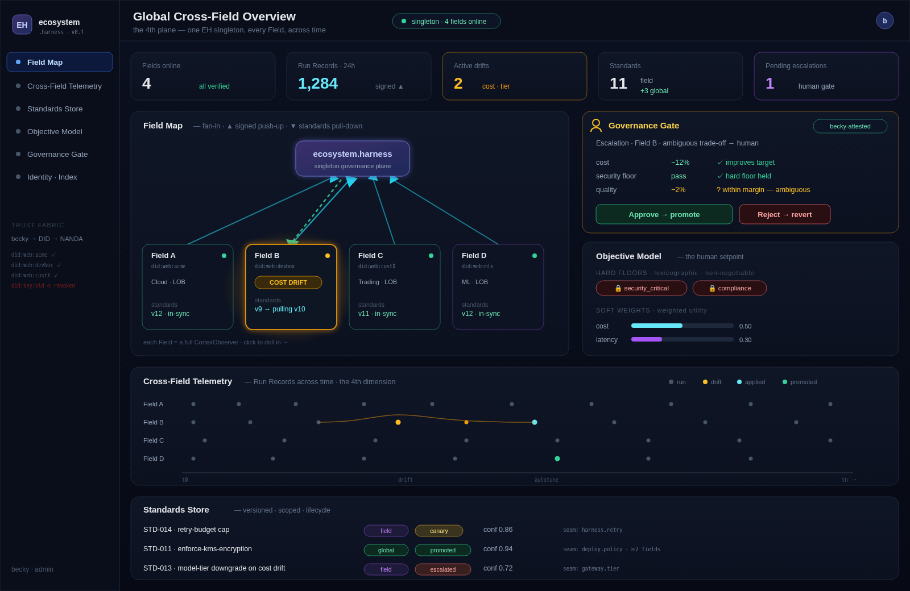

# EH FRONTEND — the cross-Field single pane of glass
### Lifting CortexObserver's visual language one tier up

*Companion to `FUTURE-the-conductor-and-the-field.md`. Private design sketch. 2026-06-25.*

> ⚠️ **Lineage artifact (EH-tier, pre-rebaseline).** The "lift CortexObserver's visual language" framing is
> superseded: Orreth's pane is a **native, fresh design** (CO informs, never drives) — see `../design/0000` §5
> and `../decisions/` (2026-07-01). Kept for the EH-frontend build plan it still sketches.

*(scalable master: `EH-FRONTEND-mockup.svg`. This is a mockup, not a screenshot — EH's `frontend/` is still reserved.)*

---

## The thesis

EH's hard part is **built** — the DID-signed control loop closes end-to-end in code. The one reserved directory is `frontend/`. That's not a gap; that's **the lift.** It's the exact thing CortexObserver already proved it can do better than anyone: take a system too deep for a human to feel and render it as **one screen.**

So we don't invent a new design language. We **lift CortexObserver's** up a tier — from *"the live truth of one Field"* to *"the live truth of every Field, and the standards flowing between them, across time."* **The 4D field map.**

---

## The visual mapping — what we already built becomes what EH needs

| CortexObserver component (the Field) | Becomes in EH (the plane) |
|---|---|
| **A.T.O.M dependency DAG** (React Flow) | **The Field Map** — EH singleton ← N Fields (fan-in); edges are *signed push-up* (▲) and *standards pull-down* (▼) |
| **Memory Explorer** (cross-agent, temporal) | **Cross-Field Telemetry** — Run Records, drift events, and standard promotions, laid out per-Field across time *(the 4th dimension, literally rendered)* |
| **Governance** (Policies/Procedures/Standards) | **Standards Store** — versioned, scoped (`field`/`global`), with lifecycle state (proposed → canary → promoted / reverted / escalated) |
| **Skills Store** (versioned, governed) | the **payload** a promoted standard binds down |
| **Allocation** (budgets · risk) | the **Objective Model** widget — hard floors (lexicographic) + soft weights |
| **HITL approval gate** (the amber node + policy chips) | the **Governance Gate** — pending escalations & global-promotion approvals, showing the canary **Δ-objective-vector** before you decide |
| **Identity Store** (`@handle`, RBAC) | the **Trust strip** — Field DIDs (`did:web:…`), AgentFacts trust, revocation status (becky → NANDA) |

> Everything we shipped this week was rehearsal for this screen.

---

## The hero screen — Global Cross-Field Overview

One pane, six regions (see the mockup):

1. **Header + stat band** — Fields online · Run Records (24h) · active drifts · standards (field/global) · pending escalations.
2. **The Field Map** *(center, the hero)* — EH at the top; Field cards fanned below, each tagged with its DID, health, drift state, and current standards version. Animated **▲ signed push-up** and **▼ standards pull-down** edges. A drifting Field glows amber; a Field with a pending standard pulses.
3. **The Governance Gate** *(right)* — the lifted HITL gate: a pending escalation with its canary Δ-vector (cost ↓, security floor ✓, quality ±), **Approve / Reject**, becky-attested. This is *the human decision point*, one tier up.
4. **The Objective Model** *(right)* — the setpoint: hard floors (security_critical, compliance — non-negotiable) + soft weights (cost, latency, quality). Editing a weight is editing governance.
5. **Cross-Field Telemetry** *(bottom)* — per-Field lanes across a time axis: dots = Run Records, amber = drift detected, cyan = standard applied, emerald = promoted. Drift becomes a **trajectory** you watch, not an alert you discover.
6. **Standards Store strip** — versioned rows: name · scope chip · state chip · confidence · the attributed seam.

**Drill-down:** click a Field → you're in *its* CortexObserver. The pane composes; the same person, the same language, one tier down.

---

## Why it sells

- It makes the **invisible visible** — the externalities (cost/security/risk drift across many runs) that no single Field and no human can see, on one screen.
- It shows **governed multi-tenancy** at a glance — per-Field isolation, global promotion gated by a human — the thing regulated buyers need to *see* before they trust it.
- It's the **single pane of glass** — the 1999 bet — at ecosystem scale.

---

## Build plan (when we're ready)

1. **Scaffold** `frontend/` as a trimmed CortexObserver shell (Next.js + the dark system + React Flow) — reuse, don't rebuild.
2. **Field Map** — React Flow with a fan-in dagre layout; nodes from `GET /api/v1/standards/{field_id}` + the index; edges animated by ingest/pull events.
3. **Telemetry** — the Memory-Explorer timeline, re-keyed from `(agent, time)` to `(field_id, time)` over the Observation Store cohorts.
4. **Standards Store** — the Governance table, re-pointed at the versioned `StandardsStore` with the lifecycle states.
5. **Governance Gate** — the HITL gate component, fed by the controller's escalation queue + canary Δ-vector.
6. **Objective Model** — a new small editor for hard floors + soft weights (the only genuinely new surface).

Six components. Five of them are **lifts** of things that already exist and already look good. That's why this is a *next*, not a someday.

---

*The hard part is done. This is the part where we make it visible.* 🥃
