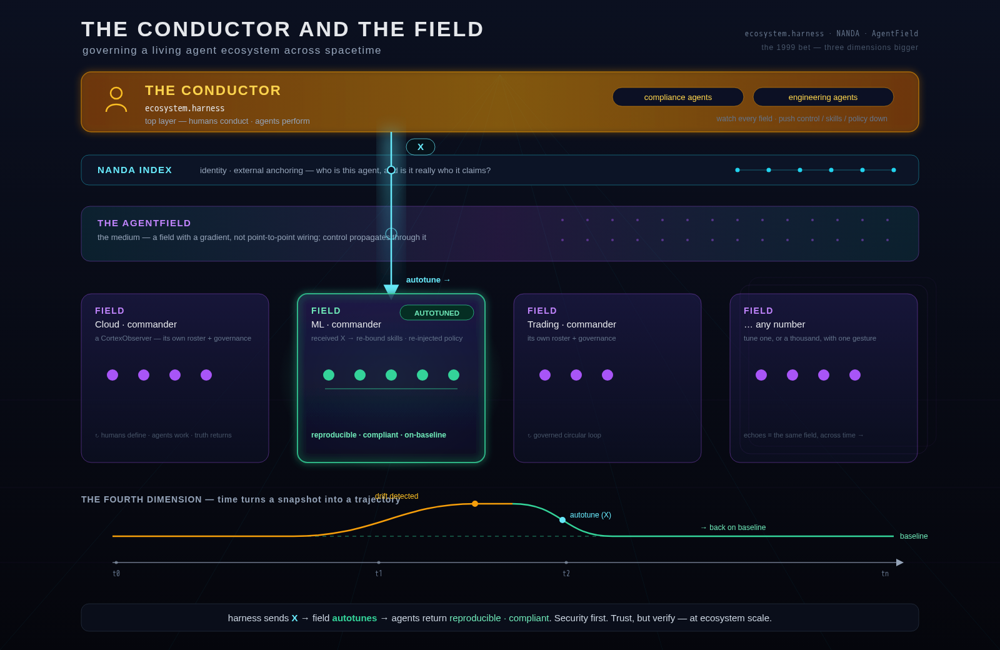

# FUTURE — The Conductor and the Field
### Governing a living agent ecosystem across spacetime

*Private vision artifact — the north star, reconciled against the real `ecosystem.harness` design. Captured 2026-06-25, updated after reading EH.*
*Lives outside the repo on purpose. The foundation is real and running — we built it (EH closes the loop end-to-end in code; only the frontend is reserved). This is the vision still ahead of it: the part we point at while we design.*

*(scalable master: `FUTURE-the-conductor-and-the-field.svg` — opens in any browser. NOTE: the diagram shows the **theoretical** model; for the **real** control direction, see "The control loop" below — observations flow UP, standards flow DOWN.)*

> The single pane of glass was the bet.
> The **field** is the canvas. **Spacetime** is the medium. The **conductor** keeps the humans in command.

---

## The ladder — why this is the next lift

Each era of computing lifted the atomic unit of intelligence up a level, absorbing the complexity below:

> Instructions → Processes → Services → Containers → Model calls → Agents → Harnesses → Harness orchestration → **ecosystem.harness**

EH's atomic unit is a **whole harness-orchestration run.** Its job: turn those runs into **governed, versioned standards.** The 4th plane atop LangGraph · AgentField · harness orchestration.

### The arc (why this is inevitable — for you specifically)

- **1999** — *"I bet I could run an enterprise from a single pane of glass."* → control + truth, from one screen.
- **CortexObserver** — one **Field**: a commander governing an agent workforce, on the circular loop *(humans define → farms enforce → agents work → truth returns → humans adjust → repeat)*.
- **ecosystem.harness (EH)** — the plane **above** many Fields: it turns their runs into institutional standards and binds them back down.

Same instinct — control, visibility, truth. The canvas just gained a dimension.

---

## Why a plane above — the externality problem

A harness optimizes **one task's accuracy.** It systematically *under-weights* the cross-cutting objectives — **cost, security, resilience, risk** — because those are **externalities to a single run**, observable only across **many.** EH is the only layer with that vantage.

This is the rigorous twin of *"the 4th dimension is a sense"*: the cross-run, cross-Field, cross-time view is exactly the thing **no single run — and no human — can see.**

And the honest constraint that keeps it sane: **EH does not make execution deterministic** (that would destroy the capability you pay for). It makes **outcomes conformant and variance bounded** — reproducible at *"did this meet the standard,"* **not** *"did it take the same path."*

---

## The topology — one EH, many Fields (fan-in)

**EH runs as a single instance at the top. Many Fields report up.** A fan-in: EH (exactly one) ← Field control planes (N) ← nodes/harnesses.

- **EH is its own container — a stateless singleton**, all state external. The same join mechanism a harness uses, one tier up: a Field is the *client*; EH is the backend it joins.
- **Direction: PUSH up, PULL down — never EH→Field polling.** Fields sit behind NAT/firewalls; EH can never reach in. Observations are *pushed* up; standards are *pulled* down (GitOps-style).
- **Optional by design.** No EH endpoint → the Field runs standalone. Turning EH off changes nothing about how a Field runs.

### The stack (top → down)

1. **The Conductor — `ecosystem.harness`.** Humans at the helm. Its workforce is *governance*, not domain work: the compliance/engineering agents, the **Objective Model** (the setpoint), the **Standards store** (versioned, scoped).
2. **The trust fabric — becky → DID → NANDA index.** `becky` issues each Field a DID (`did:web`/`did:key`); **AgentFacts** (W3C VC) carry capabilities + runtime-earned evaluations; the **NANDA index** publishes the pointer + revocation. Every byte EH trusts is **cryptographically attributable to a Field.** *(Security first. Trust, but verify — for a whole field of strangers.)*
3. **The AgentField — the medium.** The substrate the Fields live in; the layering signals travel through.
4. **The Fields — commanders.** Each Field *is* a CortexObserver: a commander, an agent roster, its own farms + local governance. Many Fields, many **lines of business.**
5. **The specialized agents.** The workforce inside each Field — the @allen-likes and @amy-likes — doing the actual labor.

---

## The fourth dimension — time as the control axis

Three dimensions give you the **topology**: which agent, which field, which skill *(space)*. The fourth axis is **time** — timestamps, the ecosystem clock, the memory continuum.

- With only 3D you see **state**. With the 4th you see **trajectory** — and drift becomes a *vector you can measure and correct*, not a surprise you discover after.
- *"The changing state of spacetime"* = the live, navigable **4D truth** of the whole ecosystem.

---

## Why this matters — the fourth dimension is a *sense*, not an axis

**The 4th dimension isn't a chart axis. It's a sense.**

Humans can't perceive the pieces changing around them — not because we're careless, but because the system got too deep to hold in one head, and it never stops moving. *(A "piece" = anything measurable or observable.)* We do silly, wrong things out of **blindness**: you cannot course-correct a drift you can't feel. The technology is deep; we know comparatively little; the mistakes are constant and mostly invisible.

An agentic workforce — deep skill, vast knowledge, running continuous recon across spacetime — isn't "more autonomy." It's **an organ we never had**: the ability to *feel* the ecosystem change in real time, and to act before a drift becomes an incident.

Which means the harness isn't a dashboard. **It's a nervous system.** *(Fittingly — that was CortexObserver's original name: the Enterprise Digital Nervous System.)*

- **Reflexes** fire *within* risk tolerance — corrected with no human in the loop.
- **Escalation** goes to the conscious mind — *you* — for the calls that actually need a human.

The agents perceive. The human decides what matters. Neither side is blind anymore.

---

## The primitive — the *piece* is the **Run Record**

My theory called it "the piece." EH already built it and gave it a schema: the **Run Record** — the normalized observation unit, `field_id`-tagged, carrying **outcome + process + risk faces**, signed by the Field's DID.

> A **piece / Run Record** = one observable run — stamped in **time**, **DID-signed** and identity-anchored (becky → NANDA), pushed through the **AgentField** up to EH.

Everything else falls out of it:

- **Recon** = the cohort of Run Records across spacetime, scoped by `(field_id, goal_hash)`.
- **Drift** = a cohort whose **trajectory** bends off baseline (dead-band + persistence — not a single noisy run).
- **Response** = a **proposed Standard**: auto-apply if low-risk + high-confidence, **escalate** to a human if not.

---

## The control loop — observe up, govern, write standards down

*(This replaces the naïve "harness sends X down" model. The real direction is **observations up, standards down** — and the field always verifies before applying.)*

1. **Field signs + pushes up.** A run completes → the Field builds a **Run Record**, signs it with its DID, and **pushes** it to EH. *(EH never polls in.)*
2. **EH verifies + attributes.** Resolve the Field DID via the NANDA index → check revocation → anti-spoof → verify signature → store in the tenant-scoped `(field_id, goal_hash)` cohort. *Unknown / revoked / spoofed / tampered → rejected.*
3. **Detect drift.** Across **many** runs (the only place externalities are visible): dead-band + persistence guards, so noise never trips it.
4. **Attribute the cause.** Config-diff bisect → the **seam** that moved → a **Standard draft** (versioned, `scope=field`) with a confidence score.
5. **Route by lane.** Low-risk seam + confidence ≥ threshold → **auto-apply** (still canaried). Otherwise → **becky/human approval.**
6. **Canary + arbitrate.** Measure the **full objective vector**; the human-owned **Objective Model** decides: **hard floors are lexicographic** (security/compliance — non-negotiable), **soft objectives** are weighted utility, **genuine ambiguity escalates to a human** — whose decision *refines the weights.*
7. **Promote → bind down.** On promote, the Standard is **EH-signed** and the Field **pulls** it, **verifies authenticity**, and applies it — re-bind a skill, re-inject a policy, re-pin a model tier. *(This is where "autotune" actually happens: Field-side, pulled, verified — never injected.)* Regression → **reverted** (versioned). Ambiguous → **escalated.**
8. **Global only by governed promotion.** A Standard proven across **≥ 2 Fields** *may* graduate to `scope=global` — but only via an explicit, **becky/human-gated, consent-respecting** step. **One tenant's runs never shape another's governance unless a human promotes it.**

EH is a **slow outer control loop**: **setpoint** = human-governed objectives · **measurement** = cross-Field telemetry · **actuator** = versioned standards bound back down.

---

## How the two projects compose

The clean part: CortexObserver and EH were *designed* to fit. The seams already exist.

| Seam | CortexObserver (the Field) | ecosystem.harness (the plane) |
|---|---|---|
| **Identity** | `becky` — Identity & Access Manager | `becky` — DID issuer + global promotion gate. **Same principal, one tier up — the bridge.** |
| **Observation** | execution steps · memory · allocations | the **Run Record** cohort it ingests |
| **Actuator** | Governance docs · Skills Store · Allocation — *where a standard lands* | the **Standards store** it writes back |
| **Setpoint** | local policies / budgets / risk | the **Objective Model** (hard floors + soft weights) |
| **The pane** | the DAG · Memory Explorer · Governance UI | the **reserved `frontend/`** — the same visual language, one tier up |
| **The chassis** | full CortexObserver per line-of-business | a **trimmed CortexObserver** at the top: governance agents only, top-level policies + critical skills |

**EH = a trimmed CortexObserver** (different roster — governance, not domain). **Each Field = a full CortexObserver** (its own agents, farms, skills, factories). Many Fields = many lines of business.

---

## The honest horizon — two layers, not one

Don't blur these into one rosy claim. They're different maturities:

- **EH (built, sans frontend) — the slow outer governance loop.** Run-granularity. Observe → drift → attribute → propose → canary → arbitrate → promote/revert/escalate → bind down. **61 tests, end-to-end, containerized.** The missing piece is the **frontend**.
- **The ambient nervous system (the further horizon) — the fast inner reflex layer.** Per-**piece** recon *beneath* the run loop — the always-on **Rust brainstem** that watches every observable and almost always does nothing, summoning the expensive cortex (reasoning agents) only when a trajectory crosses a threshold. It sits **below** EH and **feeds** it. *Deep because lightweight: a billion observations, a handful of LLM calls.* **This is next-year work — real, not done.**

---

## North star / first principles

- **Security first. Trust, but verify — at ecosystem scale.** An ungoverned A2A mesh drifts fastest and quietest. Locks at line one, not as a retrofit. *(EH already enforces this: DID-signed, revocable, anti-spoof, tenant-isolated.)*
- **Humans conduct; agents perform.** The top layer keeps a human's hand on the wheel *even when no human could watch every field.*
- **Tuning is governance, and it's pulled, not pushed.** A Field *pulls* an EH-signed standard and *verifies* it before applying. You can't slip a poisoned standard in.
- **Bound outcomes, not paths.** Conform the result; never constrain the reasoning. That's how you govern without lobotomizing.
- **The Field is the unit.** Not the agent, not the org — the **Field** (a line of business). Compose fields like instruments.

---

## What to prove first — mostly done; here's what's left

EH already closed the proof obligations in code: **measurability** (drift), **attribution** (bisect), **stability** (dead-band + canary + revert + versioning), **trade-off arbitration** (vector canary + lane + Objective Model), and the **DID security model** (unknown/revoked/spoofed/tampered all rejected). So the open frontier is the *pane* and the *wiring*:

- [ ] **The frontend — the 4D field map.** EH's reserved cross-Field overview, built by lifting CortexObserver's visual language one tier up *(see the companion sketch: `EH-FRONTEND-the-cross-field-pane.md`)*.
- [ ] **The CortexObserver ↔ EH wiring.** CortexObserver emits **signed Run Records** → EH ingest; CortexObserver **pulls + applies** standards via its Governance / Skills / Allocation actuators.
- [ ] **becky, one issuer across both.** The shared DID/identity chain wired through, Field-side and EH-side.
- [ ] **The horizon:** the ambient per-**piece** sensing layer (the Rust brainstem) beneath the run loop — the smallest possible nervous system.

---

*Captured for JB — the 1999 bet, three dimensions bigger, now reconciled with the thing we actually built. We move at the speed of your ideas now.* 🥃
